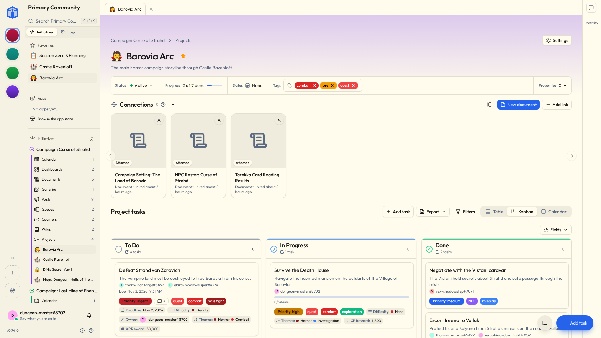

# Initiative

[](https://github.com/beyonders-studio/initiative/actions/workflows/ci.yml?query=branch%3Amain+event%3Apush)
[](https://github.com/beyonders-studio/initiative/releases)
[](LICENSE)

Initiative is a shared workspace for groups that need to get things done together, like a small business, a club, a committee, the people running the community theater fundraiser, or your family. Projects, tasks, files, calendars and the rest live in one place, so the plan stops being spread across a group chat and three spreadsheets.

You can start with one board and a few tasks and never touch anything else. When the group needs more, the other tools are already there, and you decide who gets to see and change each one.



The [user guide](https://beyonders-studio.github.io/initiative/) covers using Initiative and running your own server.

> [!NOTE]
> Initiative hasn't reached 1.0 yet, so the API can still change between minor releases.

## What's in it

- Projects and tasks, with board, table and calendar views
- Files with real-time editing, including documents, spreadsheets and whiteboards
- Calendars, posts, wikis, galleries, queues, counters and dashboards
- Communities with initiatives inside them, and sharing down to a single project or file
- A marketplace of plug-ins and dashboards, and an SDK to write your own
- Apps for iPhone, Android, Windows, Mac and Linux, and an installable web app

## Running your own server

You need Docker with Compose. Download the example compose file and give it the two secrets it needs:

```bash
curl -o docker-compose.yml https://raw.githubusercontent.com/beyonders-studio/initiative/main/docker-compose.example.yml
echo "SECRET_KEY=$(openssl rand -hex 32)" > .env
echo "POSTGRES_PASSWORD=$(openssl rand -hex 32)" >> .env
docker compose up -d
```

Open http://localhost:8173 and register. The first account becomes the owner of the server.

Keep that `.env` file somewhere safe. Postgres only reads the password when it first creates the database, and the secret key encrypts data you'll want to read later, so neither one is something to change on a whim.

For anything beyond trying it out, put it behind HTTPS and set `APP_URL` to your public address. These pages cover the rest:

- [Installation](https://beyonders-studio.github.io/initiative/en/running-a-server/installation/) has the image tags, PUID/PGID and the database setup
- [Configuration](https://beyonders-studio.github.io/initiative/en/running-a-server/configuration/) lists every setting
- [Email](https://beyonders-studio.github.io/initiative/en/running-a-server/email/), [single sign-on](https://beyonders-studio.github.io/initiative/en/running-a-server/single-sign-on/) and [push notifications](https://beyonders-studio.github.io/initiative/en/running-a-server/push-notifications/)
- [Backups and updates](https://beyonders-studio.github.io/initiative/en/running-a-server/backups-and-updates/)

Images are published to `ghcr.io/beyonders-studio/initiative` for `linux/amd64` and `linux/arm64`. Run `latest`, `stable` or a version tag. The `dev` images are for testing what's coming and shouldn't run anywhere that matters.

If you'd rather not run a server, there's a [hosted option](https://beyonders-studio.github.io/initiative/en/self-host-or-hosted/) too.

## Apps

The phone apps are on the App Store and Google Play under Initiative, by Beyonders Studio. On Android you can also install from the releases page, or let Obtainium keep it updated for you:

[](https://apps.obtainium.imranr.dev/redirect?r=obtainium%3A%2F%2Fadd%2Fhttps%3A%2F%2Fgithub.com%2Fbeyonders-studio%2Finitiative)

The desktop installers (`.exe`, `.dmg` and `.deb`) are attached to releases that change the app. Most releases only change the web side, which the apps pick up from your server on their own, so they don't come with new installers. [Installing the app](https://beyonders-studio.github.io/initiative/en/getting-started/install-the-app/) has the details.

## Built with

FastAPI, SQLModel and PostgreSQL on the backend, React, TypeScript and Vite on the frontend, Capacitor for the phone apps and Electron for the desktop app.

## Contributing

[CONTRIBUTING.md](CONTRIBUTING.md) explains how to get a dev environment running and how changes get in. Pull requests go to the `dev` branch, and contributing means agreeing to the [Contributor License Agreement](CLA.md).

To report a security problem, follow [SECURITY.md](SECURITY.md) rather than opening an issue.

## License

Initiative is open core. Everything in this repository, which is the whole app you self-host, is licensed under the [AGPL-3.0](LICENSE). The maintainers keep the copyright and the commercial rights.

| Repository | License | What it is |
|---|---|---|
| [initiative](https://github.com/beyonders-studio/initiative) | AGPL-3.0 | The app: backend, frontend, and the phone and desktop builds |
| [initiative-plugin-sdk](https://github.com/beyonders-studio/initiative-plugin-sdk) | MIT | The SDK and CLI for writing plug-ins |
| [initiative-developer](https://github.com/beyonders-studio/initiative-developer) | MIT | The plug-in registry, and a GitHub plug-in to start your own from |

Automations and billing are proprietary and live outside this repository. They exist to run the hosted service, and a self-hosted server is the complete product without them.
