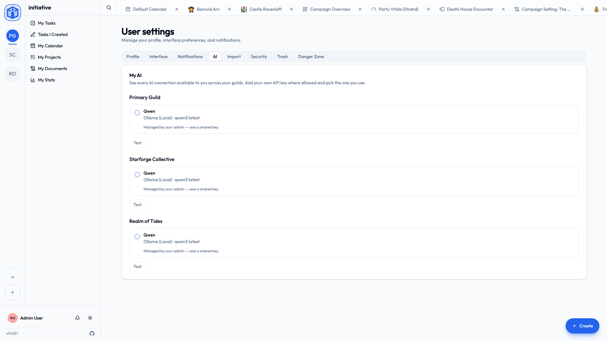

# AI features

Initiative has optional AI help for the boring parts — drafting a task description, suggesting subtasks, summarising a document.

Optional, off unless somebody deliberately switches it on, and never quietly running in the background while you weren't looking.

## What it can do

When AI is switched on, you'll see **Generate** options in a few places:

- Drafting or improving a **task description**.
- Suggesting **subtasks** to break something down.
- Producing a **summary** of a document.

You ask each time. Nothing writes itself while you're making tea.

## Bring your own key

AI features run on a provider someone supplies a key for. Depending on how your server and community are set up, that key might be provided for you, or you might add your own.

| Provider | Notes |
|---|---|
| **OpenAI** | Needs an API key. |
| **Anthropic** | Needs an API key. |
| **Ollama** | Runs models locally; needs a base URL. |
| **OpenAI-compatible** | Anything that speaks the OpenAI API; needs a base URL and key. |

To set your own up: **User settings → AI** (the tab appears once there's a connection to make), enable AI, choose your **provider**, paste your **API key** and **base URL** if needed, pick a **model**, and hit **Test connection**.

## Who decides the settings

They cascade top-down, and each level chooses whether the one below can override it:

1. **Platform** — the server owner sets defaults and decides whether communities and users may bring their own keys.
2. **Community** — a community admin can set the community's own configuration, if the platform allows.
3. **You** — personal settings, if your community or platform allows.

Seeing *"AI settings are managed by your administrator"*? Nothing is broken. Somebody above you has already made the decision, which is either a relief or an irritation depending entirely on your day.

## The privacy bit, which is genuinely worth reading

AI features work by sending the relevant text — a task's details, a document's contents — to whichever provider is configured. That content **leaves your server** and goes to that company, under *their* terms.

This is the one place in Initiative where your work deliberately goes somewhere else, so we'd rather be precise about it than reassuring:

- **We never train on your content, and there's no path for us to.** That's a fact about the architecture, not a promise about our behaviour. See [Why the rules are what they are](../security/data-and-compliance.md#why-the-rules-are-what-they-are).
- **What the provider does with it is between you and them.** The moment you press Generate, that text is governed by whatever you agreed to with OpenAI, Anthropic, or whoever else. Some providers train on what they receive; some don't; some let you choose. We can't promise on their behalf, and we won't pretend to.

Which is precisely why the buttons are explicit, why nothing generates on its own, and why every level can switch the whole thing off.

!!! tip "Want a hard guarantee? Keep it local."
    An administrator can configure a **local** provider (Ollama). The text never leaves your server, so there's no third party's terms to read and nothing to take anyone's word for. If your group's work is the kind you wouldn't hand a stranger, this is the option to ask for.

Not sure what's configured on your server? Ask your administrator — or simply never press the buttons. Everything else in Initiative works exactly the same without them, and nobody is keeping score.

## Related

- [Profile & preferences](profile-and-preferences.md) — your other personal settings.
- [Platform configuration](../admin/configuration.md) — for administrators setting AI defaults.
