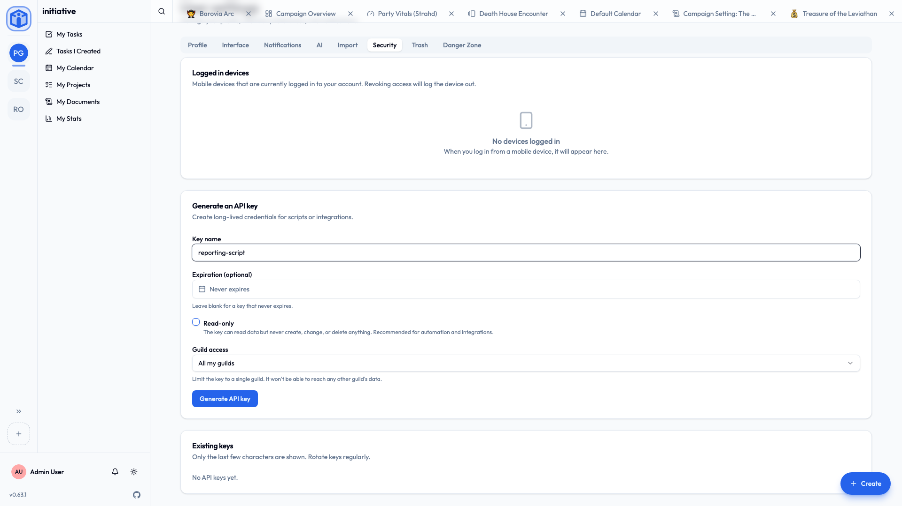

# API keys & integrations

Most people never need this page, and that's fine. But if you want to connect Initiative to a script, another tool, or an AI assistant, **API keys** are how. A key is a long-lived credential that lets software act on your behalf, with limits you set.

!!! tip "Treat an API key like a password"
    Anyone holding your key can do what it allows, as you. Don't paste keys anywhere public, and delete any you've stopped using.

## Creating one

1. **User settings → Security**.
2. Under **Generate an API key**, give it a clear **name** — `weekly-report-script`, so future-you remembers what it's for.
3. Choose its limits (below).
4. Generate, and **copy it immediately** — it's shown once. Lost it? Delete it and make another.



## Choosing limits

Each option narrows what a key can reach. Use the tightest set that still does the job:

| Option | What it does | Recommendation |
|---|---|---|
| **Read-only** | Reads data, never creates, changes, or deletes. | **On**, unless you specifically need writes. |
| **Community access** | Limits the key to a single community instead of all of yours. | Pin it to the **one** it needs. |
| **Expiration** | The key stops working after a date. | Set one for anything temporary. |

A read-only key pinned to one community is the safest default: it changes nothing, and reaches no other group's data.

## Managing keys

**Existing keys** shows each key's name, a short prefix (never the whole key), its scope, when it was last used, and when it expires. **Delete** revokes one immediately. Resetting your password revokes all of them at once, which is the fast way to shut everything down.

## Connecting an AI assistant (MCP)

Initiative can expose a small surface to AI assistants through the **Model Context Protocol (MCP)**, so an assistant can do things like *"list my projects"* or *"add a task to the Auth project"* — using your API key, bound by exactly the same access rules as everything else.

Worth knowing:

- It's **off unless your administrator enables it** on the server.
- Every action runs **as you**, scoped by your key. An assistant reaches only what *you* could reach.
- The surface is **small and read-leaning** — a handful of read actions for any key (projects, tasks, initiatives, members, task statuses, and the comments on a task or document), and only a few writes (create/edit/move a task, add a comment) for a full-access key. A read-only key can't write at all.

!!! tip "Read-only, single-community, for assistants"
    That's the right call for most uses. Only reach for a full-access key if you actually want the assistant making changes — and each change is confirmed in the assistant before it runs.

??? techspec "For the technically minded — connecting a client"
    With MCP enabled (an administrator sets `ENABLE_MCP=true`), the server is at `<your-server>/api/v1/mcp/`. Register it with your client using your API key as a bearer token — with Claude Code, for example:

    ```bash
    claude mcp add --transport http initiative \
      https://your-server/api/v1/mcp/ \
      --header "Authorization: Bearer ppk_your_key_here"
    ```

    The exposed tools are route-backed: each call goes through the normal API with your authentication and the same row-level-security access rules, so there's no ambient privilege. Administrators: see [Configuration](../admin/configuration.md).

## Related

- [Profile & preferences](profile-and-preferences.md) — the rest of your account.
- [Security & privacy](../security/index.md) — how access is enforced.
- [Configuration](../admin/configuration.md) — for administrators enabling MCP.
