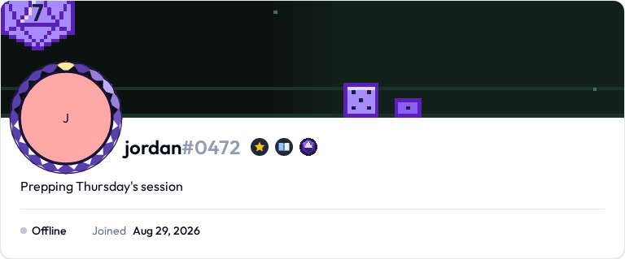
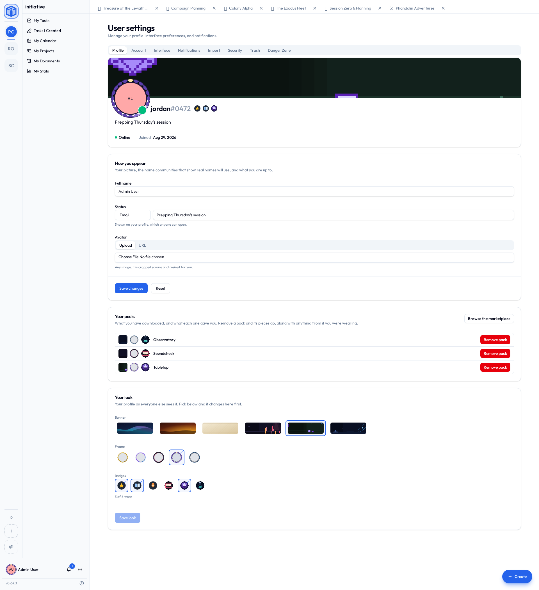

# Profile & preferences

Your personal settings live in **User settings**, opened from your name and picture at the bottom of the sidebar. Nothing here changes anything for anyone else.

The tabs split along a simple line: **Profile** is the face other people see, **Account** is how you get in, **Interface** is how the app reads to you.

## Your profile page

You have a page of your own, at a link worth sharing — `/u/jordan1234`, your handle with its number run onto the end. Open it from **My profile** in your account menu, or by clicking anyone in a member list or search result.

It shows your picture, your handle, your status, the banner and frame and trophies you're wearing, how you're around right now, and when you joined. Underneath, the communities you're in — of the ones that have listed themselves in the [community directory](../guides/communities.md#finding-a-community-to-join). A private community is nobody else's business and never appears.

It's public, and the same page whoever opens it, because it belongs to *you* rather than to any one community. So it shows your handle rather than your real name, wherever it's opened from.

## Profile

Everything on that page, with a live preview at the top — pick something and the card changes before you save, so you never have to imagine the result.

- **Picture** — upload one, or point at an image URL. An uploaded picture saves the moment you choose it.
- **Display name** — your real name, used only in communities set to show real names. Everywhere else you're your handle.
- **Status** — an emoji, a line about what you're up to, or both. Set it by clicking the bubble on the card rather than filling in a form. Up to 100 characters; clearing it takes it off.
- **Presence** — the dot under your picture. See [Saying how you're around](#saying-how-youre-around).
- **Your packs** — the decoration packs you've downloaded, and how to remove one.
- **Your look** — which banner, frame and trophies you're wearing.

### Decorations

A profile wears three things, mixed freely — they don't have to come from the same pack.

| | What it is | How many |
|---|---|---|
| **Banner** | The artwork across the top of your profile | One |
| **Frame** | Artwork around your picture, which follows you into the sidebar and onto every comment you write | One |
| **Trophies** | The rail of small marks under your picture | Up to six |

Banners and frames move; trophies hold still, because a rail of them has to stay readable at a glance. If you've asked your device for less motion, everything holds still.

Not every frame is a ring, either. Several stand *in front* of your picture, so you're sitting in the teacup, in one bay of the Colosseum, or wearing the headphones.

You never upload a decoration. You pick from what you own — the set that ships with Initiative, plus whatever **decoration packs** you download from your marketplace. See [Apps & the marketplace](../guides/apps-and-marketplace.md#your-own-marketplace). Because they ship with Initiative rather than being uploaded, wearing one costs your community no storage.

Picking the thing you're already wearing takes it off, so there's nothing extra to click for "none". Press **Save look** when you're happy.

### Removing a pack

**Remove pack** in **Your packs** gives it up. Its pieces leave your collection, and anything from it you were wearing comes off too — Initiative warns you before it does anything, and you can download it again later.

Taken a lot of packs? The search box above the list finds one by name.

## Saying how you're around

The small **dot** under your picture in the sidebar. Click it and pick:

| | What it means |
|---|---|
| **Online** | You've got Initiative open. |
| **Idle** | Sets itself once nothing's been touched for a while — or pick it outright to say you've stepped away. |
| **Busy** | You're around, and would rather not be interrupted. |
| **Offline** | Nobody sees you as here, whatever you have open. |

**Offline** means offline: it's how you're present without being seen to be. The same dot on your profile card in **User settings → Profile** opens the same menu, and your choice shows on your profile page and wherever your picture appears.

## Account

How you sign in. Two things here are shown but not editable:

- **Email** — the anchor of your account.
- **Handle** — the name you picked plus a four-digit number, like `jordan#1234`. The number is what lets two people share a name.

**Password** is the one thing you change here: current password, then the new one twice (12+ characters). Sign in with single sign-on? Your password lives with your identity provider, and this section doesn't apply to you.

## Interface

How the app reads to you. Each choice saves as you make it — no Save button.

- **Language** — for the interface.
- **Color theme** — Light, Dark, or System.
- **Timezone** — the clock your due dates, daily reminders and repeating tasks run on. Taken from your browser at sign-up; correct it here if it's wrong. It also appears beside the reminder time on the Notifications tab, where you need it in context.
- **Week starts on** — which day calendars and date pickers lead with.
- **Recent items in tab bar** — how many to keep along the top (1–100).
- **Task completion feedback** — a bit of fun when you finish something: **Confetti**, **+1 Heart**, **Natural 20**, **Gold coins**, **Random**, or **None**.
- **Sound** and **vibration** on task completion — optional, each with a button to try it.
- **Keep screen awake** — stops this device's screen dimming while Initiative is open. Saved per device.

## Privacy

Who can ask to message you, your connections, and any requests waiting on you. See [Messages](../guides/messages.md#who-can-reach-you).

## Trash

Things *you* recently deleted, restorable within the retention window. (Community-wide trash is separate — see [Trash and retention](../guides/communities.md#trash-and-retention).)

## Closing your account

The **Danger Zone** tab. Two paths, and Initiative walks you through either with a short wizard that checks for anything needing sorted first — projects you own, communities where you're the last admin.

### Deactivate

Temporarily switches your account off. You can't sign in, and you're removed from your communities (rejoining needs a fresh invite), but your name, email and content are kept. An administrator can reactivate you. Good for "I'm stepping away for a while."

### Delete

Permanent, and you choose how thorough:

- **Anonymize** — your name, email and avatar go, and you can't sign in, but things you wrote stay in place as "Deleted user". This keeps your teammates' history intact while removing *your* personal details.
- **Hard delete** (administrators) — everything goes, including content you authored.

Before deletion, Initiative makes sure your **owned projects are transferred**, so nothing your group depends on disappears with you.

!!! warning "Deletion can't be undone"
    Deactivation is reversible; deletion isn't. Unsure? Deactivate first.

## Related

- [Apps & the marketplace](../guides/apps-and-marketplace.md) — where decoration packs come from.
- [Messages](../guides/messages.md) — the Privacy tab in full.
- [Notifications](../guides/notifications.md) — what you're told about, and where.
- [API keys & integrations](api-keys-and-integrations.md) — the Security tab's access keys.
- [Data & compliance](../security/data-and-compliance.md) — what happens to your data.
