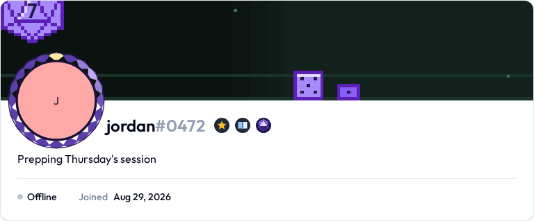
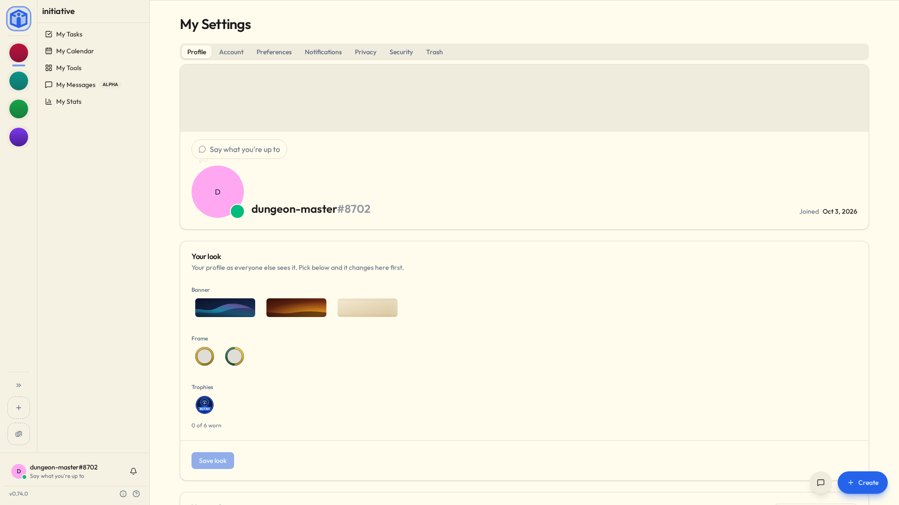
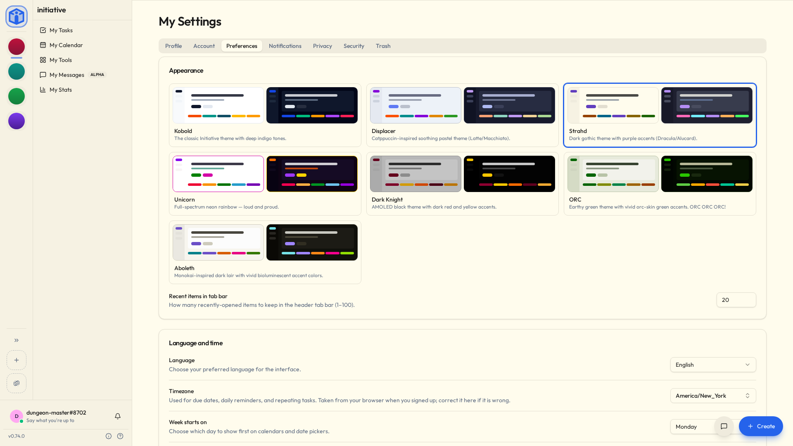

# Profile & preferences

Your personal settings live in **My Settings**, opened from your name and picture at the bottom of the sidebar.

Nothing on any of these tabs changes anything for anybody else, so fiddle away.

The tabs split along a simple line: **Profile** is the face other people see, **Account** is how you get in, **Preferences** is how the app reads to you.

## Your profile page

You have a page of your own, at a link worth sharing — `/u/jordan1234`, your handle with its number run onto the end. Open it from **My profile** in your account menu, or by clicking anyone in a member list or search result.

It shows your picture, your handle, your status, the banner and frame and trophies you're wearing, how you're around right now, and when you joined. Underneath, the communities you're in — of the ones that have listed themselves in the [community directory](../guides/communities.md#finding-a-community-to-join). A private community is nobody else's business and never appears.

It's public, and it's the same page whoever opens it, because it belongs to *you* rather than to any one community. Your handle is the only name your account has. To go by something friendlier in one community, give yourself a [display name](../guides/communities.md#your-name-in-a-community) there.

## Profile

Everything on that page, with a live preview at the top — pick something and the card changes before you save, so you never have to imagine the result.

- **Picture** — upload one, or point at an image URL. An uploaded picture saves the moment you choose it.
- **Status** — an emoji, a line about what you're up to, or both. Set it by clicking the bubble on the card rather than filling in a form. Up to 100 characters; clearing it takes it off.
- **Presence** — the dot under your picture. See [Saying how you're around](#saying-how-youre-around).
- **Your packs** — the decoration packs you've downloaded, and how to remove one.
- **Your look** — which banner, frame and trophies you're wearing.

### Decorations

A profile wears three things, mixed freely — they don't have to come from the same pack.

| | What it is | How many |
|---|---|---|
| **Banner** | The artwork across the top of your profile | One |
| **Frame** | Artwork around your picture, which follows you into the sidebar and onto every comment you write | One |
| **Trophies** | The rail of small marks under your picture | Up to six |

Banners and frames move. Trophies hold still, because six wiggling things in a row would be unreadable and slightly upsetting. And if you've asked your device for less motion, everything holds still.

Not every frame is a ring, either. Several stand *in front* of your picture, so you end up sitting in the teacup, in one bay of the Colosseum, or wearing the headphones. Yes, really. We had a lot of fun with these.

You never upload a decoration. You pick from what you own — the set that ships with Initiative, plus whatever **decoration packs** you download from your marketplace. See [Plug-ins & the marketplace](../guides/plugins-and-marketplace.md#your-own-marketplace). Because they ship with Initiative rather than being uploaded, wearing one costs your community no storage.

Picking the thing you're already wearing takes it off again, so there's no separate "none" to hunt for. Press **Save look** when you're happy with yourself.

### Removing a pack

**Remove pack** in **Your packs** gives it up. Its pieces leave your collection, and anything from it you were wearing comes off too — Initiative warns you before it does anything, and you can download it again later.

Taken a lot of packs? The search box above the list finds one by name.

## Saying how you're around

The small **dot** under your picture in the sidebar. Click it and pick:

| | What it means |
|---|---|
| **Online** | You've got Initiative open. |
| **Idle** | Sets itself once nothing's been touched for a while — or pick it outright to say you've stepped away. |
| **Busy** | You're around, and would rather not be interrupted. |
| **Offline** | Nobody sees you as here, whatever you have open. |

**Offline** genuinely means offline. You can have Initiative open all evening and the dot will still say offline, because you asked it to and it isn't anybody's business.

The same dot on your profile card in **My Settings → Profile** opens the same menu, and your choice shows on your profile page and wherever your picture turns up.

## Account

Who you are and how you get in.

- **Username** — your handle: the name you picked plus a four-digit number, like `jordan#1234`. The number is what lets two people share a name. A moderator can change it for you.
- **Email addresses** — any confirmed one signs you in, and account mail goes to all of them. Adding one, making one primary or removing one asks for your current password, or for a fresh sign-in if you sign in without one. Your addresses hear about it when a new one is confirmed or the primary moves, and a confirmed address you remove is told too. Moving the primary or removing one can [wait two days](#changes-that-wait).
- **Password** — current password, then the new one twice (12+ characters), then **Change password**.

Sign in with a work login instead? Then your password lives with them, not us, and this section is none of your concern.

### Changes that wait

Moving your primary address, removing a confirmed one, turning off two-factor authentication and removing your last passkey wait two days when they're made from somewhere your account hasn't been signed in for long. Nothing changes in the meantime, so if it wasn't you, two days is a lot of time to notice.

While it waits:

- Every confirmed address gets an email about it, with a link to cancel it.
- It sits at the top of **Account** and **Security** in your settings, with **Cancel the change**.
- Got a passkey? **Make it now with a passkey** skips the wait.

One change waits at a time. Ask for another and you'll be pointed at the first.

### "This wasn't me"

Every email about a change to how you sign in — an address, a passkey, two-factor authentication, your password — carries a **This wasn't me** button. It opens **Wasn't you?**, where **Sign out everywhere** signs your account out of every browser, phone and computer and turns off its API keys. On its own it changes nothing else.

Sometimes it can do more. When a change looks out of place — not made with a passkey, not from somewhere you'd been signed in for a day, or one of several in a row — the emails to your older addresses can undo it as well:

- an added address is taken back off;
- the primary address moves back;
- a removed address goes back on.

An added passkey can be taken back from any of your addresses. Each link works once, for a week.

## Preferences

How the app reads to you. Each choice saves as you make it — no Save button.

**Appearance**

- **Color theme** — pick one from the previews. Each comes in light and dark, and follows your device's setting. To force light or dark, use **Theme** in your account menu.
- **Recent items in tab bar** — how many to keep along the top (1–100).

**Language and time**

- **Language** — for the interface.
- **Timezone** — the clock your due dates, daily reminders, scheduled email and repeating tasks run on. Taken from your browser at sign-up; correct it here if it's wrong.
- **Week starts on** — which day calendars and date pickers lead with.
- **Time format** — whether a clock reads `1:30 PM` or `13:30`, everywhere one appears: calendars and their hour gutters, event times, due dates, message timestamps. **Browser default** takes its cue from your browser's language. Your phone or laptop keeps its own 12/24-hour setting to itself, so when the app and the clock on your wall disagree, this is the place to settle it.

**When you finish a task**

- **Task completion feedback** — a bit of fun when you finish something: **Confetti**, **+1 Heart**, **Natural 20**, **Gold coins**, **Random**, or **None**.
- **Sound** and **vibration** on task completion — optional, each with a button to try it.

**This device**

Settings kept by this browser or computer rather than your account. **Keep screen awake** stops the screen dimming while Initiative is open, which is useful for a counter propped up on a door. The desktop app adds its own switches here: updating itself, staying in the tray, and opening when the computer starts.

## Where you're signed in

**My Settings → Security** lists every browser, phone and computer with your account open, one row each: what each one is — *Chrome on macOS*, *Firefox on Windows* — where it last connected from, when it was last used, and which one is the one you're reading this on.

**Sign out** ends a browser's session and leaves the rest alone. **Remove device** is the phone and desktop app version: it signs the app out and stops your messages going to it, and if it's ever signed in again it clears off the messages only it had. It's the button for the phone that went in the canal. A device marked **not signed in** still holds your messages from an earlier sign-in; remove it once it's gone for good.

**Sign out everywhere else** closes the lot in one go and keeps you where you are, which is the button for the laptop you borrowed at your mum's and the library computer you have thought about twice since. Phones and computers keep their messages, and pick up where they left off when you sign back in.

A browser stays signed in for thirty days of not being used, and the phone and desktop apps for ninety, unless your server or community sets something shorter.

Changing your password, resetting it, or turning off a second factor signs out everything, everywhere, including you. That's the biggest hammer in the drawer. This is the one for when you don't need the hammer.

The same tab holds [two-factor authentication](two-factor-authentication.md), [passkeys](passkeys.md) and [API keys](api-keys-and-integrations.md).

## Privacy

Who can ask to message you, your connections, and any requests waiting on you. **Ignored accounts** is here too: **Ignore by handle**, and that account's mentions, replies and reactions stop reaching you, along with anything it sends you. Communities you share carry on as normal: you each see the other's work there. See [Messages](../guides/messages.md#who-can-reach-you).

## Trash

Things *you* recently deleted, restorable within the retention window. (Community-wide trash is separate — see [Trash and retention](../guides/communities.md#trash-and-retention).)

## Closing your account

The bottom of the **Account** tab. Two paths, and Initiative walks you through either with a short wizard that checks for anything needing sorted first — projects you own, communities where you're the last admin.

### Deactivate

Temporarily switches your account off. You can't sign in, and you're removed from your communities (rejoining needs a fresh invite), but your handle, email and content are kept. Whoever runs the server can reactivate you. Good for "I'm stepping away for a while."

### Delete

You disappear for everyone else straight away. What you hold is kept a while longer, and then erased.

- **Anonymize** — your email and picture go, and you can't sign in, but things you wrote stay in place as "Deleted user". This keeps your teammates' history intact while removing *your* personal details.
- **Hard delete** (platform operators) — everything goes, including content you authored.

Before deletion, Initiative makes sure your **owned projects are transferred**, so nothing your group depends on disappears with you.

You also get an email confirming it happened, to every address you'd confirmed. The one moment somebody most wants it in writing.

!!! tip "There's a window where you can change your mind"
    **Sign back in during it and the whole thing is called off** — communities, roles, files, exactly where you left them. Thirty days on most servers, though whoever runs yours sets the number and may have set none at all, in which case nothing is erased on a timer.

    After that it's properly permanent, and there is no undo, no support ticket and no clever recovery. If you're unsure, deactivate instead.

## Related

- [Plug-ins & the marketplace](../guides/plugins-and-marketplace.md) — where decoration packs come from.
- [Messages](../guides/messages.md) — the Privacy tab in full.
- [Notifications](../guides/notifications.md) — what you're told about, and where.
- [API keys & integrations](api-keys-and-integrations.md) — the Security tab's access keys.
- [Data & compliance](../security/data-and-compliance.md) — what happens to your data.
