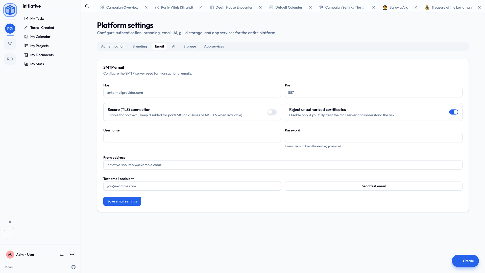

# Email

Initiative sends email for account verification, password resets, invitations, and the daily overdue-task digest. Point it at an **SMTP** mail server from **Settings → Platform → Email**, as the [owner](platform-roles.md).

!!! info "Without email, the email things don't happen"
    Initiative works fine without SMTP, but it can't send verification links, password resets, or email notifications. In-app bell notifications carry on regardless.

## What you'll need

Outgoing mail credentials — your own mail server, or a transactional email service. Specifically: host, port, username, password, and a "from" address.

## Settings

In **Settings → Platform → Email**:

| Field | Notes |
|---|---|
| **Host** | Your SMTP server, e.g. `smtp.mailprovider.com`. |
| **Port** | Commonly `587` (STARTTLS), `465` (TLS), or `25`. |
| **Secure (TLS) connection** | Turn **on** for port `465`. Leave **off** for `587`/`25` (they use STARTTLS when available). |
| **Reject unauthorized certificates** | Keep **on**. Turn off only if you fully trust the server and understand the risk (for example, a self-signed certificate on an internal relay). |
| **Username** / **Password** | Your SMTP credentials. (Leave the password blank when editing to keep the existing one.) |
| **From address** | The sender shown to recipients, e.g. `Initiative <no-reply@example.com>`. |

## Test it before you rely on it

**Send test email**, pick a recipient, send. If it arrives, you're done. If not, check the host/port/TLS combination first — that's the usual culprit — then the credentials.

## Related

- [Configuration](configuration.md) — foundational server settings.
- [Notifications](../guides/notifications.md) — what gets emailed, from the user's side.
- [Push notifications](push-notifications.md) — the mobile equivalent.
