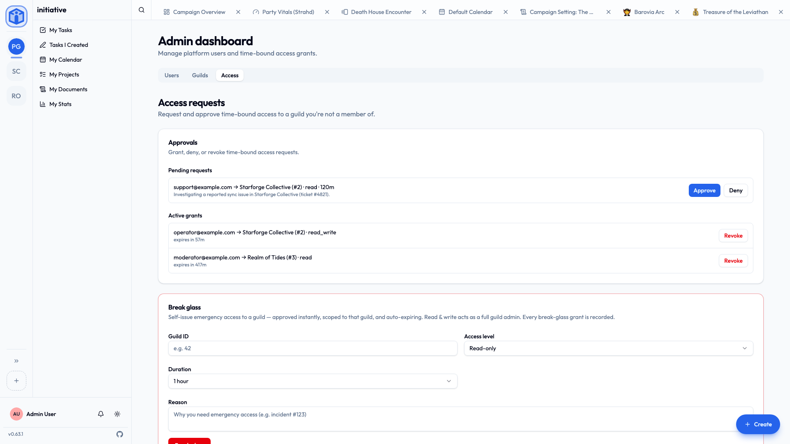

# Platform roles

Two role systems, kept deliberately separate:

- **Community roles** (admin / member) govern a single workspace. See [Working with communities](../guides/communities.md).
- **Platform roles** govern the **whole server** — every community, every user. That's this page. The tier below owner is called **operator**, to keep it clear of the community "admin" role.

Platform roles are managed by the [owner](#the-owner) — and for some actions, operators — from **Settings → Platform** and the **Admin dashboard**.

## The ladder

Five rungs, each adding to the one below:

| Role | What it can do |
|---|---|
| **Member** | Standard access to their own communities. No server-wide privileges. This is everyone by default. |
| **Support** | Read-only visibility across the platform (users, communities, audit), can **request** time-bound access to a community to help with an issue, and can let somebody answer the age question again after a typo. |
| **Moderator** | Everything Support can do, **plus** user management (suspend/reactivate) and content moderation. |
| **Operator** | Manages users, communities, and roles platform-wide, has cross-community access (via break-glass), approves access requests, and writes [announcements](announcements.md). |
| **Owner** | Full control, **including server-wide configuration** (single sign-on, email, branding, AI). The only role that can change configuration. |

!!! info "Capabilities, not just titles"
    Each rung maps to a set of **capabilities**, and features are gated on the capability rather than the role name. The practical upshot is exactly what the table says — but it means the model is precise about *what* each role may do, not just who outranks whom.

## The owner

The **first person to register** on a new server becomes the **owner**. The owner is the only role that can change app-wide configuration, so:

!!! warning "Never leave the server without an owner"
    Don't demote or delete the last owner-level account.

    Initiative does guard against removing the final configuration-holder, but don't rely on that as a plan. Make sure there is always at least one person who can change settings and is reachable.

## Managing platform users

From **Settings → Platform → Users** (or the **Admin dashboard → Users**) you can:

- **Promote / demote** a user's platform role.
- **Reset a user's password** (sends them a reset email).
- **Reactivate** a deactivated account.
- **Export** the user list as CSV.
- **Let someone answer the age question again**, where they answered as under age. Nearly always a mistyped year. It clears the answer and nothing else — they answer again from scratch, and no birthday is recorded either way. See [Asking members their age](configuration.md#asking-members-their-age).
- **Delete a user**, choosing how thorough it is:
    - **Deactivate** — can't sign in; data preserved; reversible.
    - **Anonymize** — personal details removed; their content remains as "Deleted user"; not reversible.
    - **Hard delete** — everything removed, including authored content; not reversible.

Before a destructive delete, Initiative makes you resolve **blockers** — for example, transferring projects the user owns, or promoting a replacement where they were the last admin — so nothing important is orphaned.

## Cross-community access: break-glass and time-bound grants

**Nobody holds a standing back door into communities they don't belong to** — not even platform operators. When platform staff genuinely need to reach a community's data, they take **explicit, time-bound, recorded** access instead. Manage it from **Settings → Access**.

Two paths:

- **Request and approve** (Support and Moderator). Someone **requests** scoped access to a community — read-only by default, or read-and-write — for a chosen number of hours, with a reason. An approver (Operator/Owner) grants or denies it, and it **auto-expires**. A read-write grant can edit existing content, but not author new material or manage members.
- **Break glass** (Operator and Owner). For urgent situations, an operator can **self-issue** an emergency grant to a community — approved instantly, scoped to that community, expiring automatically. A read-write break-glass grant acts as a **full community admin** for its window. Every break-glass grant is recorded, so the access is auditable.

!!! info "Why it's built this way"
    Privileged access has to be deliberately taken, is scoped to one community, expires on its own, and leaves a record naming who took it and why. That's a stronger position than a permanent bypass nobody has to justify. More in [How your data is kept separate](../security/how-your-data-is-kept-separate.md).

## Announcements

Operators and owners can write **announcements** — notices shown in a dialog to the people using the server. They're for a change somebody has to act on, or would otherwise be confused by. See [Announcements](announcements.md).

## Community storage limits

The owner can set a maximum storage size per community from **Settings → Platform → Communities**. See [File & object storage](object-storage.md#per-community-storage-limits).

## Related

- [Announcements](announcements.md) — telling everyone something.
- [Configuration](configuration.md) — foundational settings.
- [Working with communities](../guides/communities.md) — the per-community admin role.
- [How your data is kept separate](../security/how-your-data-is-kept-separate.md) — the access model behind all of this.
