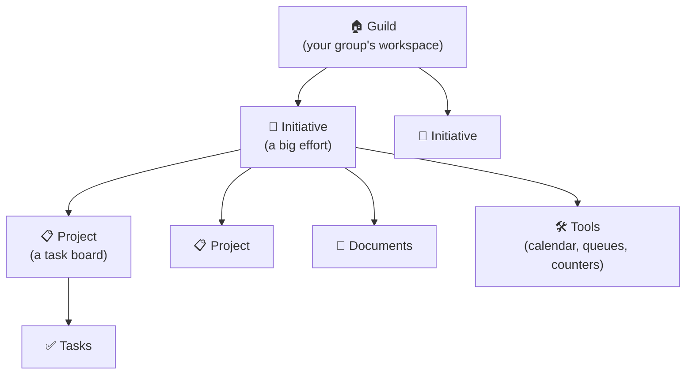

# How Initiative is organized

Initiative has a simple shape underneath it. Once you picture how the pieces nest together, everything else clicks into place.

## The big picture

Think of it like a building with nested spaces:

From biggest to smallest:

1. **Guild** — the whole workspace for one group of people.
2. **Initiative** — a folder inside a guild for one big effort.
3. **Projects, documents, and tools** — the actual work, kept inside an initiative.
4. **Tasks** — the individual to-dos on a project's board.

Let's take them one at a time.

## Guild — your group's workspace

A **guild** is the outermost container: one separate space for one group of people. Your tabletop campaign, your work team, and your neighborhood association would each be their own guild.

Guilds don't mix. Nothing in one guild is visible from another, even on the same server. You can belong to several guilds and switch between them from the top of the sidebar — but each is its own sealed world.

Within a guild there are just two member levels: **admin** (runs the place) and **member** (takes part). More in [Working with guilds](../guides/guilds.md).

!!! example "A real example"
    *"Riverside Players"* is a community theater group. They make one guild for everything they do together. Inside it, they'll create initiatives for each production.

## Initiative — a big effort

An **initiative** is a folder for a major undertaking, gathering all its related projects, documents, and tools in one place. It's the level where you decide *who's involved* and *what they can do*.

Why have this middle layer? Because real groups juggle several efforts at once, and not everyone needs to see all of them. Initiatives let you keep each effort tidy and give the right people access to the right things.

!!! example "Continuing the example"
    Riverside Players creates an initiative called *"Spring Play: Our Town."* Inside it go the rehearsal-schedule project, the budget spreadsheet, the script document, and the performance calendar. Only the people working on the spring play are added to it — the folks doing the *summer* show don't need to see it.

Every guild comes with one **Default Initiative** so you always have somewhere to start. You can add as many more as you need.

People are added to an initiative as **members**, and each member is given a **role** (like "Director" or "Cast") that decides which kinds of tools they can use. See [Initiative roles](../sharing/initiative-roles.md).

## Projects and tasks — getting work done

A **project** is a board for tracking work. It holds **tasks** — the individual to-dos — and lets you see them in whatever way suits you: a simple **Table**, a drag-and-drop **Kanban** board, a **Calendar**, or a **Timeline** (Gantt).

A **task** can have a description, a status (like "To Do" or "Done"), a priority, start and due dates, people assigned to it, subtasks, and tags. Tasks are where the day-to-day happens. See [Projects & tasks](../guides/projects-and-tasks.md).

## Documents — writing things down

A **document** lives inside an initiative and holds knowledge: meeting notes, a plan, a script, a spreadsheet. Documents can be written and edited **together, in real time**, so two people can work on the same page at once. You can also upload files (PDFs, Word, images) as documents. See [Documents](../guides/documents.md).

## Tools — for groups that need more

Beyond projects and documents, each initiative can use a few extra **tools**:

- **Calendar & events** — schedule things, invite attendees, and send reminders.
- **Queues** — keep track of whose turn it is (great for games and rotations).
- **Counters** — track numbers that go up and down (scores, health, budgets).

You don't have to use any of these — they're there when you need them. See [Tools](../guides/tools.md).

## The other half: people and access

Everything above is about *where things live*. The other half of the picture is *who can see and do what*. Initiative layers access from the outside in, and it's surprisingly intuitive:

| Layer | The question it answers |
|---|---|
| **Guild** | Are you a member of this group at all? |
| **Initiative** | Are you part of this particular effort? |
| **Initiative role** | What kinds of tools are you allowed to use here? |
| **Sharing** | For *this specific* project or document, can you view it, edit it, or own it? |

Each layer sits inside the one above it. You can only reach a document if you're in its guild, *and* in its initiative, *and* it's been shared with you. We explain this in friendly detail in [Sharing & access](../sharing/index.md), and in technical depth in [Security & privacy](../security/index.md).

??? techspec "For the technically minded — these four layers are enforced in the database"
    The four layers above aren't just interface conveniences — they're enforced at the database level using PostgreSQL's row-level security, so a bug in the app can't quietly hand someone data they shouldn't see. There are also two overrides: a **guild administrator** always has full access within their own guild, and platform staff can be granted **temporary, time-limited, audited** access for support — never a standing back door. The full model is in [How your data is kept separate](../security/how-your-data-is-kept-separate.md).

## Where to go next

- Ready to *do* things? Head to the [how-to guides](../guides/index.md).
- Curious who-can-see-what? Read [Sharing & access](../sharing/index.md).
- Hit an unfamiliar word? The [glossary](../reference/glossary.md) has you covered.
