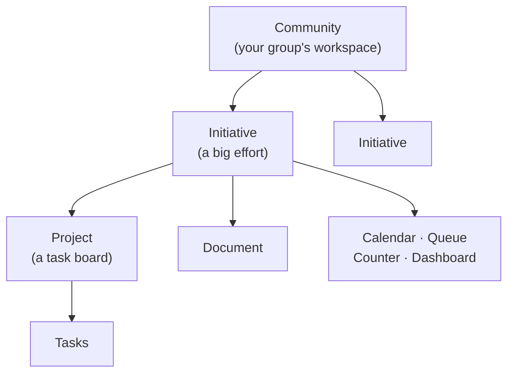

# How Initiative is organized

There's a simple shape underneath all of this, and it's worth about four minutes. Once you can picture how the bits nest inside each other, the rest of the app stops needing explaining and you can go back to your actual life.

## The big picture

```mermaid
graph TD
  G["Community<br/>(your group's workspace)"]
  I1["Initiative<br/>(a big effort)"]
  I2["Initiative"]
  P1["Project<br/>(a task board)"]
  D1["Document"]
  T1["Calendar · Queue<br/>Counter · Dashboard"]
  TASK["Tasks"]

  G --> I1
  G --> I2
  I1 --> P1
  I1 --> D1
  I1 --> T1
  P1 --> TASK
```

Biggest to smallest:

1. **Community** — the whole workspace for one group of people.
2. **Initiative** — a folder inside it for one big effort.
3. **Tools** — the six kinds of thing that hold the work, kept inside an initiative.
4. **Tasks** — the individual to-dos on a project's board.

!!! tip "You do not have to build all of this"
    Making a community hands you an initiative and somewhere to put your first project. That's the setup. Done. Plenty of groups run happily on exactly that for years and never touch anything else on this page.

    This diagram is a map of what's *available*. It is not a checklist, and you are not behind.

## Community — your group's workspace

The outermost box: one separate space for one group of people. Your business, your volunteer committee and your neighbourhood association would each be their own community.

Communities don't mix. Nothing in one is visible from another — not to other people, and not to you either. You can belong to several and hop between them from the rail down the left, but each one is a sealed world that knows nothing of the others.

Inside a community there are exactly two levels of person: **admin** (runs the place) and **member** (is in the place). That's the whole hierarchy. Nobody has to be promoted to Senior Member. See [Working with communities](../guides/communities.md).

!!! example "A running example"
    *Riverside Players* is a community theatre group. They make one community for everything they do together. Inside it, one initiative per production.

## Initiative — a big effort

A folder for one major undertaking, holding all the tools that effort uses. This is the level where you decide **who's involved**.

Why is there a middle layer at all? Because real groups have four things on the go simultaneously, and not everybody needs to see all four — or, frankly, wants to. The person doing the raffle does not need the budget spreadsheet in their sidebar every morning.

!!! example "Continuing the example"
    Riverside Players make an initiative called *Spring Play: Our Town*. Into it go the rehearsal schedule, the budget spreadsheet, the script, and the performance calendar.

    Only the spring play people are in it. The summer show crew never see it, never scroll past it, and are never once tempted to have an opinion about it.

Every community comes with a **Default Initiative** so there's always somewhere to start. Add as many more as you need.

People are added as **members**, each with a **role** — "Director", "Cast" — that decides which tools they can use. See [Initiative roles](../sharing/initiative-roles.md).

## Tools — the things that hold the work

Everything inside an initiative is a **tool**. There are six kinds, and they all behave the same way: they're shared the same way, they take tags, they have comment threads, and you can point at any of them with `#` from anywhere you write.

Learn how one works and you've learned how the next one works. That's the whole idea.

### The two you'll start with

**Projects** are boards. A project holds **tasks**, and shows them however you like — a **Table**, a drag-and-drop **Kanban** board, or a **Calendar**. Same work, three ways of looking at it, so the person who thinks in tidy lists and the person who thinks in columns can share a project without either of them quietly suffering.

A **task** carries a description, a status, a priority, dates, the people doing it, subtasks and tags. This is where the day-to-day actually happens. See [Projects & tasks](../guides/projects-and-tasks.md).

**Documents** hold the knowledge: meeting notes, a plan, a script, a budget, or a **whiteboard** for the things that are far easier drawn than described. Most kinds can be edited by several people at once, live, so there's no emailing versions around. You can upload files as documents too. See [Documents](../guides/documents.md).

### The four you grow into

- **Calendar & events** — things that happen at a time.
- **Queues** — whose turn it is.
- **Counters** — numbers that move.
- **Dashboards** — one screen that answers "how are we doing?"

Use none of these and nothing is missing. They aren't sitting there judging you. See [Tools](../guides/tools.md).

!!! info "Six today"
    The list of tools is a real, defined thing in the app rather than a loose category, and it has grown before. When a seventh arrives it'll turn up here, in the roles you can hand out, and in everything else that treats a tool as a tool — because there's one list and everything reads from it.

## Apps — what other groups already built

Some of what a group needs isn't in that list, and doesn't have to be.

The **marketplace** has ready-made **dashboards** and **apps** built by people who had the same problem first. Adding one is a couple of clicks: pick it, choose where it goes, name it.

Dashboards land in an initiative like any other tool. Apps get added community-wide by an admin, because they add something everybody shares. See [Apps & the marketplace](../guides/apps-and-marketplace.md).

## The other half: who can see what

Everything above is about *where things live*. The other half is *who's allowed near them*. Access layers from the outside in:

| Layer | The question it answers |
|---|---|
| **Community** | Are you in this group at all? |
| **Initiative** | Are you part of this particular effort? |
| **Initiative role** | Which kinds of tools may you use here? |
| **Sharing** | For *this specific* project or document — look, edit, or own? |

Each layer sits inside the one above it. You reach a document only if you're in its community, **and** its initiative, **and** it's been shared with you.

Which sounds like a lot of gates until you notice what they buy you: you never have to think about any of this again. The only people who see a thing are the people you put in front of it, and that stays true whether or not you're paying attention.

The friendly version is [Sharing & access](../sharing/index.md). The one with the technical detail is [Security & privacy](../security/index.md).

??? techspec "For the technically minded — these layers are enforced in the database"
    They're not interface conveniences. The **community** layer is structural: each community's content lives in its own PostgreSQL schema, and a request routed into one cannot address another's tables. The **initiative**, **role** and **sharing** layers are enforced inside that schema by PostgreSQL row-level security, evaluated on every statement — so the database, not the application, has the final say. Two overrides sit above them: a **community administrator** has full access within their own community, and platform staff can hold **temporary, time-limited, audited** access for support, never a standing one. Full model in [How your data is kept separate](../security/how-your-data-is-kept-separate.md).

## Where next

- Want to actually *do* things? [The how-to guides](../guides/index.md).
- Worried about who can see what? [Sharing & access](../sharing/index.md).
- Need something the built-in tools don't do? [Apps & the marketplace](../guides/apps-and-marketplace.md).
- Hit a word you don't recognise? [The glossary](../reference/glossary.md), or just search for it.
