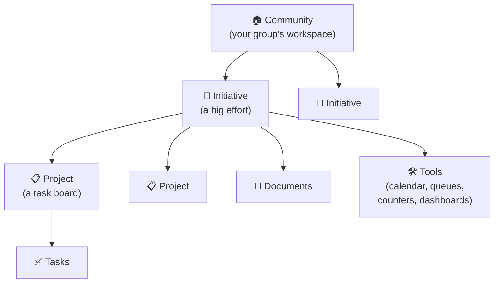

# How Initiative is organized

There's a simple shape underneath all of this. Once you can picture how the pieces nest, everything else falls into place.

## The big picture

```mermaid
graph TD
  G["🏠 Community<br/>(your group's workspace)"]
  I1["📁 Initiative<br/>(a big effort)"]
  I2["📁 Initiative"]
  P1["📋 Project<br/>(a task board)"]
  P2["📋 Project"]
  D1["📄 Documents"]
  T1["🛠️ Tools<br/>(calendar, queues,<br/>counters, dashboards)"]
  TASK["✅ Tasks"]

  G --> I1
  G --> I2
  I1 --> P1
  I1 --> P2
  I1 --> D1
  I1 --> T1
  P1 --> TASK
```

Biggest to smallest:

1. **Community** — the whole workspace for one group of people.
2. **Initiative** — a folder inside it for one big effort.
3. **Projects, documents and tools** — the actual work, kept inside an initiative.
4. **Tasks** — the individual to-dos on a project's board.

!!! tip "You don't have to build all this"
    Creating a community hands you an initiative and somewhere to put your first project. Plenty of groups run happily on one community, one initiative and a couple of projects for years, and only reach for the rest when something genuinely needs it.

## Community — your group's workspace

The outermost container: one separate space for one group. Your business, your volunteer committee and your neighborhood association would each be a community of their own.

Communities don't mix. Nothing in one is visible from another, even on the same server. You can belong to several and switch between them from the rail, but each is its own sealed world.

Inside a community there are two member levels: **admin** (runs the place) and **member** (takes part). See [Working with communities](../guides/communities.md).

!!! example "A running example"
    *Riverside Players* is a community theater group. One community for everything they do together. Inside it, an initiative per production.

## Initiative — a big effort

A folder for a major undertaking, gathering its projects, documents and tools in one place. This is the level where you decide **who's involved** and **what they can do**.

Why a middle layer? Because real groups juggle several efforts at once, and not everyone needs to see all of them.

!!! example "Continuing the example"
    Riverside Players makes an initiative called *Spring Play: Our Town*. In it: the rehearsal-schedule project, the budget spreadsheet, the script, the performance calendar. Only the spring-play people are in it — the summer-show crew never see it.

Every community comes with a **Default Initiative** so you always have somewhere to start. Add as many more as you need.

People are added as **members**, each with a **role** ("Director", "Cast") that decides which tools they can use. See [Initiative roles](../sharing/initiative-roles.md).

## Projects and tasks — the actual work

A **project** is a board. It holds **tasks**, and shows them however suits you: a **Table**, a drag-and-drop **Kanban** board, or a **Calendar**. Same work, three ways of looking at it — so nobody has to think about it the way someone else does.

A **task** can carry a description, a status, a priority, start and due dates, assignees, subtasks, and tags. This is where the day-to-day happens. See [Projects & tasks](../guides/projects-and-tasks.md).

## Documents — writing things down

A **document** lives in an initiative and holds knowledge: meeting notes, a plan, a script, a budget spreadsheet, or a **whiteboard** for the things that are easier drawn than written. Many can be edited by several people **at once, live**. You can also upload files — PDFs, Word, images — as documents. See [Documents](../guides/documents.md).

## Tools — there when you want them

Each initiative can also run:

- **Calendar & events** — schedule things, invite people, send reminders.
- **Queues** — track whose turn it is (rotations, rosters, running orders).
- **Counters** — track numbers that move (tallies, scores, budgets).
- **Dashboards** — one screen of charts, numbers and timelines, built from your own data.

Use none of them if you like. See [Tools](../guides/tools.md).

## Apps — what other groups already built

Some of what a group needs isn't in that list, and doesn't have to be. The **marketplace** carries ready-made **dashboards** and **apps** built by people solving the same problems. Adding one is a couple of clicks: pick a listing, choose where it goes, name it.

Your marketplace holds what ships with Initiative plus what the person running your server approved — curated by someone you can actually ask about it.

Dashboards land in an initiative like any other tool. Apps are added community-wide by a community admin, because they add something the whole community shares. See [Apps & the marketplace](../guides/apps-and-marketplace.md).

## The other half: who can see what

Everything above is about *where things live*. The other half is *who gets to reach them*. Access layers from the outside in:

| Layer | The question it answers |
|---|---|
| **Community** | Are you in this group at all? |
| **Initiative** | Are you part of this particular effort? |
| **Initiative role** | Which kinds of tools may you use here? |
| **Sharing** | For *this specific* project or document — view, edit, or own? |

Each layer sits inside the one above. You reach a document only if you're in its community, *and* its initiative, *and* it's been shared with you. In practice: the only people who ever see something are the people you deliberately put in front of it.

The friendly version is [Sharing & access](../sharing/index.md); the technical one is [Security & privacy](../security/index.md).

??? techspec "For the technically minded — these layers are enforced in the database"
    They're not interface conveniences. The **community** layer is structural: each community's content lives in its own PostgreSQL schema, and a request routed into one cannot address another's tables. The **initiative**, **role** and **sharing** layers are enforced inside that schema by PostgreSQL row-level security, evaluated on every statement — so the database, not the application, has the final say. Two overrides sit above them: a **community administrator** has full access within their own community, and platform staff can hold **temporary, time-limited, audited** access for support, never a standing one. Full model in [How your data is kept separate](../security/how-your-data-is-kept-separate.md).

## Where next

- Ready to *do* things? The [how-to guides](../guides/index.md).
- Curious who-sees-what? [Sharing & access](../sharing/index.md).
- Want more than the built-in tools? [Apps & the marketplace](../guides/apps-and-marketplace.md).
- Hit a word you don't know? The [glossary](../reference/glossary.md).
