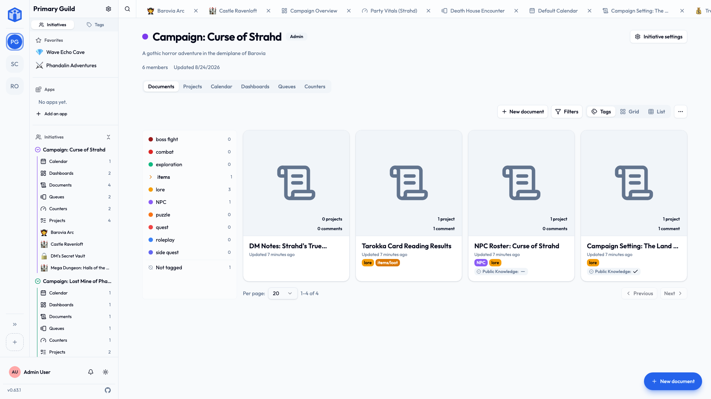

# A quick tour

Let's walk through the screen so everything feels familiar. Don't worry about remembering it all — you'll learn it naturally as you go. Here's the lay of the land.

## The community rail (far-left edge)

Down the **far-left edge of the screen** is a narrow vertical strip of icons:

- At the **top** is the **Initiative logo**. Click it to reach **your personal space** — the things that are *yours*, pulled together from across every community: *My Tasks*, *Tasks I Created*, *My Projects*, *My Documents*, *My Calendar*, and *My Stats*. See [Your space](../guides/your-space.md).
- **Below the logo** is one icon for **each community** you belong to. The highlighted icon is the community you're in now; click another to switch. Opening a community shows that community's **dashboard** and fills the sidebar with its contents. (More on communities in [Your first community](your-first-community.md).)

## The sidebar (next to it)

When you're in a community, the sidebar maps out that community. You'll usually find:

- **Initiatives** — the heart of the workspace. Each one expands to show its projects and documents, and clicking an initiative's **title** opens that initiative's own **dashboard**. This is where most of your work lives.
- **Tags** and **Favorites** — quick ways to find things you've labeled or starred.

!!! tip "Collapse what you don't need"
    Initiatives expand and collapse, so you can keep the sidebar tidy. There's also a control to **collapse all** or **expand all** at once.

## The bottom of the sidebar

Pinned to the **bottom** of the sidebar are your personal controls:

- Your **name and picture** — opens your **account menu**, with **My profile**, your **settings**, and **sign out**. Your picture wears whatever frame you have put on it.
- The **light / dark theme** toggle — switch the whole app between **Light**, **Dark**, or **System** (which follows your device's own setting). Set it once and forget it.
- Your **notifications** — a running list of everything you've been alerted to.

Below those, you'll see the app's **version number** and a link to the project's **open-source code on GitHub**.

## The main area (in the middle)

Whatever you click in the sidebar opens here — a project board, a document, your task list, a settings page. It's where you actually do the work.

## The tab bar (across the top)

As you open projects, tasks, and documents, Initiative keeps them as **tabs** along the top, like a web browser. Jump between recent things with a click, and close a tab when you're done with it. You can set how many recent items it keeps in **User settings → Interface**.

## Search — the fastest way around

Press ++cmd+k++ (Mac) or ++ctrl+k++ (Windows/Linux) anywhere to open **search**. Start typing the name of a project, task, document, or page, and jump straight to it. On a phone, a three-finger tap opens the same thing.

Search is often quicker than clicking through the sidebar — it's worth getting into the habit. See [Search & shortcuts](../guides/search-and-shortcuts.md).

## Next

You know your way around. Let's get you into your group — [join or create your first community](your-first-community.md).
