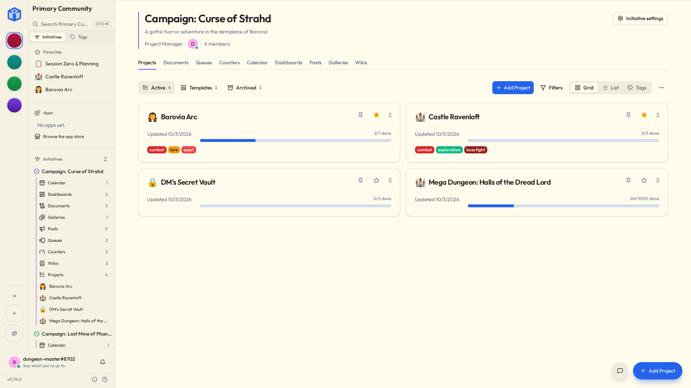

# A quick tour

Nobody reads the tour. You're going to skim this, click something, and work it out by touch like everyone else does, and that's genuinely fine — the app is built on the assumption that you will.

But if you'd like the map first: four regions on screen, plus one corner of it that belongs to you rather than to any group. You'll spend about 95% of your life in two of them. Here's what the rest are up to.

## The far-left strip

A narrow column of icons welded to the edge of the screen. One per community you belong to. Click one and the entire app swaps over — sidebar, projects, documents, the lot.

Can't tell your communities apart from a row of tiny pictures? **Expand community list** opens the rail out into cards: each community's banner, description and categories, with how many people are in it and how many are online right now.

## The logo above them

The **Initiative logo** sits above the community icons, and it isn't one. It's your corner — and you have already been in it, because the page you land on when you sign in is **My Tasks**: everything assigned to you, from every community at once, in one list.

Click the logo from anywhere and the sidebar swaps to your own short list — My Tasks, My Calendar, My Tools, My Messages, My Stats. Click a community icon to go back out.

So: **the icons are where the group's work lives, the logo is where yours does.** Belong to four groups and you still only have one list of what you've agreed to. See [Your space](../guides/your-space.md).

## The sidebar

A map of whichever community you're currently standing in.

It has two tabs. **Initiatives** is the one that matters. Each initiative expands into a row per tool, with a count beside each and its projects listed underneath. Whatever you're looking for is almost certainly under here, nested a level or two down, being quietly organised.

Click an initiative's *name* for its own page: the name with the initiative's colour running down the side, your role there, the faces of whoever's online, and a tab for each of its tools.

**Favorites** sits at the top of that tab, for the projects you've starred. **Tags** is the other tab, for things you've labelled. **Search** is near the top, though within a week you'll be doing that from the keyboard and this button will become purely decorative.

In a busy community the sidebar gets long. Initiatives collapse, and there's a **Collapse all** for when it has got away from you completely and you'd like to begin again. Too narrow, or too wide? Drag its edge.

## The bottom of the sidebar

Your bits, tucked underneath.

**Your name and picture** opens your account menu — your profile, **My Settings**, **Theme**, and signing out.

The small **dot** on your picture is your presence: online, idle, busy, or offline. Offline means offline. You can sit in Initiative at two in the morning with six documents open and that dot will say offline the entire time, because you asked it to and it is nobody's business. See [Saying how you're around](../account/profile-and-preferences.md#saying-how-youre-around).

**Theme**, in that menu, does Light, Dark, or System. "System" is for those of us who lost the argument with our laptop some time ago and have made peace with it.

**The bell**, beside your name, is your notifications.

Under all of it, one small row:

- **The version number** opens the changelog, for anyone who likes to know what changed and when.
- **Past announcements** (the info icon), for when you dismiss something at speed and experience immediate regret.
- **Documentation** (the question mark) opens these pages.
- **Ask for help** (the lifebuoy) appears wherever there's somebody to ask: a community that takes help requests, or a server that has given an address to write to.

## The middle

Where the work is. Whatever you clicked opens here — a board, a document, a task list, a settings page.

It gets the most room because it *is* the thing. Everything else described on this page is scaffolding holding up this one rectangle.

## The tabs along the top

Browser tabs, but for your work. Things you open stack up along the top, so you can get back to the document you were three paragraphs into when somebody messaged you about something else entirely.

Close them when you're done. Or let them pile up, as is traditional. You can cap how many it keeps in **My Settings → Preferences**, if you'd like that limit actually enforced rather than merely intended.

## The one thing genuinely worth learning today

++cmd+k++ on a Mac. ++ctrl+k++ on Windows or Linux. Three fingers on a phone screen.

Type the name of any project, task or document — or any page of this help site — and go straight there. No remembering which initiative you filed it under. No clicking down the sidebar muttering "it's in here somewhere."

This is faster than navigating. Not usually — every time. It is the entire difference between the people who find Initiative quick and the people who find it fiddly, and it takes roughly four days to become muscle memory.

Learn this one thing and you have our full written blessing to forget the rest of this page.

## Next

That's the furniture. Go [join or create your first community](your-first-community.md) and put something in it.
