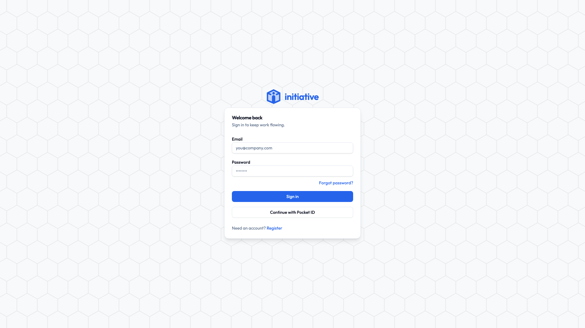

# Create your account

Your account is just you. One of them, and it follows you into every group you join — so no separate login for the book club and the day job.

## Step 1: Open Initiative

Two ways you've probably arrived:

- **Somebody sent you an invite link.** Click it. It already knows which group you're joining, so after you make your account you land straight inside it. This is the easy path and we recommend taking it.
- **Somebody sent you a web address.** Something like `initiative.yourteam.com`. Open it in your browser.

## Step 2: Pick how to sign up

Look for **Create account** (or **Sign up**). You'll have one or two options:

- **Email and password** — the normal one. Carry on to Step 3.
- **Single sign-on** — a button saying something like **Continue with Single Sign-On**. If your work or school set this up, click it, log in the way you already do, and you're finished. No new password. Skip the rest of this page and go and have a nice day.

## Step 3: Fill in the boxes

| Box | What goes in it |
|---|---|
| **Full name** | How you'd like your teammates to see you. Changeable later, so don't agonise. |
| **Email** | One you can actually check — we send a confirmation link there. |
| **Password** | At least **12 characters**. Longer is better. |
| **Confirm password** | The same one again. Yes, really. |

There may also be an **"I'm not a robot"** box. Prove yourself and carry on.

!!! tip "About that password"
    Four random words in a row is both very strong and very memorable, and beats the one with a capital letter and an exclamation mark that you've been quietly reusing since 2016. A password manager is better still, because then you don't have to remember anything at all.

## Step 4: Confirm your email

What happens next depends on how your group set things up:

- **"Check your inbox to verify your email."** Click the link, then sign in. Nothing after a few minutes? It's in the spam folder. It's always in the spam folder.
- **"Pending approval from an administrator."** Your group checks new sign-ups by hand. Nothing for you to do but wait for a human to click a button.
- **You're just let straight in.** Some groups auto-approve anyone with a matching email address — everyone at `@yourteam.com`, say.

??? techspec "For the technically minded — how sign-up is gated"
    Three independent settings, combined however an administrator likes:

    - **Public registration** can be switched off entirely, making invite links the only way in.
    - **An allow-list of email domains** auto-approves sign-ups from trusted domains; everyone else waits for manual approval.
    - **Email verification** confirms the address belongs to whoever typed it.

    The first person to register on a brand-new server becomes the platform **owner**. See [Platform roles](../admin/platform-roles.md).

## Next

You have an account. Go and [sign in with it](signing-in.md).
