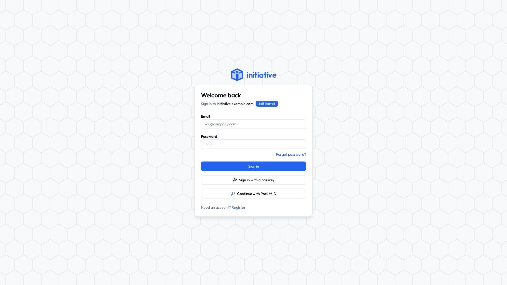
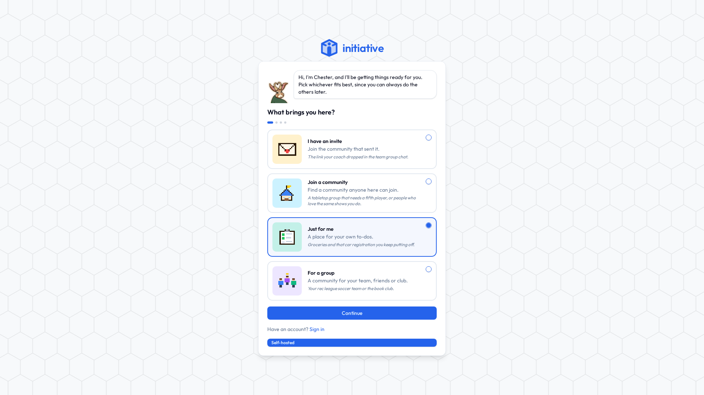

# Create your account

Your account is just you. One of them, and it follows you into every group you join — so there's no separate login for the book club and the day job, and no fourth password to write on anything.

Signing up is a few short questions, then the account. Every question has an answer filled in already, so **Continue** always works, and anything you pick can be changed later. You cannot get this wrong.

## Step 1: Open Initiative

Two ways you've probably arrived:

- **Somebody sent you an invite link.** Click it. It already knows which group you're joining, so it skips straight to your handle and your account, and you land inside the group. This is the easy path and we wholeheartedly recommend it.
- **Somebody sent you a web address.** Something like `initiative.yourteam.com`. Open it and press **Start a community** — it asks first, so this works even if you only came to join one.

## Step 2: Say what you're here for

| Answer | Pick it when | What you end up with |
|---|---|---|
| **I have an invite** | Somebody gave you a code rather than a link. Paste either. | A place in their community. |
| **Join a community** | You'd like to find a group, not run one. | The community directory, open on whatever you said you're into. |
| **Just for me** | You want somewhere for your own to-dos and nobody else's opinions. | A community of one, with a **To do** list ready and waiting. |
| **For a group** | You're the one organising. The team, the committee, the five-a-side, the friends who have been "about to plan that trip" since March. | A community with its first initiative, and an invite link to send round. |

Some servers only take people with an invite. On those you won't see this question at all; you'll be asked for your invite instead.

## Step 3: A couple of questions

Each path asks one or two things — a name for your space, what you're into, what to call the first [initiative](../concepts/index.md). Each has a sensible answer filled in already. Change it, or don't. Press **Continue** either way, or **Skip** where you see it.

**About you** asks for:

- **Your handle.** The name people find you by, with a number on the end that Initiative picks so nobody has to settle for `jordan7`. Stuck? Tap one of the suggestions under the box. Nobody here has those yet.
- **Your timezone.** Guessed from your browser, and usually right.
- **Your date of birth**, on servers that ask for one. Communities anyone can find and join are for people 16 and over, so it's required if you picked **Join a community** and optional otherwise. It's only used to check your age, and it isn't shared with anyone.

Picked **Join a community**? Say where you are, if you like, and the communities near you come first. Nobody else sees it, and nothing far away is hidden. Then choose as many interests as you like, and the directory opens on all of them.

## Step 4: Create your account

Last step. Give your **email**, then choose how you'll sign in:

- **Password.** At least **12 characters**. Longer is better.
- **Passkey.** Your phone or computer unlocks it with a fingerprint, face or PIN, and there's no password to remember.
- **Email me a code.** No password at all. We email you a code whenever you sign in.

The options you see depend on what your server allows. There may also be an **"I'm not a robot"** box. Prove yourself. We believe in you.

!!! tip "About that password"
    Four random words in a row is both extremely strong and genuinely memorable. It comfortably beats the one with a capital letter at the front and an exclamation mark on the end that you have been quietly reusing since 2016.

    A password manager is better still, because then you don't have to remember anything at all, which is the dream.

If your work or school uses **single sign-on**, skip all of this: use **Continue with Single Sign-On** on the [sign-in page](signing-in.md) and you're done.

## Step 5: You're in (or nearly)

- **Straight in.** **Just for me** opens your **To do** list. **For a group** shows your invite link to copy and send. **Join a community** opens the directory.
- **"Check your email."** Click the link in it, then sign in on the same browser, and Initiative finishes setting up what you asked for. Nothing after a few minutes? It's in the spam folder. It's always in the spam folder.
- **"Waiting for approval."** Whoever runs the server checks new sign-ups by hand. Sign in once they've said yes.

??? techspec "For the technically minded — how sign-up is gated"
    Several independent settings, combined however whoever runs the server likes:

    - **Public registration** can be switched off, making invites the only way in. Switching off community creation does the same.
    - **An allow-list of email domains** auto-approves sign-ups from trusted domains; everyone else waits for manual approval.
    - **Email verification** confirms the address belongs to whoever typed it.
    - **The community age question** can be turned off by the platform owner, on a server where every account is known to be an adult.

    The first person to register on a brand-new server becomes the platform **owner**, through a separate setup screen. See [Platform roles](../running-a-server/platform-roles.md).

## Next

You have an account. Next time, [sign in with it](signing-in.md).
