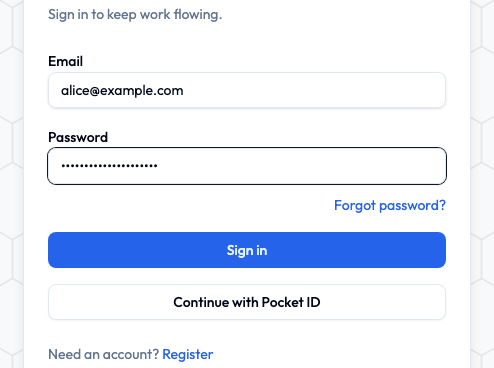

# Signing in

Four seconds, give or take.

## Email and password

1. Open your group's Initiative address.
2. Type your **email** and **password**.
3. Click **Sign in**.

You land on your home screen. Initiative keeps you signed in on that device, so you're not logging in again every morning like it's an online bank.

## Single sign-on

If your work or school set this up, there's a button saying something like **Continue with Single Sign-On**. Click it, log in the way you already do everywhere else, done. No extra Initiative password to forget.

## Forgotten your password?

Happens to everyone, roughly monthly.

1. Click **Forgot password?** on the sign-in screen.
2. Type the email address your account uses.
3. Follow the reset link we send you.
4. Pick a new password (12+ characters) and sign in.

Nothing arriving? Check spam first. Reset links also go stale after a while, so if yours has been sitting in your inbox since Tuesday, just ask for a fresh one.

## The mobile app

The app needs one extra step the first time, because it has to be told *which* Initiative it's talking to. There are lots of them out there and it can't guess.

1. Open the app. You'll get a **Connect to Server** screen.
2. Type in your group's Initiative address — the same one you use in a browser.
3. Sign in with your email and password, or single sign-on.

After that it remembers, and stays signed in.

!!! tip "One account, as many devices as you like"
    Laptop and phone at the same time is completely fine. To see everywhere you're currently signed in — and kick off anything you don't recognise — open **User settings → Security → Logged in devices**. Worth a glance now and then, in the same spirit as checking the smoke alarm.

## Signing out

Click your **name or picture** at the bottom of the sidebar, then **Sign out**.

On a shared or public computer, do this. Every time. The library computer does not need to stay logged into your PTA.

## Next

Now let's find where everything lives — [take the quick tour](a-quick-tour.md).
