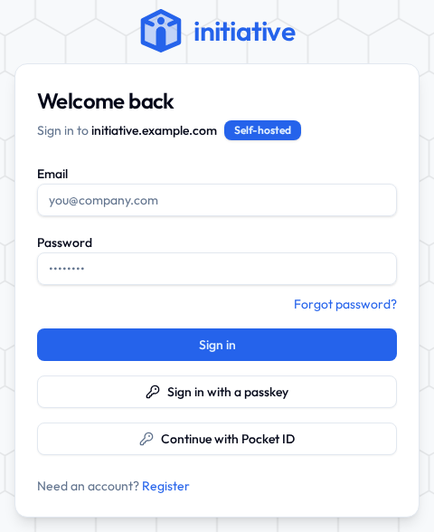

# Signing in

Four seconds, give or take.

## Email and password

1. Open your group's Initiative address.
2. Type your **email** and **password**.
3. Click **Sign in**.

You land on your home screen. Initiative keeps you signed in on that device, so you aren't logging in again every single morning like it's your bank.

The card says which server you're signing in to — **Sign in to** and its address — with a small **Self-hosted** badge beside it. That's the kind of server you're on: one somebody runs for your group, at the address you just opened.

## A code by email

If your group's Initiative offers it, there's an **Email me a code** button. Type your address, and a six-digit code turns up in your inbox. Type that in. You're in.

No password anywhere in that. Nothing to remember, nothing to reset, nothing on a sticky note under the keyboard.

The code lasts ten minutes and works once. Get it wrong five times and it gives up rather than letting you keep going — ask for a fresh one and carry on.

Haven't got an account yet? Same button. The code confirms your address, it asks you to pick a username, and that's the whole thing.

## Single sign-on

If your work or school set this up, there's a button saying something like **Continue with Single Sign-On**. Click it, log in the way you already do everywhere else, done. No extra Initiative password to forget.

## Passkeys

If you've [added a passkey](../account/passkeys.md), press **Sign in with a passkey** — or click into the email box, where most browsers offer it above the addresses they remember. Unlock it the way you unlock the device, and you're in. Nothing typed.

## Forgotten your password?

Happens to everybody. Roughly monthly. There is no shame here.

1. Click **Forgot password?** on the sign-in screen.
2. Type the email address your account uses.
3. Follow the reset link we send you.
4. Pick a new password (12+ characters) and sign in.

Nothing arriving? Check spam first — it's usually spam. Reset links also go stale after a while, so if yours has been sitting in your inbox since Tuesday, just ask for another.

No password to forget, because you sign in with a [passkey](../account/passkeys.md) and the passkey has gone with the phone? **Use a recovery code** on the same screen sets you a new password with one of the ten you were given.

## The mobile app

Haven't got it yet? [Installing the app](install-the-app.md) covers the iPhone, Android and desktop apps, and the home-screen version for everything else. The desktop app signs in the same way.

The app needs one extra step the first time, because it has to be told *which* Initiative it's talking to. There are a lot of them out there and it has no way of guessing which one is yours.

1. Open the app. Under the title it says **Sign in to**, followed by a server. Tap that, choose **Your own server**, type in your group's Initiative address — the same one you use in a browser — and tap **Connect**.
2. Sign in with your email and password, single sign-on, or a passkey. On Android a passkey works right inside the app; on iPhone the browser opens for a moment and hands you back.

After that it remembers, and stays signed in. Moving to a different server works the same way, from the sign-in or sign-up card: tap the server's name, then a new address and another **Connect**. The app keeps the last address you used, in case you want to go back.

!!! tip "One account, as many devices as you like"
    Laptop and phone at the same time is completely fine, and so is the tablet you'd forgotten about.

    To see everywhere you're currently signed in — and boot off anything you don't recognise — open **My Settings → Security → Where you're signed in**. Worth a glance every so often, in roughly the same spirit as testing the smoke alarm.

## Signing out

Click your **name or picture** at the bottom of the sidebar, then **Sign out**.

On a shared or public computer, do this. Every time. The library computer does not need standing access to your PTA.

## Next

Now let's find where everything lives — [take the quick tour](a-quick-tour.md).
