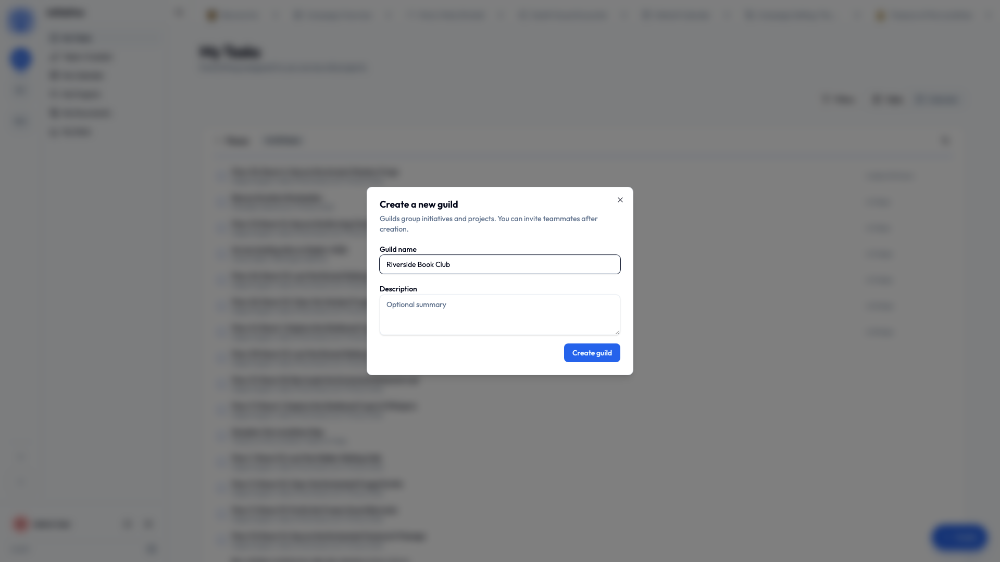

# Your first community

A **community** is a workspace — one separate space for one group of people and everything they're working on. You need to be in one before you can do anything much.

Three ways in: someone **invites** you, you **find** one that's listed itself publicly, or you **make** your own.

## Joining by invite (the usual one)

Most people arrive on an invite link from somebody already in the group.

1. **Open the link.**
2. **Sign in**, or [make your account](create-account.md) if you haven't yet.
3. You're in. The community's icon appears on the rail down the left, and you're on its home screen.

That's genuinely the whole thing.

!!! note "If your link says it's expired"
    Invite links can be set to run out, or to only work a certain number of times. This is the link's fault, not yours, and definitely not a comment on you as a person. Ask whoever sent it for a new one — it takes them about four seconds.

## Finding one yourself

Some communities list themselves publicly so anyone can find them. Hit the **add-a-community** button on the rail and pick **Join a community** — you can browse by category or search by name, then join straight from a community's card. No invite, no waiting for approval.

Don't see a **Join a community** option? Then this server hasn't switched that feature on, and everything here works by invitation. Nothing's wrong. More in [Finding a community to join](../guides/communities.md#finding-a-community-to-join).

## Making your own

Starting fresh for your own group? You can create a community yourself, as long as your server allows it.

1. On the **community rail** down the left edge, choose **Create community** (look for the **+**).
2. Give it a **name** — usually just what your group is actually called. "Fairview Bakery". "PTA Committee". "The Nguyens".
3. Add an **icon** while you're there. Once you're in three communities, that rail of tiny pictures is the only thing standing between you and posting the surprise party plans in the work one.
4. Create it. Congratulations, you're an administrator.

!!! info "No 'Create community' button?"
    Some servers turn that off deliberately, so everybody joins through invites instead. Ask an administrator to invite you, or to make one for you.

## What a brand-new community comes with

A **Default Initiative** — a ready-made folder, so you're not staring at a beautiful empty screen wondering what on earth the first move is meant to be.

Rename it, ignore it, add more later. It's yours.

The natural first thing to do:

1. Open the **Default Initiative** in the sidebar.
2. Click **Create Project**, give it a name, and there's your first board.

Put some tasks on it. That's a working setup — everything else in these guides is optional extra.

## Switching between communities

You can belong to as many as you want — work, the volunteer thing, your family — and they stay completely separate from each other.

Click a community's icon on the rail and the whole app moves over with you: sidebar, projects, documents, everything. Nothing leaks between them, ever, in either direction.

??? techspec "For the technically minded — a community is a hard boundary"
    Each community's content lives in its own database schema, created with the community, and a request is routed into exactly one of them — so reads and writes reach only communities you belong to, enforced at the database level rather than in the interface. Two browser tabs can sit in two different communities at once with no crossover. See [How your data is kept separate](../security/how-your-data-is-kept-separate.md).

## Next

You're in. Either build a mental picture with [how Initiative is organized](../concepts/index.md), or skip it entirely and go straight to the [how-to guides](../guides/index.md).

Both are completely valid life choices and we won't ask which you picked.
