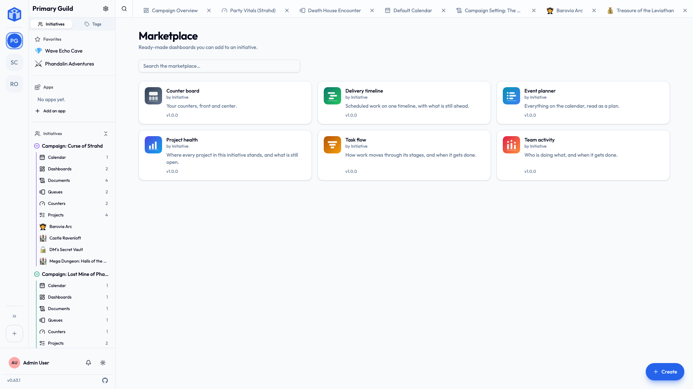
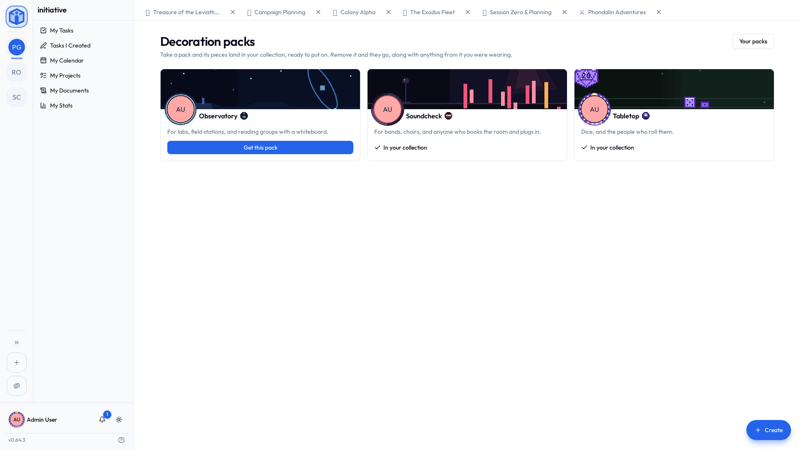

# Apps & the marketplace

The tool your group needs has usually been needed before, by a group with the same problem. The **marketplace** is where those tools live: ready-made dashboards and apps you can add to your workspace in a couple of clicks, without a developer and without waiting for a new version of Initiative.

Your marketplace holds the listings that ship with Initiative, plus any that the person running your server has added and approved. It isn't an open upload pool — nothing reaches your marketplace without them putting it there.

## Two marketplaces

There are two, and the difference is who gets what you take.

| | **Your community's** | **Yours** |
|---|---|---|
| What's on it | Dashboards and apps | Decoration packs |
| Who it's for | Everyone in that community | You, in every community you're in |
| Where to open it | **Browse the marketplace** on your dashboards list, or the **Apps** section of the sidebar | **Browse the marketplace** on **User settings → Profile** |

## Your community's marketplace

| | **Dashboards** | **Apps** |
|---|---|---|
| What it adds | A screen of charts, numbers, and timelines | Something the whole community shares |
| Where it goes | Into one initiative | Into the community |
| Who can add it | Anyone who can create dashboards in that initiative | Community admins only |

Both are browsed the same way: search, open a listing to read what it does, then add it.

## Adding a dashboard

A **dashboard** displays your data on one canvas — task counts, project progress, upcoming calendar entries, counters. Dashboards are read-only by design: nothing you see on one can be edited from it.

1. Open the listing and choose **Add to an initiative**.
2. Pick the **initiative** it should live in.
3. Give it a **name** — the listing's name is filled in, and you can change it now or later.

It then appears under that initiative's **Dashboards**, exactly like one you built yourself. You can rename it, tag it, share it, and delete it like any other tool.

!!! info "Don't see any initiative to choose?"
    You can only add a dashboard where you're allowed to create one. If the list is empty, ask an initiative manager to give your role the dashboard permission — see [Initiative roles](../sharing/initiative-roles.md).

### Previews

A listing's page can show a **preview** of the dashboard, drawn with sample data so you can see the shape of it before you commit. What you add will show your group's real numbers instead.

### Updates

When the publisher releases a newer version, the dashboard shows **Version X available**. Updating is a choice you make — nothing changes underneath you. If a listing needs a newer version of Initiative than your server is running, it says so rather than half-working.

## Adding an app

An **app** adds something to the community as a whole rather than to one effort — a shared surface, extra dashboard widgets, or a connection to a service your group already uses. Because it affects everyone, **only community admins can add or remove one**.

1. Switch the marketplace to the **Apps** shelf and open a listing.
2. Choose **Add to community** and name it.
3. If the app needs setting up, it's marked **Needs setup** — open its settings to finish.

The Apps shelf lists the apps your server actually runs. An app is served by a program the person running your server sets up, so one they haven't set up — or have switched off — isn't offered here at all. If you were expecting a particular app and can't find it, they're the person to ask.

Installed apps appear in the **Apps** section at the top of the sidebar, above your initiatives, and are managed under **Community settings → Apps**.

### Setting an app up

Some apps need a credential before they can do anything — an API key, or a sign-in to another service. There are two kinds, and the difference matters:

- **Community credential** — set once by a community admin, used for everyone. Good for a shared account the whole group works through.
- **Your account** — each member supplies their own, and it's used only for them. Your credential is yours; other members can't see or use it.

Each connection shows which service it uses and what it's allowed to do there, so you can decide before you supply anything.

### Turning an app off, and removing it

- **Turn off** hides an app from everyone while keeping its setup. Turn it back on and it picks up where it left off. Disabled apps stay visible in **Community settings → Apps**, which is where an admin turns them back on.
- **Remove** takes it out of the community entirely. Anything it created moves to the **Trash**, where it can still be restored during the retention window. Every credential it held — the community's and each member's — is deleted, and the app is told to stop using them.

## Your own marketplace

Your marketplace holds **decoration packs** — sets of artwork for your profile. A pack carries a banner, a frame for your picture, and a badge, built around one thing a group of people has in common: **Tabletop** for the table that rolls for it, **Soundcheck** for bands and anyone who books the room and plugs in, **Observatory** for labs, field stations and reading groups with a whiteboard.

What you take here is yours rather than your community's. Download a pack in one community and you are wearing it in all of them, because your profile belongs to you.

1. Open **Browse the marketplace** on **User settings → Profile**.
2. Open a pack to see the profile it would make — the banner running, the frame around your own picture, the badge beside your name.
3. **Get this pack**, and its pieces land in your collection.

Downloading a pack does not put anything on you. It gives you the pieces; you choose which to wear back on **User settings → Profile**, and you can mix pieces from different packs however you like. See [Profile & preferences](../account/profile-and-preferences.md#decorations).

## Where listings come from, and what they can reach

Every listing in your marketplace got there one of two ways:

- It **ships with Initiative** — part of the built-in catalog, credited to Initiative. That credit can't be claimed by anything else.
- Your **platform owner added it** — the person who runs your server chose that listing and published it to your deployment. If you run Initiative yourself, that person is you.

There's no third way in. Anyone can write a listing, but reaching *your* marketplace is a decision your platform owner makes, one listing at a time. See [Publishing your own listings](../admin/publishing-listings.md).

Every listing also shows **who published it** — on the card, on its page, and in the dialog where you add it — so the question is answered at the moment you're deciding.

Two things stay true whatever you install:

- **Your access rules still apply.** A dashboard shows *you* only the data you could already reach — the same community, initiative, role, and sharing checks as everywhere else. Two people looking at the same dashboard can correctly see different numbers.
- **Widgets run in a sandbox.** Marketplace widgets run in an isolated runtime that can only return something to draw. If one misbehaves, that tile shows an error and the rest of the page carries on.

## Related

- [Profile & preferences](../account/profile-and-preferences.md) — wearing what a decoration pack gave you.
- [Tools](tools.md) — the calendar, queues, counters, and dashboards built into every initiative.
- [Sharing & access](../sharing/index.md) — who can see what you add.
- [Publishing your own listings](../admin/publishing-listings.md) — for administrators adding listings to their server's marketplace.
