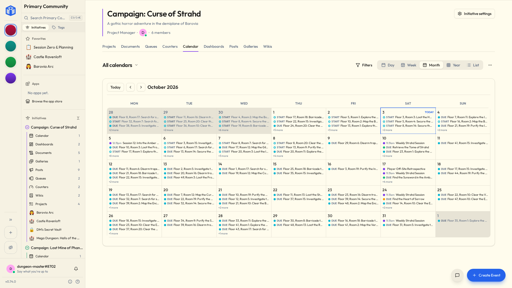

# Calendar & events

The calendar is for things that happen at a time: meetings, rehearsals, deadlines, shifts, performances, and the AGM that nobody wants to attend but everybody has to.

Tasks have dates too, and they turn up on your [personal calendar](your-space.md#my-calendar) alongside events. The difference: a task is something *you do*, an event is something *you turn up to*. Some weeks the second category is more restful.

## Creating an event

On an initiative's **Calendar**, click a slot and **Create Event** opens. On a phone, the **+** at the bottom of the screen opens it too. You can set:

| | |
|---|---|
| **Title** | What it is. |
| **Description** | The detail — agenda, what to bring, where to park. |
| **Location** | A place, or a link for anything online. |
| **Start and end** | Or tick **all day** and skip the times. |
| **Color** | So rehearsals and meetings are distinguishable at a glance. |
| **Attendees** | The people invited. |
| **Repeat** | If it happens more than once. See [Repeating events](#repeating-events). |

To make another one like an event you already have, open it and use **Duplicate** under its title. The copy invites the same people afresh. On a repeating event opened at one of its dates, Initiative asks whether you mean that date, which becomes an event of its own, or the whole series, which brings the dates you changed on their own with it.

## Repeating events

Pick **Repeat** and choose daily, every weekday, weekly, monthly or annually. **Custom…** covers the awkward ones: the second Tuesday, the last Friday, the first weekday of the month, the 1st and the 15th.

The form lists the next few dates underneath, so you can check it means what you meant before twelve people turn up on the wrong Tuesday. **Ends** stops it on a date, after a number of times, or never.

Every date shows on the calendar, and every date sends its own reminder.

### Changing one date

Move, rename, re-invite or delete a repeating event — in its settings, or by dragging it on the calendar — and Initiative asks which dates you mean:

| | |
|---|---|
| **Just this event** | This date changes. The rest carry on as they were. |
| **Events after this point** | This date and everything after it. The earlier ones stay as they happened. |
| **All events in the series** | The lot. |

A few more things live on a repeating event:

- **Skipped dates.** Deleting just one date skips it. The event's settings list every skipped date with **Restore** beside it, for when the cancelled rehearsal turns out to be happening after all.
- **Extra dates.** **Add a date** puts in a one-off, like the bonus session the week before the show.
- **Make this its own event** lifts one date out of the series entirely. It keeps everything it had, and the series skips that date.

A date changed on its own says so at the top, with **Open the series** to get back to the rest.

## RSVPs

Invited people answer **Accepted**, **Declined**, **Tentative**, or leave it sitting at **Pending**. You get to see who's actually coming, which is the entire reason anybody sends an invitation in the first place.

Pending isn't a rude answer, incidentally. It's the default, and it nearly always means "haven't opened it yet" rather than "am refusing to engage".

On a repeating event, each date gets its own answer. Accepting one Tuesday is not accepting every Tuesday until the end of time.

Anyone who can see an event can RSVP to it, and answering adds them to the attendees. For a guest list rather than an open door, turn off **Anyone who can see it may RSVP** under the event's **Settings → Attendees**: then only the people you added can answer. A repeating event's dates all follow the series.

## Reminders

Each person sets their **own** reminder on an event: at the start, or a chosen number of minutes, hours or days beforehand.

Yours doesn't affect anybody else's — so the person who needs an hour's warning and the person who needs three days and a follow-up can both be accommodated without negotiating.

Reminders run on **your timezone**, which Initiative guesses from your browser when you sign up and usually gets right.

If your reminders are arriving at genuinely baffling hours, this is the thing to check: **My Settings → Preferences**.

## Views, importing and exporting

See your events by **day, week, month, year, or as a list**.

The page's title picks which calendars to show. It reads **All calendars**, a count, or the one calendar's name, so you can tell at a glance when something's switched off. That choice is yours alone — hiding the five-a-side fixtures does not hide them from the people actually playing five-a-side.

Dated tasks from the initiative's projects show up too. **Project tasks**, under **Filters**, turns them off, and the same panel narrows them by status and priority.

Events **import and export as standard `.ics` files**, which every other calendar app on earth speaks.

| To export | Where | Who |
|---|---|---|
| The events you can see | **Export · iCalendar (.ics)** in the page's **More actions** menu, beside **Import .ics**: every date of the calendars on screen, in one file | Anyone who can see them |
| A whole calendar | That calendar's **Settings → Advanced**, which also offers a file Initiative can import back | Whoever could also delete it |

So you can pull a whole season's fixtures in at once, or push the rehearsal schedule straight into everyone's phone calendar — including the members who will never, under any circumstances, open Initiative.

Repeats go both ways too, with their skipped dates and any date changed on its own.

??? techspec "Repeats in files and the API"
    A repeat is an RFC 5545 rule (`RRULE`, with `EXDATE` for skipped dates and `RDATE` for extra ones), kept in UTC. In an `.ics` file, a date changed on its own is a second `VEVENT` with the series' `UID` and a `RECURRENCE-ID`. Over the API, `PATCH` and `DELETE` on a repeating event take `scope` (`this`, `following`, `all`) and the `occurrence` they start from.

!!! tip "The one calendar that knows everything"
    [My Calendar](your-space.md#my-calendar) gathers events *and* dated tasks from every community you're in, on one screen.

    If you belong to three groups that each quietly believe their thing is the only thing happening in your week, this is the page that settles the argument.

## Calendars for the whole community

Some things belong to everybody rather than to one effort: bank holidays, the monthly social, game nights, the fortnight when the office is shut and nobody can find out why.

Those go in the **Community calendar** plug-in, which a community admin adds from the [marketplace](plugins-and-marketplace.md). It shows up in the sidebar's Plug-ins section and opens on every calendar the community shares, overlaid in one view.

It arrives with one calendar, and community calendars belong to the admins: only an admin sees **New Calendar** there. One for holidays, one for socials, one per team, as many as the community needs. A new one starts readable by *everyone in the community*, and members add events to the calendars shared with them. So a community calendar is a way to post a schedule that everybody follows and nobody can accidentally edit.

Pick which ones you see from the title, the same as anywhere else.

Community calendars hold the community's own events and nothing else — no tasks, no project work. Removing the plug-in sends all of its calendars to the trash together, where they can be recovered.

## Sharing and comments

Calendars share like every other tool: **Viewer**, **Editor**, **Owner**, or open to the whole initiative, with bulk editing from the list view. Each calendar has its own comment thread, switchable off under **Settings → Details**.

## Related

- [Your space](your-space.md#my-calendar) — everything you're expected at, in one place.
- [Notifications](notifications.md) — event invites and reminders.
- [Plug-ins & the marketplace](plugins-and-marketplace.md) — where the community calendar comes from.
