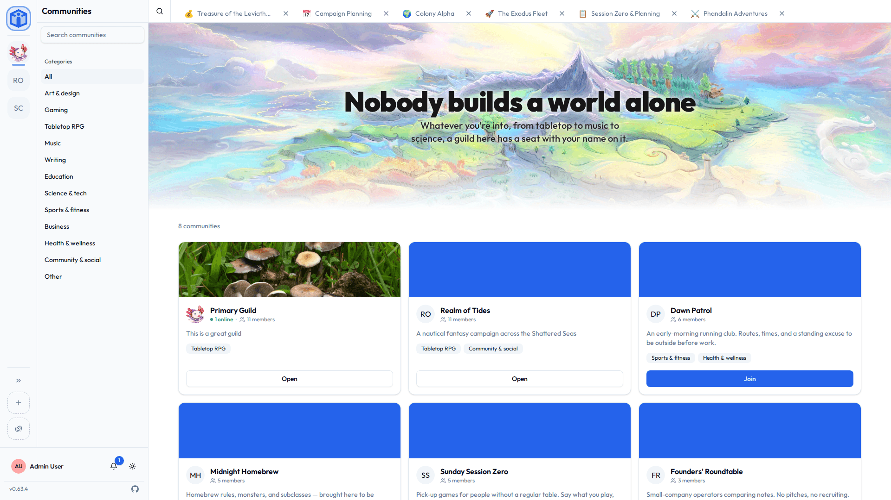
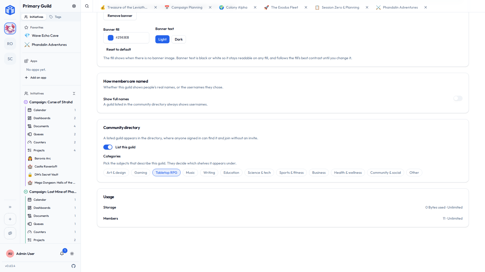

# Working with communities

A **community** is your group's workspace. This page covers moving between them, getting people in, and — if you're the one running it — keeping the place from descending into chaos.

Not in one yet? Start with [Your first community](../getting-started/your-first-community.md).

## Switching between communities

The **community rail** runs down the far-left edge of the screen: one icon per community, with the highlighted one being where you currently are. The **Initiative logo** above them takes you to [your own corner of things](your-space.md).

Click any icon to switch. Everything follows you over — sidebar, initiatives, projects. Each community is completely independent; work, people and settings never cross between them.

!!! tip "Two communities at once"
    Open Initiative in two browser tabs and each one can sit in a different community, quite happily, simultaneously. Useful on the days when the work team and the volunteer thing both want you and neither will be reasoned with.

The rail also keeps up with itself. If an admin adds you somewhere, or a group login sync brings you in, or a community you're already in lists itself publicly, the rail updates where you're standing. No reloading.

## The community front page

Opening a community drops you on its front page. Its tools run across the top as circles — pick one, and you get everything of that kind that's reached **you**: shared with you directly, with a role you hold, or with everyone in an initiative you're in.

Only the tools your initiatives actually use turn up, so a community that has never once needed a queue is not given a Queues circle to look at and feel vaguely guilty about.

**Search** narrows by name; the **Name**, **Initiative** and **Last updated** headers sort. Both reach everything in the community, not just the rows on screen, so nothing hides on page two. All of it lives in the web address, so you can bookmark or send the exact view you're on.

Community admins get the same page. Their authority is unchanged — open any initiative and they see all of it — but the front page is a reading list, not an inventory of everything in existence.

## Finding a community to join

Most communities are private, and you get in by invitation. Some list themselves publicly, and those you can find on your own.

Hit the **add-a-community** button on the rail and choose **Join a community**. That opens the **community directory**: a card per listed community, with its description, categories, member count, and how many are online right now.

Search by name, browse by category, and **join straight from the card** — no invite, no waiting, no approval queue, no email that arrives four days later. You're a member the moment you click.

What you searched and which shelf you're on live in the address, so a filtered directory view is a link you can send somebody.

The first time you join a listed community, you'll be asked your date of birth. Listed communities can be found by anyone signed in, so they're open to people you've never met, and you need to be **13 or older** to take part. You're asked once, ever, and then never again.

!!! info "The date isn't kept"
    We work out whether you're old enough and then throw it away. Your account records *that* you answered, never what you said. It isn't sold, shared, or stored anywhere.

    Only the parts of Initiative open to people outside your own communities ask at all — a private community never does, and neither does an invite into one. See [Data and compliance](../security/data-and-compliance.md).

!!! info "Not every server has a directory"
    It's a server-wide feature that starts switched **off**. If there's no **Join a community** button, this server hasn't turned it on and everything here is invite-only. That's the platform owner's call — see [Configuration](../admin/configuration.md).

## Listing your community (admins)

From **Community settings → Community**:

1. Turn on **List in the community directory**.
2. Pick at least one **category**. This is how people find you, so pick what you're genuinely for.
3. **Certify** that the community holds no adult or illegal content.

You can unlist at any time. Everything carries on exactly as before; it just stops appearing to strangers.

That certification is the entire content rule — if you can't honestly tick it, you don't get listed. One other thing keeps a community out regardless: a **member limit of one**, because then there'd be no seat for anyone to take. (Nearly full is fine. It's the limit itself that has to leave room.)

!!! tip "Give new arrivals somewhere to land"
    A listed community whose initiatives are all invite-only leaves every newcomer looking at a beautiful, entirely empty page, quietly wondering what they did wrong on the way in.

    Initiative spots this and tells you, with the fix attached: mark one initiative **open** so people can join it themselves, or **auto-join** so they simply arrive already inside it. See [How people join an initiative](initiatives.md#how-people-join-an-initiative).

## Inviting people (admins)

1. **Community settings → Users**.
2. Create an **invite link**.
3. Optionally limit it:
    - **Max uses** — how many people can get in on this one link.
    - **Expires in (days)** — when it stops working.
4. **Copy it** and send it however you like. Email, chat, read it aloud down the phone.

Anyone who opens it joins after signing in or making an account.

## Member roles

| Role | What they can do |
|---|---|
| **Member** | Take part in the initiatives and projects they're added to. |
| **Admin** | All of that, **plus** run the community: members, invites, initiatives, settings. An admin can see and manage everything in their community. |

Promote and demote from **Community settings → Users**.

Promoting somebody also lifts the **initiative roles they already hold** — every initiative they're in moves them up to project manager, so the app starts treating them as the authority they now actually are. They get told when somebody asks to join, and waiting requests show up on the front page. A membership left behind by an older promotion can be fixed from that initiative's **Members** tab.

### What the member list shows

The things a community actually manages: **handle**, **name** (in communities that show real names), **community role**, whether the membership came from a group login sync, the member's standing, and when they joined. **Export all as CSV** gives you the same columns.

A member's platform role and whether they've confirmed their email address aren't a community's business, so they're in neither the list nor the CSV. Platform-wide user management lives in the [admin dashboard](../admin/platform-roles.md#managing-platform-users).

!!! note "Community admin is not the same as running the server"
    Being an admin of *your* community gives you total control of that community — and precisely no control over the server or anybody else's community. Server-wide roles are a separate thing entirely: see [Platform roles](../admin/platform-roles.md).

## Community settings (admins)

Open **Community settings** from the sidebar or the rail:

| Tab | What's in it |
|---|---|
| **Community** | Name, description, icon and banner (square, up to 512 KB), and the directory listing. |
| **AI** | Optional AI settings — see [AI features](../account/ai-features.md). |
| **Users** | Members, roles, invite links. |
| **Authentication** | Single sign-on for this community, where your server offers it. |
| **Initiatives** | Create and manage the community's initiatives. |
| **Apps** | Installed apps — see [Apps & the marketplace](apps-and-marketplace.md#adding-an-app). |
| **Trash** | Recently deleted things, restorable. |
| **Data** | Export the whole community, and re-download a finished export. |
| **Danger zone** | The stuff you can't undo. |

### Trash and retention

Deleted things go to the community **Trash** first, where an admin can bring them back. You set how long they hang around — a number of **days**, or **never auto-purge** to keep them indefinitely.

This is the setting that quietly saves somebody's entire afternoon roughly twice a year. Be generous with it. Nobody has ever regretted a long retention window at the exact moment they needed one.

### The danger zone

The hard-to-undo things, chiefly **deleting the community**.

That permanently removes *everything* — initiatives, projects, tasks, documents, members, the lot — and you'll be made to confirm properly, including retyping things by hand.

The friction is entirely deliberate and we're not sorry about it. Only come here when you genuinely mean it, and ideally not at 11pm.

??? techspec "For the technically minded — what community deletion does"
    It removes the community's isolated database area and the database roles tied to it, then cleans up the shared records connecting people to it: memberships, invites, single-sign-on mappings, access grants. Thorough and final. If you only want *out* of a community, **leave** it from the rail instead — that removes just you.

## Leaving a community

On the **community rail**, open the community's menu and choose **Leave community**. That removes you and nobody else. Everyone carries on without you, which is either a relief or mildly wounding depending on the day you're having.

If you're the *last administrator*, you'll be made to promote somebody first. Walking out and leaving a community with nobody in charge is a favour to no one, least of all the person who eventually notices.

## Related

- [Initiatives](initiatives.md) — organising work inside a community.
- [Sharing & access](../sharing/index.md) — who can see what.
- [Security & privacy](../security/index.md) — how communities stay separate.
