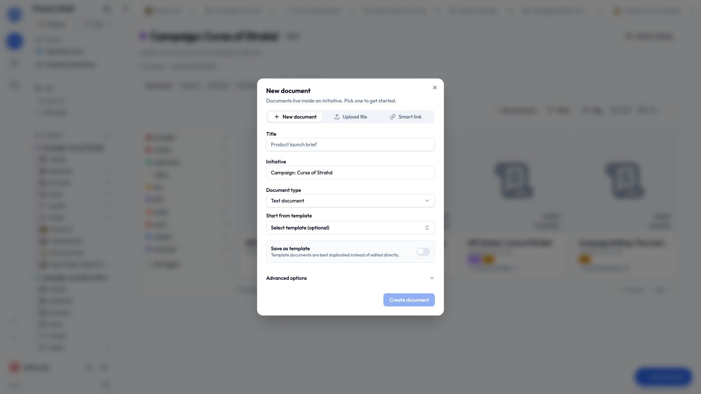
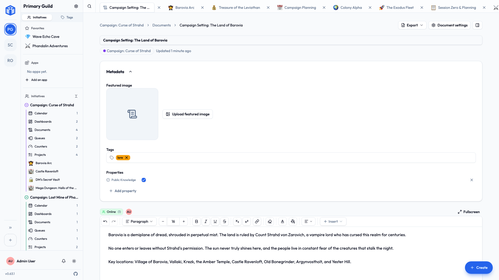

# Documents

A **document** is where your group writes things down — notes, plans, scripts, budgets — and keeps its files. Documents live inside an initiative, and most kinds can be edited by several people **at once**, live, with no versions emailed round and no `final_v3_ACTUAL_final` anywhere.

## Kinds of document

| Type | What it's for |
|---|---|
| **Text document** | A rich-text page, like a word processor. Notes, plans, write-ups. |
| **Spreadsheet** | A grid with formulas. Numbers, lists, tables. |
| **Whiteboard** | A free-form canvas for sketching ideas and diagrams. |
| **Smart link** | An embedded view of something that lives somewhere else — a video, a shared file. |
| **Upload** | A file: PDF, Word, Excel, PowerPoint, text, images, and more. |

!!! info "50 MB per uploaded file"
    Enough for almost anything that isn't video. For the things that are, use a **Smart link** to point at wherever it already lives.

## Creating one

1. In an initiative (or from **My Documents**), choose **Create Document**.
2. Pick the **type**.
3. Give it a **title** and confirm the **initiative**.
4. Optionally start from a **template**.
5. Write (or upload).

## Writing a text document

The editor has what you'd expect: **formatting** (bold, italic, underline, strikethrough, super/subscript, inline code), **blocks** (headings, quotes, code blocks), **lists** (bulleted, numbered, checklists), **alignment**, **insert** (images, tables, dividers, embedded video), and undo/redo.

Everything **autosaves**. There is no save button, which means there is no save button to forget.

Four keys do more than they look:

- `@` mentions a person.
- `#` links to anything in the initiative. See [Mentions & links](mentions-and-links.md).
- `[[` links to another document, and offers to make one if the name is new.
- `/` opens the insert menu — images, tables, embeds, and [smart chips](#smart-chips).

## Smart chips

A link tells you something exists. A **smart chip** tells you what it's doing *right now*, and keeps telling you without anyone maintaining it.

Type `/` in a text document and pick one, or choose **Smart chip** from the toolbar's insert menu. Either way the picker opens on the work you edited most recently, so there's usually nothing to type.

| Smart chip | Shows |
|---|---|
| Task status | The column it sits in, in that project's color |
| Task assignee | Who's holding it |
| Task due date | When it's due — red once that's passed, unless the work is finished |
| Task priority | How urgent it was marked |
| Counter value | The current number, against its target where it has one |
| Event date | When it happens, dimmed once it has |

The chip carries the reading itself, so your sentence keeps its shape:

> Ship the release — **In progress** · **12 Sep**

Hover for what the thing is called now, what kind of thing it is, and which of its facts you're looking at. Click to open it.

Move that task to Done and the chip turns green — here, and in every other document that mentions it, with nobody editing a word. Meeting notes that are still true a month later, more or less by accident.

Smart chips are a text-document thing. A whiteboard holds shapes and a spreadsheet holds cells; there's nowhere for a chip to sit.

!!! note "What other people see"
    A chip shows what *you* can see. If a document mentions a task in a project nobody shared with you, the chip shows the name it had when it was written and nothing about its state.

!!! tip "Exports show the words, not the chip"
    A chip can't keep itself current inside a PDF or a Word file, so an export shows the name the thing had when the chip was written.

## Spreadsheets

The everyday essentials:

- **Formulas** — `SUM`, `AVERAGE`, `MIN`, `MAX`, `COUNT`, `IF`, `ROUND`.
- **Formatting** — fonts, colors, alignment, and number formats (plain, number, currency, percent, date).
- **Freeze** rows or columns so headers stay put.
- **Import and export** as CSV or Excel (XLSX).

## Whiteboards

A free-form canvas for the thinking that refuses to be a paragraph — a floor plan, a seating chart, who-does-what, boxes and arrows that made complete sense at the time.

- **Draw anything** — shapes, arrows, freehand lines, text, images, arranged however you like.
- **Work on it together** — everyone's pointer shows up live with their name on it, so you can point at the same thing at the same time.
- **Go fullscreen** when the canvas wants the whole window.
- **Export as a picture** — **PNG** or **SVG**, for a slide deck, an email, or a printout.

Whiteboards autosave like everything else, and are shared, tagged and commented on exactly like any other document.

## Editing together, live

- **Real-time editing** — open the same document as someone else and you see their changes as they type.
- **Autosave** keeps it current without anyone hitting save.
- **Offline-friendly** — if your connection drops you can keep working, and it syncs when you're back.

!!! tip "You'll see who else is here"
    Initiative shows who else is viewing or editing, so nobody rewrites the same paragraph twice in opposite directions.

## Comments and mentions

Open a document's **Comments** to discuss it without touching the content. Reply to build a thread; edit or delete your own. The thread runs the full width of the page, underneath the document — same place it sits on every other kind of page.

To pull someone in, type `@`. To point at something rather than someone, type `#` and pick any project, task, document, queue, counter, calendar event or dashboard in the initiative. See [Mentions & links](mentions-and-links.md).

### Reactions

Every comment has a row of **reactions** and a button to add one — a way to answer without writing a reply. Agreement, thanks, "seen it."

- Click the button to pick an emoji. Common suggestions first, every emoji searchable underneath.
- Click a reaction someone already added to join it; click again to take yours back.
- Hover to see who added it.

Anyone who can reply can react. The author is notified — as a periodic summary rather than one ping per thumbs-up, and only if they've left that switch on under [Notifications](notifications.md).

!!! tip "Turning comments off"
    Every tool — documents, projects, queues, counters, calendars, dashboards — has a **Disable comments** switch under **Settings → Advanced**. It takes the thread off that item's page; nothing is deleted, and it all comes back if you switch it on again. Tasks are unaffected: a task keeps its own comments whatever its project says.

## File documents and version history

Uploaded files keep a **version history**. Upload a new version and the older ones stay available, each marked with its date, so you can always get back to an earlier copy.

## Attaching documents to a project

A document can be **attached** to a project so the reference sits next to the work. From a project, choose **Attach existing** — or create a new one to attach.

## Document settings

- **Details** — tags and metadata.
- **Access** — who can view, edit, or own it. Levels are **Viewer**, **Editor**, **Owner**. See [Sharing](../sharing/sharing-projects-and-documents.md).
- **Advanced** — save as a template, duplicate, copy to another initiative, delete.

## Templates

Made a layout you'll reuse — a meeting-notes format, a project brief? Save it as a **template** and start fresh copies from it. Templates are copied rather than edited, so the original stays pristine.

## Related

- [Sharing projects & documents](../sharing/sharing-projects-and-documents.md) — control who sees each one.
- [Tags](tags.md) — organize with labels.
- [Mentions & links](mentions-and-links.md) — refer to people and other work.
- [Your space](your-space.md) — find all the documents that are yours.
