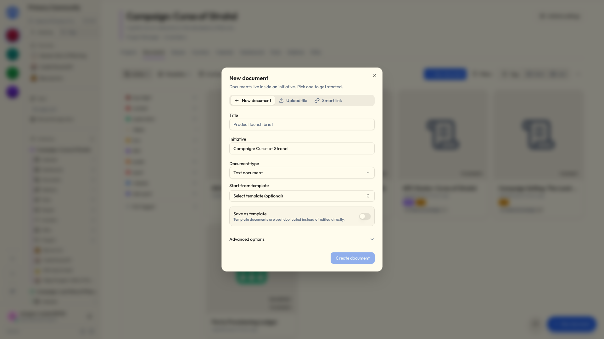
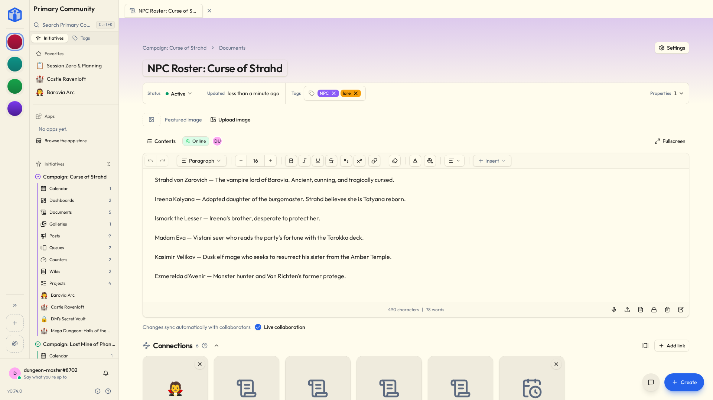

# Files

**Files** is where your group writes things down — notes, plans, scripts, budgets — and keeps the things it's been sent.

Files live inside an initiative, and most kinds can be edited by several people **at the same time**, live.

No emailing versions round. No `final_v3_ACTUAL_final.docx`. No wondering whether Dave is working on the old one.

## Kinds of file

| Type | What it's for |
|---|---|
| **Text document** | A page you write on, like a word processor. Notes, plans, write-ups. |
| **Spreadsheet** | A grid with formulas. Numbers, lists, tables. |
| **Whiteboard** | A blank canvas for sketching things out. |
| **Smart link** | An embedded view of something that lives somewhere else — a video, a shared file. |
| **Upload** | Something from your computer: PDF, Word, Excel, PowerPoint, images, and more. |

Got the file on your desktop already? Drag it anywhere onto the files
page — any view — and **New file** opens on the **Upload file** tab with it
ready to go. Or drop it on the box in that tab instead of hunting for it in a
file picker.

!!! info "50 MB per uploaded file"
    Plenty for almost anything that isn't video. For the things that are, use a **Smart link** to point at wherever it already lives instead.

## Making one

1. In an initiative, choose **New file**.
2. Pick the **type** — or the **Upload file** or **Smart link** tab.
3. Give it a **title** and confirm which **initiative** it belongs to.
4. Optionally start from a **template**.
5. Write. Or upload. Or draw.

## Writing a text document

The editor has what you'd expect: **bold, italic, underline**, headings, quotes, code blocks, bulleted and numbered lists, checklists, alignment, images, tables, columns, dividers, embedded video, and undo for when you change your mind.

Everything **autosaves**. There is no save button — which means there is no save button to forget to press at 11pm, and no version of this evening where you lose forty minutes of work to a browser tab.

A few keys do more than they look like they do:

- `@` mentions a person.
- `#` links to anything in the initiative. See [Mentions & links](mentions-and-links.md).
- `[[` links to another file — and offers to make one if the name is new.
- `.
- `/` opens the insert menu: images, tables, callouts, statuses, drawings, diagrams, embeds, and [smart chips](#smart-chips).

A few pieces are worth knowing by name:

| | |
|---|---|
| **Callouts** | A coloured panel for the thing nobody should miss — **Info**, **Note**, **Tip**, **Success**, **Warning** or **Error**. Unlike a quote it holds anything: lists, code, a table. Click its icon to change the kind, or to take the panel away and keep the words. The arrow in its corner folds the panel down to its first line — put a title there and a long aside becomes one line until somebody wants it. |
| **Statuses** | A word in a coloured pill — *Done*, *Blocked*, *Waiting on legal* — set by hand. Click one to change the word or the colour. For a status that keeps *itself* up to date, use a [smart chip](#smart-chips). |
| **Merged cells** | Drag across cells in a table and **Merge cells** from the table menu joins them into one; **Unmerge cells** splits it back. For the header that sits over three columns, and the row label that runs down two. |
| **Drawings** | A small whiteboard inside the page. Draw it, save it, and it sits there as a picture. **Edit drawing** opens it again. |
| **Diagrams** | Flowcharts, sequence diagrams and friends, written as text in [Mermaid](https://mermaid.js.org/) and drawn as you type. **Diagram** in the `/` menu starts one; any code block set to Mermaid is drawn the same way. Someone reading the page sees the picture, and the code stays out of their way. |

The **Markdown** button at the bottom of the editor shows the whole page as markdown and back. Callouts are written the way Obsidian writes them (`> [!warning]`, and `> [!warning]-` when folded), merged cells the way MultiMarkdown does (`||` and `^^`), columns as Pandoc's fenced divs (`:::: {.columns}`), a drawing as its scene in an `excalidraw` code block, a `#` link as `[[task:12|Roll call]]`, a smart chip as the same with the fact it shows (`[[task:12:status|Roll call]]`) and a mention as `@[Ada](4)`, so all of it survives the round trip — and a file from those tools pastes in and comes out right.

!!! note "Drawings in exports"
    A Markdown export keeps each drawing the same way. Word and PDF leave drawings out: a drawing is redrawn by the browser every time it's shown, and a printed page has no browser in it.

A long text document has a **Contents** list of its headings, nested the way you wrote them. Pick one and the page scrolls there; it marks where you are as you read. It's closed until you open it, and then it stays open.

Pictures keep their captions. Click a picture to see it full size, and zoom in with a pinch, a double-tap, ++ctrl++ and the scroll wheel, or the buttons along the top.

Pictures in a text document belong to its initiative, and open for anybody in it. Paste a picture from another initiative's file and this one keeps its own copy.

### The featured image

A file can lead with a **featured image**, running across the top. Anyone who can edit the file can **Replace** or **Remove** it, and a file without one has a row at the top to add one with **Upload image**.

Already have the picture in the page? Select it and choose **Make this the featured image**. Uploading a picture with **Insert › Image** offers a box that does the same.

## Smart chips

A link tells you something exists. A **smart chip** tells you what it's *doing right now*, and keeps telling you without anybody maintaining it.

Type `/` in a text document and pick one, or use **Smart chip** in the toolbar's insert menu. The picker opens on whatever you were working on most recently, so usually there's nothing to type.

| Smart chip | Shows |
|---|---|
| Task status | The column it's sitting in, in that project's colour |
| Task assignee | Who's holding it |
| Task due date | When it's due — turning red once that's passed, unless it's finished |
| Task priority | How urgent somebody said it was |
| Task checkbox | A box and the task's name. Tick it and the task itself is done |
| Counter value | The current number, against its target if it has one |
| Event date | When it happens, dimmed once it has |

The chip carries the reading itself, so your sentence keeps its shape:

> Ship the release — **In progress** · **12 Sep**

Hover it to see what the thing is called now and what kind of thing it is. Click it to go there.

Move that task to Done and the chip turns green — here, and in every other file that mentions it, with nobody editing a word. Meeting notes that are still accurate a month later, more or less for free.

A task checkbox is the one chip you can *use*. The box is only offered to people who can edit the task; everybody else sees it ticked or not.

An ordinary checklist ticks a line on this page and nothing else, which is what you want for a register — nobody enjoys arriving at a meeting to find they've been crossed out. When the line is real work, use a task checkbox, and ticking it in the minutes ticks it on the board.

Smart chips are a text-document thing. A whiteboard holds shapes and a spreadsheet holds cells, so there's nowhere for a chip to sit.

!!! note "What other people see"
    A chip shows what *you* can see. If a page mentions a task in a project nobody's shared with you, the chip just shows the name it had when it was written, and nothing about its state.

!!! tip "Exports show the words, not the chip"
    A chip can't keep itself up to date inside a PDF or a Word file, so an export shows the name the thing had when the chip was written.

## Embeds

A chip shows one fact. An **embed** shows the whole thing: its name, and underneath it whatever description somebody wrote for it — a task's notes, a project's summary, what the calendar is for — in a panel of its own. Embed a text document or a wiki page and you get the page itself, read-only, in a scrolling pane. A spreadsheet, a whiteboard or an upload shows its name.

Type `![[` and pick something, or choose **Embed** from the `/` menu. Hover any `#` link while you're writing and **Show in full** turns it into an embed; the link icon in the embed's corner turns it back.

Like a chip, it reads live. Rewrite the task's description and every page embedding it says the new thing.

The arrow in the embed's corner folds it down to its name. Folding a callout or an embed is saved with the page, so everyone who opens it sees it folded; somebody who can only read the page can still open it for themselves.

An embedded page's own embeds show as names only, so two pages embedding each other don't go on forever.

!!! tip "Embeds in markdown and exports"
    In the **Markdown** view an embed is `![[task:12|Roll call]]`, which is how Obsidian writes one. An export can't reach back for the description or the page, so it shows a panel with the thing's name.

## Spreadsheets

The everyday essentials, and not much more:

- **Formulas** — start a cell with `=`. The usual functions are there: `SUM`, `AVERAGE`, `IF`, `ROUND`, `MEDIAN`, `MATCH`, `TEXTJOIN` and plenty more. Click a cell while you type to point at it.
- **Several sheets** in one spreadsheet, as tabs along the bottom. A formula can read another sheet: `=SUM(Data!A1:A20)`.
- **Formatting** — fonts, colours, borders, alignment, and number formats (number, currency, percent, date).
- **Freeze** rows or columns so the headers stay put while you scroll, and **hide** a row, column or whole tab you're not looking at.
- **Find and replace** with ++ctrl+f++.
- **Import and export** as CSV or Excel.

## Whiteboards

A blank canvas for the thinking that flatly refuses to become a paragraph. A floor plan. A seating chart. Who-does-what. Boxes and arrows that made complete sense at the time and will need explaining in March.

- **Draw anything** — shapes, arrows, freehand lines, text, images.
- **Work on it together** — everyone's pointer shows up live with their name on it, so you can point at the same thing at the same time from different houses.
- **Go fullscreen** when the canvas wants the whole window.
- **Export as a picture** — PNG or SVG, for a slide deck, an email, or a printout. It's in the whiteboard's **Settings → Advanced**, with its other exports.

Whiteboards autosave like everything else, and are shared, tagged and commented on exactly like any other file.

## Working on something together

- **Real-time editing** — open the same file as somebody else and you'll see their changes appear as they type.
- **Autosave** keeps it current without anyone doing anything.
- **Offline-friendly** — if your connection drops you can keep working, and it syncs up when you're back.

!!! tip "You'll see who else is in here"
    Initiative shows who's viewing or editing alongside you, so nobody rewrites the same paragraph twice in opposite directions.

## Comments and mentions

Open a file's **Comments** to talk about it without touching the actual content. Reply to build a thread; edit or delete your own.

To pull somebody in, type `@`. To point at a *thing* rather than a person, type `#` and pick anything in the initiative. See [Mentions & links](mentions-and-links.md).

A screenshot says it faster than three paragraphs. Paste or drag one into a comment, or tap the picture button — on the app it offers your camera. Take it back out and it's gone from storage too. A picture linked from some other website shows up as a link you click, not an image that loads itself.

### Reactions

Every comment gets a row of **reactions** and a button to add one — a way to answer without writing a whole reply. Agreement, thanks, or the universally understood "I have read this and have nothing to add."

- Click the button and pick an emoji. Common ones first, everything searchable underneath.
- Click a reaction somebody's already added to join in; click again to take yours back.
- Hover one to see who added it.

Anyone who can reply can react. The author gets told — as a periodic summary, not one ping per thumbs-up, because that would be unbearable — and only if they've left that switch on under [Notifications](notifications.md).

!!! tip "Turning comments off"
    Every [tool](tools.md) has a **Comments** switch under **Settings → Details**, on to begin with. Switch it off and the thread comes off that item's page; nothing is deleted, and it all comes back if you switch it on again.

    Tasks are unaffected. A task keeps its own comments whatever its project says.

## Uploads and version history

An upload keeps a **version history**. Upload a new version and the older ones stay put, each marked with its date.

So you can always get back to the copy from before somebody helpfully reorganised it.

## Attaching files to a project

A file can be **attached** to a project so the relevant reference sits right next to the work. Add it from the project's **Connections** section, where it sits under **Attached** — or drop something from your computer there and it becomes a new file, already attached. See [Mentions & links](mentions-and-links.md#connections).

## File settings

- **Details** — tags, properties, the comment switch, and whether it's a template.
- **Access** — who can view, edit or own it. Levels are **Viewer**, **Editor**, **Owner**. See [Sharing](../sharing/sharing-projects-and-files.md).
- **Advanced** — [duplicate](tools.md#duplicating) it here or into another initiative, export, archive, delete.

## Templates

Made a layout you'll use again — a meeting-notes format, a project brief? Make it a **template**, from **Status** at the top of the file, and start fresh copies from it whenever.

Templates get copied rather than edited, so the original stays pristine no matter what anyone does to their copy.

## Related

- [Sharing projects & files](../sharing/sharing-projects-and-files.md) — who sees each one.
- [Tags](tags.md) — labelling so you can find things later.
- [Mentions & links](mentions-and-links.md) — pointing at people and other work.
- [Your space](your-space.md#my-tools) — every file that's reached you, from every community, in one list.
