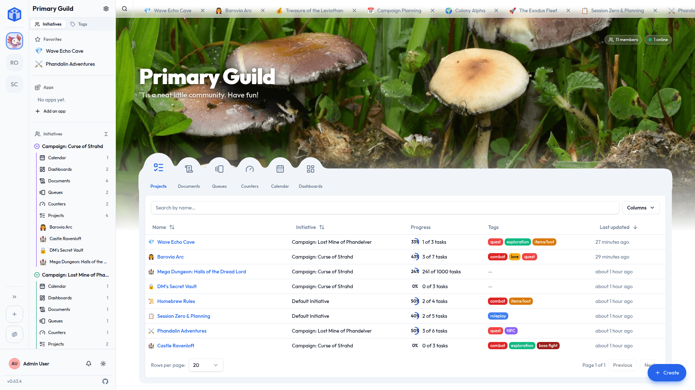
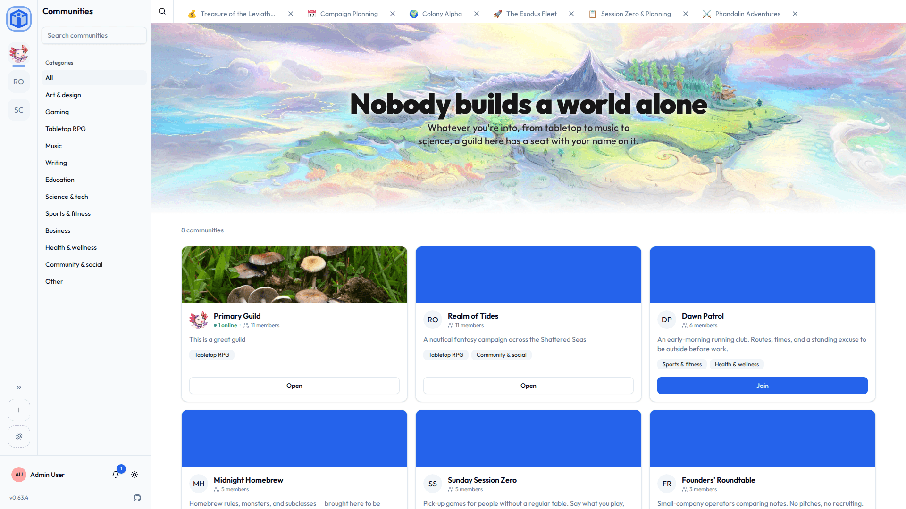
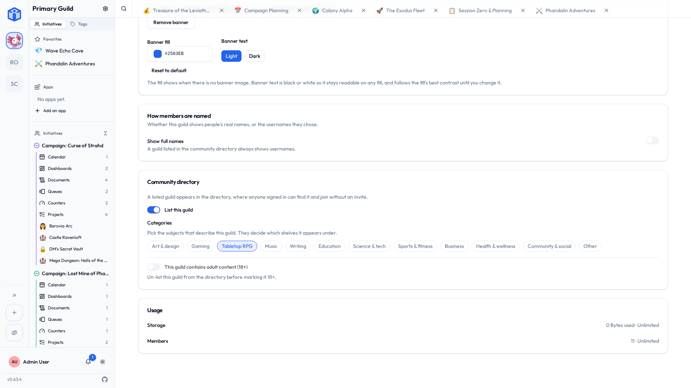
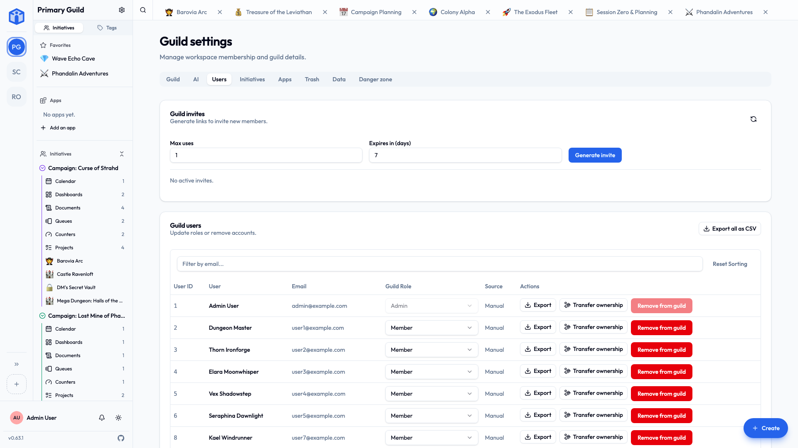

# Working with guilds

A **guild** is your group's workspace — one separate space for one group of people. This guide covers moving between guilds, inviting people, and (if you're an administrator) looking after one.

If you haven't joined or created a guild yet, start with [Your first guild](../getting-started/your-first-guild.md).

## Switching between guilds

You can belong to many guilds at once. The **guild rail** runs down the far-left edge of the screen — a vertical strip of icons, one per guild. The highlighted icon is the guild you're in now, and the **Initiative logo** above the guilds takes you to [your personal space](your-space.md).

- Click any guild's icon to switch to it.
- Switching changes everything else — the sidebar, initiatives, and projects — over to that guild.
- Each guild is independent. Work, people, and settings never cross between them.

Opening a guild lands you on its **front page**: a row of the guild's tools across the top, one circle each. Pick a tool and everything of that kind in the guild is listed underneath it — every project, document, calendar, queue, counter group or dashboard you have access to, wherever it lives — with the initiative it belongs to, its tags, and when it last changed. Click a name to open it, or an initiative to go there instead.

Only the tools your initiatives actually use appear, so a guild that doesn't run queues never shows a Queues circle. The tool you're looking at is part of the address, so you can bookmark or share the view you're on.

!!! tip "Two guilds at once"
    Open Initiative in two browser tabs and you can have each tab in a different guild — handy if you're juggling, say, a work team and a side project.

## Finding a guild to join

Most guilds are private and you get in by invitation. Some choose to list themselves publicly, and those you can find and join on your own.

Under the **add-a-guild** button on the guild rail, choose **Join a community**. That opens the **community directory**: a card for each listed guild with its banner, icon, description, categories, how many members it has, and how many are there right now.

- **Search** by name or description.
- **Browse by category** — the shelves group guilds by what they're for.
- **Join** from a guild's card. There's no invite and no waiting: you're a member as soon as you click.

What you searched for and which shelf you're on are both part of the address, so a filtered view of the directory is a link you can send someone.

!!! info "Not every server has one"
    The directory is a server-wide feature that starts switched **off**. If you don't see **Join a community**, this server hasn't turned it on, and guilds here are invite-only. That's the platform owner's decision — see [Configuration](../admin/configuration.md).

## Listing your guild (administrators)

A guild admin can put their guild in the directory from **Guild settings → Guild**.

1. Turn on **List in the community directory**.
2. Pick at least one **category**. This is how people find you when browsing, so choose what your guild is actually for.
3. **Certify** that the guild holds no adult or illegal content.

You can unlist at any time; the guild and everything in it carry on exactly as before, it simply stops appearing to strangers.

Two things keep a guild out of the directory whatever you set:

- A guild marked **18+** is never listed.
- A guild whose **member limit is set to one** is never listed — there would be no seat for anyone to join. (A nearly-full guild is fine; it's the limit itself that has to leave room.)

!!! tip "Give arrivals somewhere to land"
    A listed guild whose initiatives are all invite-only leaves newcomers looking at an empty page — they've joined the guild but can't see any of its work yet. Initiative will tell you when that's the case and point you at the fix: mark one initiative **open** so people can join it themselves, or **auto-join** so they simply arrive in it. See [How people join an initiative](initiatives.md#how-people-join-an-initiative).

## Inviting people (administrators)

Guild administrators bring new people in with **invite links**.

1. Go to **Guild settings → Users**.
2. Create an **invite link**.
3. Optionally set limits:
    - **Max uses** — how many people may join with this one link.
    - **Expires in (days)** — when the link stops working.
4. **Copy the link** and share it however you like (email, chat, etc.).

Anyone who opens the link can join the guild after signing in or creating an account.

## Member roles

Inside a guild there are two roles:

| Role | What they can do |
|---|---|
| **Member** | Take part in the initiatives and projects they're added to. |
| **Admin** | Everything a member can do, **plus** manage the guild: members, invites, initiatives, settings, and more. A guild admin can see and manage everything in their guild. |

Administrators can promote a member to admin, or step a member back down, from **Guild settings → Users**.

!!! note "Guild admin is not the same as the app's owner"
    Being an admin of *your* guild gives you full control of that guild — but not of the whole server or other people's guilds. Server-wide roles are a separate thing, covered in [Platform roles](../admin/platform-roles.md).

## Guild settings (administrators)

Open **Guild settings** from the sidebar (or the guild rail). You'll find tabs for:

- **Guild** — the name, description, and icon. (Icons should be a square image, up to 512&nbsp;KB.)
- **Users** — members, their roles, and invite links.
- **Initiatives** — create and manage the guild's initiatives.
- **AI** — optional AI settings for the guild (see [AI features](../account/ai-features.md)).
- **Trash** — recently deleted items, which you can restore.
- **Danger zone** — sensitive actions, including deleting the guild.

### Trash and retention

When something is deleted, it isn't gone immediately — it goes to the guild's **Trash**, where an admin can restore it. You can set how long items stay before they're cleared for good (a number of **days**, or **never auto-purge** to keep them indefinitely). This is your safety net for accidental deletions.

### The danger zone

The **Danger zone** holds actions that are hard or impossible to undo — most importantly, **deleting the guild**. Deleting a guild permanently removes *everything* in it: initiatives, projects, tasks, documents, and members. To prevent accidents, you'll be asked to confirm carefully (including re-entering details). Only do this if you're certain.

??? techspec "For the technically minded — what guild deletion does"
    Deleting a guild removes its isolated database area and the database roles tied to it, and cleans up the shared records that connect people to it (memberships, invites, single-sign-on mappings, access grants). It's thorough and final. If you only want to step back from a guild without destroying it, **leave** it instead (from the guild rail) — that just removes *you*.

## Leaving a guild

Don't want to be in a guild anymore? On the **guild rail**, open the guild's menu and choose **Leave guild**. This removes you only — the guild and everyone else carry on. If you're the *last administrator*, you'll need to promote someone else to admin first, so the guild isn't left without anyone in charge.

## Related

- [Initiatives](initiatives.md) — organizing work inside a guild.
- [Sharing & access](../sharing/index.md) — who can see what.
- [Security & privacy](../security/index.md) — how guilds stay separate.
