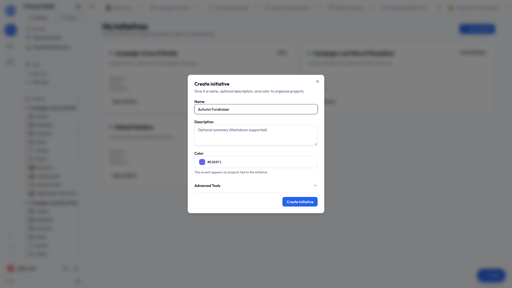
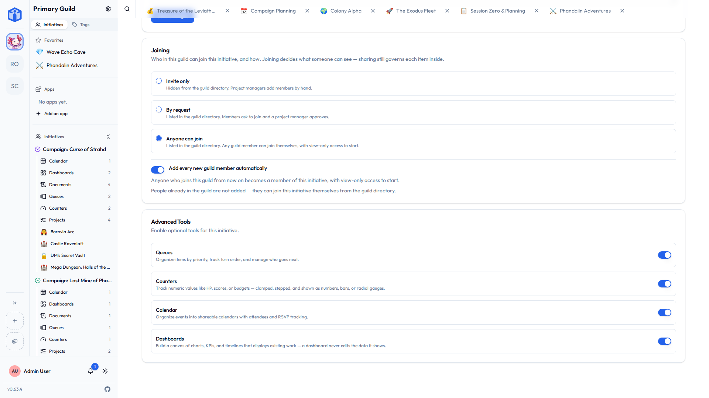
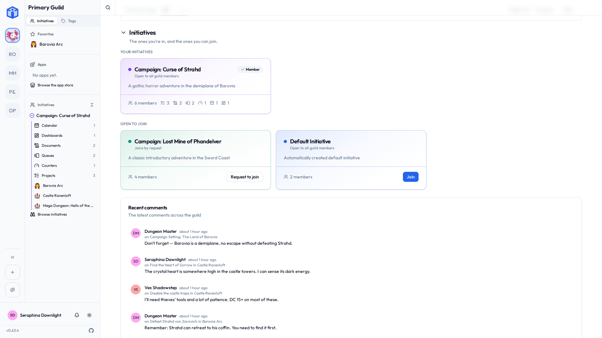
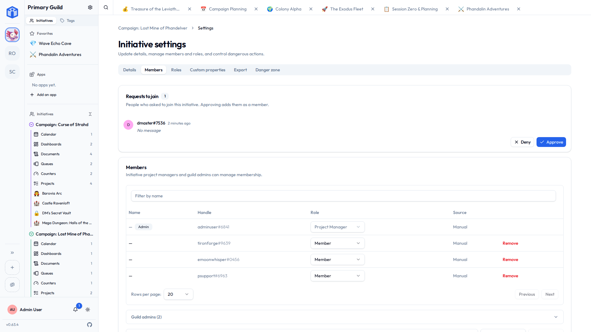
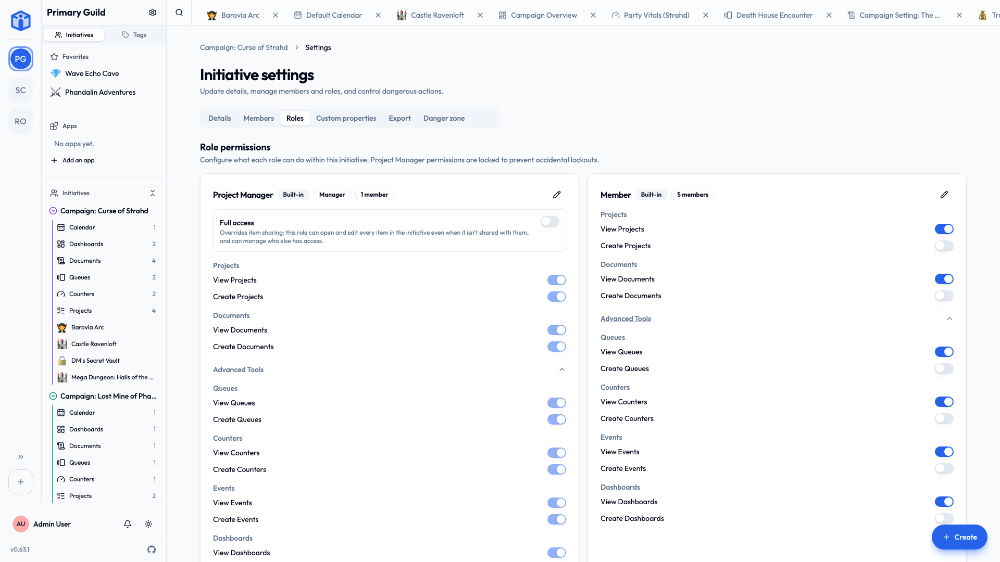

# Working with initiatives

An **initiative** is a folder for a big effort inside your community. It gathers that effort's projects, documents and tools, and it's where you decide who's involved.

New to the idea? [How Initiative is organized](../concepts/index.md) first.

## Creating one

1. In the sidebar, find **Initiatives** and choose **Add initiative**.
2. **Name** it after the effort: "Spring Play", "2026 Budget", "Onboarding".
3. Pick a **color**. It follows the initiative's projects around, so groups are easy to tell apart at a glance.
4. Optionally add a **description** (Markdown works).
5. Create it.

It appears in the sidebar; expand it to see its projects and documents.

!!! info "The Default Initiative"
    Every community starts with one, so there's always somewhere to begin. Rename it and use it like any other — it just can't be deleted, so you're never left without a home for new work.

## The initiative dashboard

Clicking an initiative's **title** opens its dashboard: how its projects are progressing, what's coming up, what's changed lately. The quick answer to "how's this effort going?"

## Adding members

An initiative's contents are visible **only to its members**. To add someone by hand:

1. Open the initiative → **settings → Members**.
2. **Add** people from your community.
3. Give each one a **role** (below).

An invite-only initiative isn't merely closed to outsiders — it isn't there for them. No name in a list, no locked door, nothing. That's how an initiative keeps sensitive work with the people involved, even from other members of the same community.

An initiative that opens itself up (below) shows its name, description and size so people can find it. That's all a non-member gets; the projects and documents stay out of reach until they actually join.

## How people join an initiative

Each initiative sets its own front door, under **settings → Details → Joining**:

| Setting | What it means |
|---|---|
| **Invite only** | Nobody joins alone; a manager adds them. The default. |
| **By request** | Listed for the community. Someone asks, a manager approves or declines. |
| **Anyone can join** | Listed for the community, and any member joins in one click. |

Anything that isn't invite-only appears in the **Initiatives** section of the community front page — name, color, description, member count — split into the ones you're in and the ones you could join.

However someone arrives, they land on the built-in **member** role (view-only on the always-on tools), and sharing still decides each project and document inside. Opening an initiative up exposes nothing that was private to it; it only changes who may walk in.

### Asking to join

On a **by request** initiative, the card offers **Request to join**, with room for a short note about who you are or why you're asking.

Managers get notified — in-app, plus push or email if they've got those on — and the request waits in **settings → Members**, above the roster, showing who asked, what they wrote, when, and whether they've been declined here before. **Approve** adds them; **Decline** doesn't.

Being declined isn't a ban. They can ask again, and only one request of theirs is ever open at a time.

### Adding everyone automatically

A community admin can mark an **anyone can join** initiative as **auto-join**. From then on, everyone arriving in the community — by invite, from the [directory](communities.md#finding-a-community-to-join), or through single sign-on — lands in it already a member, nothing to click.

This is how you stop newcomers meeting an empty community, and it's worth having at least one if your community is publicly listed.

Two things to know:

- It applies **from now on**. It doesn't reach back and sweep in everyone already there.
- Only an **anyone can join** initiative can carry it, so auto-join never hands out access somebody couldn't have taken themselves a moment later.

### Community admins join like everyone else

A community admin has authority over every initiative in their community — but authority isn't navigation. Their sidebar and front page show **the initiatives they're actually in**, then the ones on offer, same as anyone. An admin buried under a hundred initiatives they've never opened can't find the three they work in.

To put one in front of themselves, an admin joins it from the front page. They walk straight in whatever the joining setting says — no request, no waiting — and land on the **project manager** role their standing already implies. **Community settings → Initiatives** still lists every initiative in the community, and taking the project manager role there does the same job.

None of this changes what an admin may *do*. Open a single initiative and they see all of it.

!!! tip "Adding an admin to your initiative"
    A project manager can add a community admin like anyone else — the member picker offers them, and they arrive as project manager, the only role their standing allows here.

## Roles and what they unlock

Each member holds a **role**, which decides which *kinds of tools* they can use here — whether they can create projects, or only view them.

Initiative ships a **Manager** role (think project lead) whose permissions are fixed, and you build your own on top: "Coordinator", "Volunteer", "Client", "Guest". Name them after how your group actually talks about itself, not after anything Initiative expects.

Permissions group by tool — **Projects**, **Documents**, **Queues**, **Counters**, **Events**, **Dashboards** — each offering **View** and **Create**. So "Volunteer" might view projects and documents but create nothing, while "Coordinator" creates everything.

Full walkthrough of roles and how they combine with sharing: [Initiative roles](../sharing/initiative-roles.md).

!!! tip "Managers see everything"
    The built-in **Manager** role reaches every project and document in the initiative without each being shared with it. That's unique to Manager — custom roles don't get it. Hand it only to people who genuinely need the whole picture.

## Initiative settings

- **Details** — name, color, description, and **Joining**.
- **Members** — who's in, their roles, and waiting join requests.
- **Roles** — create roles and set permissions.
- **Properties** — the custom fields this initiative's tasks, documents and events can carry.
- **Export** — download the initiative's data (managers and above).
- **Danger zone** — archive, unarchive, delete.

### Archiving vs. deleting

- **Archive** tucks a finished effort away without losing anything. Hidden from the main view, restorable any time. Good for "the spring play is over, but keep the records."
- **Delete** sends the initiative and everything in it to the community **Trash**, where an admin can still restore the lot until the retention period runs out. After that, gone.

## Related

- [Projects & tasks](projects-and-tasks.md) — the work inside an initiative.
- [Documents](documents.md) — shared knowledge inside an initiative.
- [Initiative roles](../sharing/initiative-roles.md) — roles and sharing in depth.
