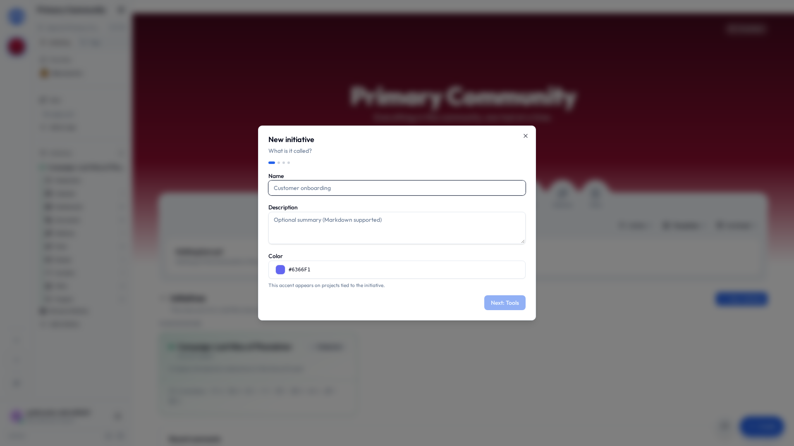
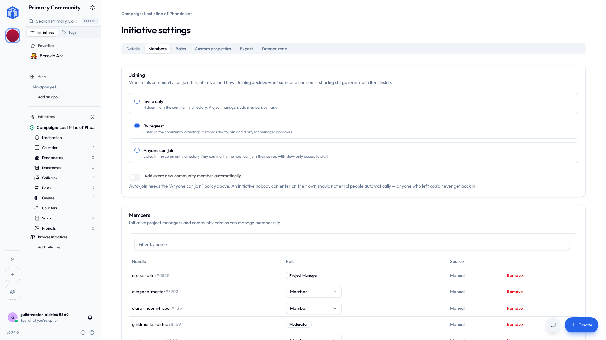
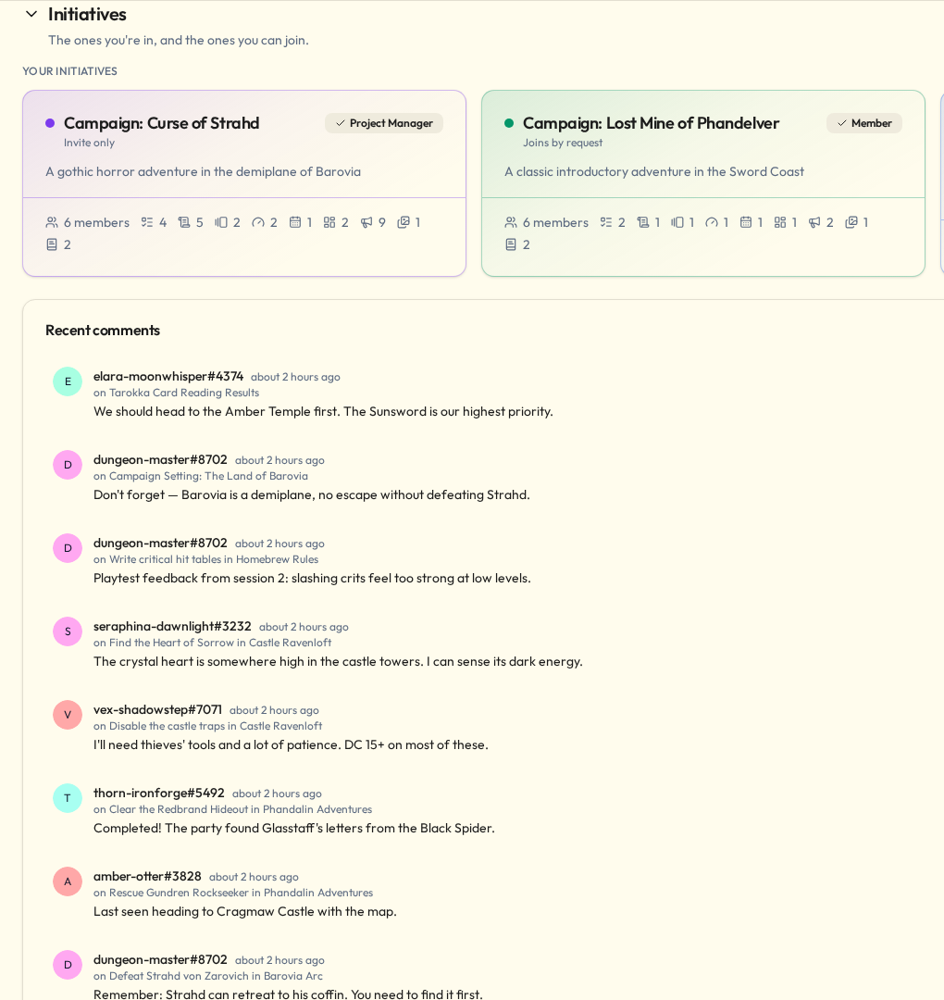
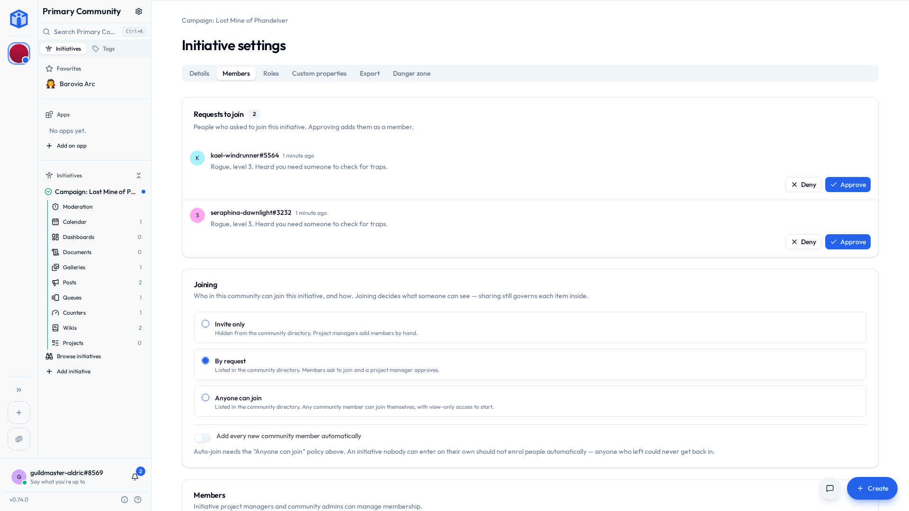
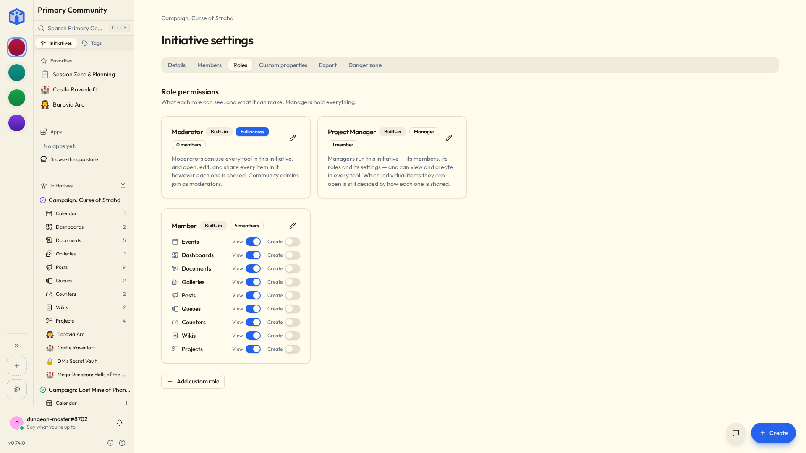

# Working with initiatives

An **initiative** is a folder for one big effort inside your community. It holds that effort's projects, files and other tools, and it's where you decide who's actually involved in it.

New to the idea? [How Initiative is organized](../concepts/index.md) explains the shape first.

## Making one

In the sidebar, find **Initiatives** and choose **Add initiative**. **New initiative** walks you through four questions:

1. **What is it called?** Name it after the effort — "Spring Play", "2026 Budget", "Onboarding" — and pick a **colour**. The colour follows its tools around, so you can tell at a glance what belongs to what without reading a single word. A description is optional.
2. **What is it made of?** Pick the [tools](tools.md) it needs. Projects and files start ticked; at least one has to stay.
3. **Who can get in?** Invite only, by request, or anyone in the community. See [How people join an initiative](#how-people-join-an-initiative).
4. **What can they do?** What an ordinary member may do with those tools: **Make things**, **See things**, or **Managers only**, for work that should stay with a few people until you say otherwise.

Every answer can be changed later, and turning a tool off never deletes what's in it. So if you're stuck on question two, guess. Nobody is marking this.

The new initiative shows up in the sidebar. Expand it to see its tools.

!!! info "Your first one"
    A new community arrives empty, and the home page asks you to make the first initiative before anything else. That is deliberate: an initiative is a *name for a body of work*, and only you know what this community's work is called.

    Some communities carry one called **Default Initiative**. There's nothing special about it. Rename it, archive it or delete it like any other.

## The initiative page

Click an initiative's name to open it. Its name sits beside a rule in its colour, with the description under it, and then one quiet line: your role here, then the faces of whoever's online right now. Point at a face to see who it is; open the member count for everybody, searchable.

Under that is one tab per tool, each with one main button for making a new one. **Initiative settings** sits top right, for the people who run it.

## Adding members

An initiative's contents are visible **only to its members**. To add somebody by hand:

1. Open the initiative → **settings → Members**.
2. **Add** people from your community.
3. Give each one a **role** (see below).

Here's the important bit: an invite-only initiative isn't merely closed to people who aren't in it. It isn't *there* for them at all. No name in a list. No locked door to rattle. No "you do not have permission" message to feel odd about.

That's how an initiative keeps sensitive work with the people involved — even from other members of the same community — without anybody ever having to be told they're on the outside of something.

An initiative that opens itself up (below) shows its name, description and size so people can find it. That's all a non-member gets. The projects and files stay out of reach until they actually join.

## How people join an initiative

Each initiative sets its own front door, under **settings → Members → Joining**:

| Setting | What it means |
|---|---|
| **Invite only** | Nobody joins on their own. A manager adds them. This is the default. |
| **By request** | Listed for the community. Somebody asks, a manager says yes or no. |
| **Anyone can join** | Listed for the community, and any member joins in one click. |

Anything that isn't invite-only appears in the **Initiatives** section of the community front page — name, colour, description, member count — split into the ones you're already in and the ones you could join.

However somebody arrives, they land on the built-in **Member** role, and sharing still decides each individual project and file inside.

So opening an initiative up doesn't suddenly expose anything that was private within it. It only changes who's allowed to walk in.

### Asking to join

On a **by request** initiative, the card offers **Request to join**, with room for a short note explaining who they are or why they're asking.

Managers get notified — in the app, plus push or email if they've got those on — and the request waits in **settings → Members**, above the roster, showing who asked, what they wrote, when, and whether they've been turned down here before. **Approve** adds them. **Decline** doesn't.

Being declined isn't a ban and it isn't permanent. They can ask again later.

They can also only have one request open at a time, so nobody can express their enthusiasm by sending you fifteen.

### Adding everyone automatically

A community admin can mark an **anyone can join** initiative as **auto-join**. From then on, everybody arriving in the community — by invite, from the [directory](communities.md#finding-a-community-to-join), or through a work login — lands in it already a member, with nothing to click.

This is how you stop every new arrival meeting a completely empty community and quietly concluding they've done something wrong. Worth having at least one if your community is publicly listed.

Two things to know:

- It applies **from now on**. It doesn't sweep in everybody who's already there.
- Only an **anyone can join** initiative can carry it — so auto-join never hands out access that somebody couldn't have taken for themselves a moment later anyway.

### Community admins join like everybody else

A community admin has authority over every initiative in their community. But authority isn't navigation.

Their sidebar and front page show **the initiatives they're actually in**, then the ones on offer, exactly like everybody else's.

An admin buried under a hundred initiatives they have never once opened cannot find the three they actually work in. That helps nobody, least of all the admin.

To put one in front of themselves, an admin joins it from the front page. They walk straight in whatever the joining setting says — no request, no waiting — and arrive on the **Moderator** role their standing already implies. **Community settings → Initiatives** still lists every initiative in the community.

None of this changes what an admin may *do*. Open any initiative and they see all of it.

!!! tip "Adding an admin to your initiative"
    A project manager can add a community admin like anybody else — the member picker offers them, and they arrive as a Moderator, which is the standing they already had.

## Roles and what they unlock

Each member holds a **role**, which decides which *kinds of tools* they can use here — whether they can make projects, or only look at them.

Every initiative comes with three: **Manager** (think project lead) and **Moderator**, whose permissions are fixed, and **Member**, whose you set. You build your own on top: "Coordinator". "Volunteer". "Client". "Guest". "Person Who Only Needs To See The Rota".

Name them after how your group actually talks about itself, not after anything Initiative expects. Nobody has ever introduced themselves at a committee meeting as a view-only contributor.

Permissions are grouped by tool — **Projects**, **Files**, **Queues**, **Counters**, **Events**, **Dashboards**, **Posts**, **Galleries**, **Wikis** — each offering **View** and **Create**. So "Volunteer" might view projects and files but create nothing, while "Coordinator" creates everything.

There's a full walkthrough in [Initiative roles](../sharing/initiative-roles.md).

!!! warning "Moderators see absolutely everything"
    The built-in **Moderator** role reaches every project and file in the initiative, whether or not it was ever shared with them. That's unique to Moderator — no other role gets it, or can be given it however much you'd like. A community admin hands it out, and arrives on it themselves.

    So hand it to the people who genuinely need the whole picture. Not as a thank-you for being helpful, and not because somebody's been around a long time and it felt rude not to.

## Moderation

Moderators and community admins see one more entry at the top of the initiative in the sidebar: **Moderation**. Nobody else does, and nothing turns it off.

| Tab | What's in it |
|---|---|
| **Reports** | What people have [reported](communities.md#reporting-something) here, **Open** and **Settled**. Each shows what was reported, how many people reported it, and what they said. |
| **Members** | Who's in, and what each of them may do. |
| **Sharing** | How widely each thing here is shared. Open one to change it. |
| **Log** | What moderators have done here, newest first: what was removed and why, what a removed comment said, locks and warnings. **Put back** undoes a removal. |

Open the reported thing to see it where it lives, then come back and settle it, with a note on why if you like:

- **Dismiss** — nothing to do.
- **Remove…** — takes it down, for the reason it was reported for unless you pick another. A comment becomes a line saying it was removed and why, and its replies stay; anything else goes to the bin. Whoever wrote it is told why, never by whom.
- **Warn…** — sends whoever wrote it what you type, as a notice from the moderators. It never says who reported it.
- **Send to the platform** — below.

A report of something illegal shows **Platform notified**: it went to whoever runs the server as well, and they look at it whatever you decide here.

You don't need a report to act. Moderators and community admins get a shield menu on comments, posts, pictures, wiki pages, queue items and events:

- **Remove…**, as above.
- **Lock comments** — the thread still reads, and only moderators add to it. Its owner can't unlock it.
- **Clear reactions**, on comments and posts.
- **Hold for the platform…** — below. You won't see it either once it's held.

A project manager runs the work and doesn't moderate it: they can delete their own comments, not other people's. Give a role **Full access** if it should moderate.

**Send to the platform** is for the report that isn't this community's to settle. It goes to whoever runs the server, carrying what the reporters wrote and attached, and asks one question: while they look, should the reported thing stay up?

- **Leave it up while they look** — everyone can still see it until they decide.
- **Hide it now, and keep it exactly as it is** — for when the police or a court asked you to keep it, or it may be illegal. Say why, and if you like leave a note for whoever runs the server, such as who asked and a reference number. A report of something illegal starts with this one chosen.

Hidden content is **held for the platform**:

- Nobody in the community can see it, community admins and you included. Anything inside it is held too, like a project's tasks or a wiki's pages, and so are the pictures and files it shows.
- Nobody here can change it or delete it. Deleting what it's inside leaves it in place, and the bin can't empty it.
- Replies to a held comment stay, under an **Unavailable** placeholder.
- Only whoever runs the server can release it: putting it back as it was, moving it to the bin, or deleting it for good.
- Nobody is told. To its author it simply isn't there.

## Initiative settings

- **Details** — name, colour, description, and the **Tools** card, where you choose which tools it offers.
- **Members** — **Joining**, any waiting requests, and who's in with their roles.
- **Roles** — make roles and set what they can do.
- **Properties** — custom fields anything in this initiative can carry.
- **Export** — download the initiative's data (managers and above). **Keep content in this initiative** stops anyone, managers and community admins included, from exporting things from it one at a time, or copying or moving them to another initiative. Copies and moves inside it, this whole-initiative download and the community's own export carry on as normal.
- **Danger zone** — archive, unarchive, delete.

### Archiving vs. deleting

- **Archive** tucks a finished effort out of sight without losing a single thing. Restorable whenever. This is the button for "the spring play is over, but I am absolutely not throwing away the records."
- **Delete** sends the initiative and everything inside it to the community **Trash**, where an admin can still restore the whole lot until the retention period runs out. After that it's genuinely gone.

When in doubt, archive. Archiving has never once ruined anybody's week.

## Related

- [Projects & tasks](projects-and-tasks.md) — the work inside an initiative.
- [Files](files.md) — the writing inside an initiative, and everything it's been sent.
- [Initiative roles](../sharing/initiative-roles.md) — roles and sharing in depth.
