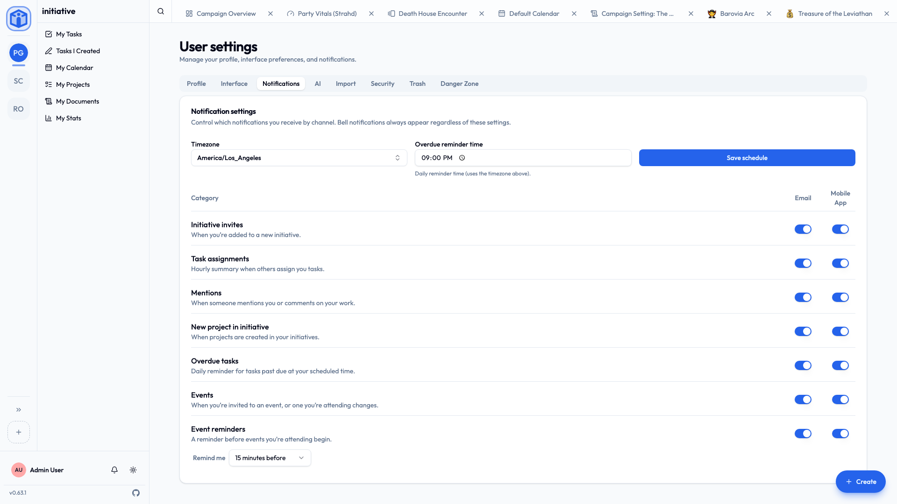

# Notifications

Initiative can tell you when something wants your attention — a task landed on you, somebody mentioned you, an event is coming up.

What you get told about, and where, is entirely yours to decide. Nobody's forcing anything into your inbox.

## The three channels

| Channel | What it is |
|---|---|
| **Bell** | The in-app bell. Always on, whatever else you've set. |
| **Email** | Messages to your inbox. |
| **Mobile app** | Push notifications on your phone (needs the app, and permission). |

The **bell** always works. **Email** and **mobile** are yours to switch on and off, category by category.

Bell notifications arrive **as they happen** — a mention lands the moment it's written, not whenever the page next thinks to check. Marking one read updates your other open tabs too, so you don't clear the same thing three times.

## Choosing what you hear about

**User settings → Notifications** gives you a grid: one row per category, with an **Email** and a **Mobile App** switch each.

| Category | You hear about it when… |
|---|---|
| **Initiative invites** | You're added to a new initiative. |
| **Task assignments** | Somebody assigns you tasks (one summary, not one per task). |
| **Mentions** | Somebody `@mentions` you or comments on your work. |
| **Reactions** | Somebody reacts to one of your comments (also a summary). |
| **New project in initiative** | A project appears in one of your initiatives. |
| **Overdue tasks** | A daily nudge about what's past due, at a time you choose. |
| **Events** | You're invited to something, or something you're attending changes. |
| **Event reminders** | Shortly before an event you're going to. |
| **Direct messages** | Somebody messaged you. You're told who and how many — never what it says, because nothing outside your own devices could tell you that. |

## Timing

A few of these are about *when*, not just *whether*:

- **Task assignments** arrive as one summary once the dust settles. Initiative waits until nothing new has landed on you for a few minutes, so a batch of ten tasks reaches you as one message rather than ten — and sends anyway within half an hour if they keep coming. Email and mobile follow the same schedule, so you never get the same news twice at different times.
- **Reactions** work the same way, for the same reason: they arrive in flurries. The bell shows each one as it happens; email and mobile wait for the flurry to finish.
- **Overdue tasks** come as one **daily digest** at a time you pick, in your **timezone**.
- **Event reminders** are set per event — at the start, or a chosen number of minutes, hours or days before.

!!! tip "Set your timezone, seriously"
    Daily digests, due dates and repeating-task maths all run on your timezone. Initiative guesses it from your browser when you sign up, and it's usually right.

    If your reminders are turning up at genuinely baffling times, this is the thing to check: **User settings → Interface**.

## Turning on mobile push

1. Install the mobile app and sign in.
2. In **User settings → Notifications**, choose **Enable push notifications**.
3. Say yes when your phone asks.

If push shows as **Blocked**, that's your phone rather than Initiative — open your device settings, find Initiative, and allow notifications there.

## Announcements

Notifications are about *your* work. An **announcement** is about the app itself: a version that changed something, a setting that moved, a maintenance window your administrator wants you to know about.

They arrive as a dialog rather than in the bell, because they're the sort of thing worth being stopped for. Some are one card; a longer one becomes a few pages you step through with **Next**. **Got it** clears it and it doesn't come back — unless whoever wrote it asked for more than one acknowledgement, in which case the dialog will say so.

Dismissed one at speed and immediately regretted it? Nothing's lost. The **info icon in the sidebar footer** opens **Past announcements**: everything you've been shown, newest first, read and unread marked, with a filter for the unread ones. Pictures open full size on a click.

Run a server and want to write one? See [Announcements](../admin/announcements.md).

## Related

- [Your space](your-space.md) — where your tasks and events gather.
- [Profile & preferences](../account/profile-and-preferences.md) — your timezone and everything else.
- [Announcements](../admin/announcements.md) — writing them, for administrators.
