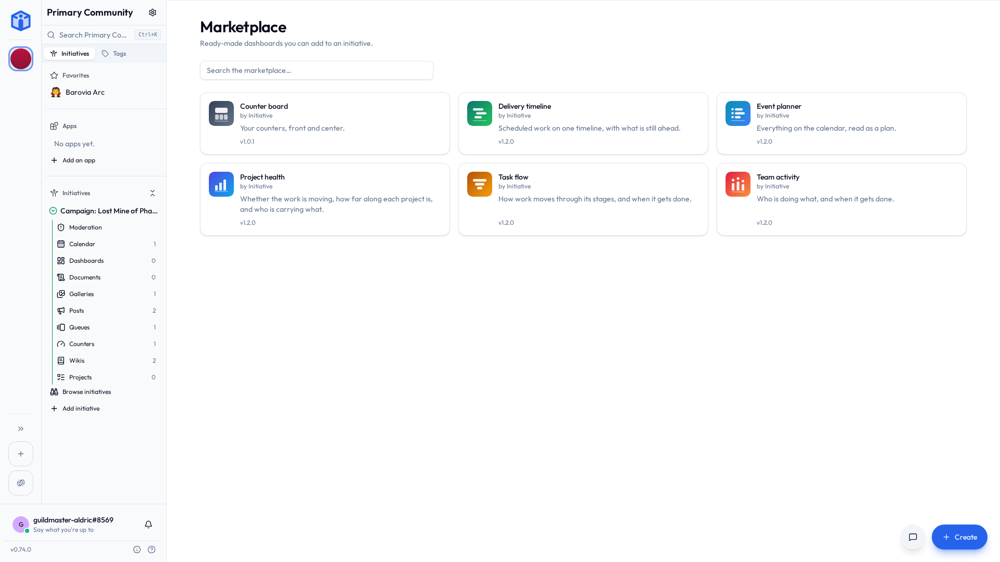
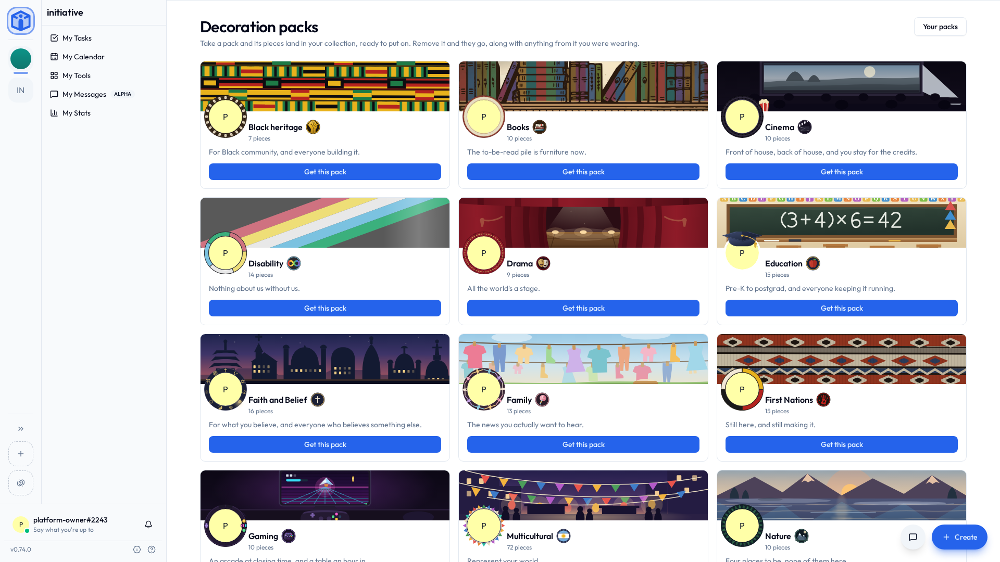

# Plug-ins & the marketplace

Whatever your group needs, some other group has needed exactly the same thing, built it, got fed up rebuilding it every year, and shared it.

The **marketplace** is where those live: ready-made dashboards, projects and plug-ins you add in a couple of clicks. No developer. No custom build. No waiting for us to get round to shipping it.

Your marketplace holds the listings that ship with Initiative plus whatever the person running your server has added and approved. Nothing turns up on it by accident — everything there is there because a human put it there.

## Two marketplaces

There are two, and the difference is who gets what you take.

| | **Your community's** | **Yours** |
|---|---|---|
| What's on it | Dashboards, projects and plug-ins | Decoration packs |
| Who it's for | Everyone in that community | You, in every community you're in |
| Where to open it | **Browse the marketplace** in a dashboards or projects list's **More actions** menu (beside the create button, while the list is empty), or at the foot of the **Plug-ins** section of the sidebar | **Browse the marketplace** on **My Settings → Profile** |

## Your community's marketplace

| | **Dashboards** | **Projects** | **Plug-ins** |
|---|---|---|---|
| What it adds | A screen of charts, numbers and timelines | A board that's already set up: columns, fields and a first round of tasks | Something the whole community shares |
| Where it goes | Into one initiative | Into one initiative | Into the community |
| Who can add it | Anyone who can create dashboards there | Anyone who can create projects there | Your community's [superadmin](communities.md#why-superadmin-is-separate) |

All three browse the same way: search, open a listing to read what it does, add it.

### Adding a dashboard

1. Open the listing and choose **Add to an initiative**.
2. Pick the **initiative** it should live in.
3. Give it a **name** — the listing's name is filled in, changeable now or later.

It appears under that initiative's **Dashboards**, exactly like one you built. Rename it, tag it, share it, delete it like any other tool.

!!! info "No initiative to choose from?"
    You can only add a dashboard where you're allowed to create one. If the list is empty, ask an initiative manager to give your role the dashboard permission — see [Initiative roles](../sharing/initiative-roles.md).

A listing's page can show a **preview** drawn with sample data, so you can see the shape of it before committing. Yours will show your group's real numbers.

When the publisher ships a newer version, the dashboard shows **Version X available**. Updating is your choice; nothing changes underneath you. If a listing needs a newer Initiative than your server runs, it says so rather than half-working.

### Adding a project

Somebody has already worked out what a hiring pipeline needs as columns. A few listings ship with Initiative: a sales pipeline, a hiring pipeline, a bug tracker, a content calendar, a grant tracker, a product launch and facility maintenance.

1. Open the listing. **Blank** and **Example** show it both ways: the empty board you'd get, and the same board with some made-up work moving through it.
2. Choose **Add to an initiative**, and pick the initiative and a name.
3. Choose **What to start from**: **Start blank**, or **Start from the example**.
4. Pick a **Start date**. The project's dates move so the earliest lands on that day, and the rest keep their distance from it. A launch with a deadline six weeks in is still six weeks in.

What lands is an ordinary project of your own. Rename the columns, delete the example tasks, take it apart entirely; nothing you do reaches the listing or anybody else's copy.

### Adding a plug-in

A **plug-in** adds something to the community as a whole rather than one effort: a page of its own, extra dashboard widgets, or a link to a service your group already uses. Because it affects everyone, **only your community's [superadmin](communities.md#why-superadmin-is-separate) can add or remove one**. Everybody else can browse, read the listing, and go and ask them nicely.

1. Switch the marketplace to the **Plug-ins** shelf and open a listing.
2. **Add to community**, and name it.
3. Answer the questions it asks (below), and add it.
4. If it needs setting up, it's marked **Needs setup**. Open its settings to finish.

The Plug-ins shelf lists the plug-ins your server actually runs. Some need a program running alongside Initiative, and one your server hasn't set up, or has switched off, isn't offered here. Expected something and can't find it? Whoever runs your server is who to ask. On the hosted service they're already running — see [Self-host or let us host it](../self-host-or-hosted.md#plug-ins-that-need-something-running-behind-them).

Installed plug-ins appear in the **Plug-ins** section at the top of the sidebar, above your initiatives, and are managed under **Community settings → Integrations**.

### What you're agreeing to

Adding a plug-in asks up to three things, and every answer can be changed later from the plug-in's settings. So none of this is a trap, and you can't get it wrong in a way that sticks.

| | What it means |
|---|---|
| **What it can reach** | The kinds of thing it may read, or read and change: projects, files, comments, tags, custom properties, and so on. Everything it asks for starts ticked; untick what you'd rather it didn't have. A line marked *This server doesn't allow it* is off-limits whatever you tick. Two lines start unticked: acting as a moderator, and acting as an admin (see below). |
| **Where it works** | Every current initiative, or only the ones you pick. A plug-in reads and changes things only in the initiatives it works in, so the committee's private budget initiative stays out of reach unless you put it there. |
| **Who can open it there** | Only for a plug-in with a page inside initiatives: which roles see that page. Community admins always can. |

A plug-in asking for nothing gets asked nothing. It just gets a name.

A plug-in allowed to change something, such as a task, can fill in that thing's [custom properties](initiatives.md#initiative-settings) as well. **Properties** on its own is for making new ones: it lets the plug-in read an initiative's property definitions, and with write, add to them.

!!! info "Some plug-ins have a minimum age"
    A listing that has one says so: **Ages 16+**, for the country your browser is set to. It can differ by country. The community can still add it; somebody under the age where they are just can't open or use it.

However you answer, **it never reaches past what you allowed.** A plug-in that may read projects in the Garden initiative reads projects in the Garden initiative. Not files, not the Kitchen.

### Acting as a moderator or an admin

On its own, a plug-in sees what any member of an initiative would without being given anything more: what's shared with everyone there, and what it made itself. Something shared with three people stays with those three.

Some plug-ins can do more if you let them, and ask for it in two lines that start unticked:

- **Act as a moderator in the initiatives it's placed in.** Inside an initiative it works in, it reaches everything a moderator would, whoever it's shared with.
- **Act as an admin across your whole community.** Everything a community admin reaches, including initiatives it isn't placed in.

Ticking either lets the plug-in ask for that standing; it doesn't use it everywhere at once. An automations plug-in, for example, uses it only for an automation somebody holding that role set up to run that way. Either way, it still reaches only the kinds of thing ticked above. An admin-standing plug-in that may read projects reads every project, and still no files.

### Updates

Plug-ins update themselves. Most new versions arrive quietly and nobody notices, which is the idea.

The exception is a version that wants **more** than you agreed to: something new to reach, or a new page. That one waits. The superadmin gets a notification, and the plug-in's settings show what the new version wants, with **Accept and update** and **Decline** beside it. Declining keeps the plug-in exactly as it is, on the version it's already running.

Prefer to read every update first? Turn off **Update automatically** in the plug-in's settings, and each new version waits for you to click **Update to** it.

Some plug-ins come with your server and are added to every community for you. Those can't be removed or turned off from here, and they update without asking. Whoever runs the server decides whether they exist at all.

### A plug-in can own things

Content usually belongs to a person. It can also belong to a **plug-in**, so a project a plug-in looks after doesn't end up orphaned when the person who set it up moves on.

In **Settings → Users**, **Transfer ownership** offers plug-ins beside admins. A plug-in can be given something only while it's switched on, works in that initiative, and is allowed to change that kind of thing. A plug-in that owns something may decide who else gets access to it, if you allowed it to change sharing.

### Setting a plug-in up

Some plug-ins need a credential — an API key, or a sign-in to another service. Two kinds, and the difference matters:

- **Community credential** — set once by the superadmin, used for everyone. Good for a shared account the whole group works through.
- **Your account** — each member supplies their own, used only for them. Yours is yours; other members can't see or use it.

Each connection shows which service it uses and what it's allowed to do there, so you can decide before you hand anything over.

### Turning a plug-in off, and removing it

- **Turn off** hides it from everyone while keeping its setup. Turn it back on and it picks up where it left off. Disabled plug-ins stay listed in **Community settings → Integrations**.
- **Remove** takes it out entirely:
    - Anything it set up when it was added moves to the **Trash**, restorable during the retention window.
    - Anything it owned stays where it is, with no owner. An admin picks it up with **Claim unowned content** in **Settings → Users**.
    - Every credential it held, the community's and each member's, is deleted, and the plug-in is told to stop using them.

## Your own marketplace

Yours holds **decoration packs**: artwork for your profile, and by far the least serious part of Initiative.

Each pack is built around one thing a group of people has in common, and carries banners, frames and trophies you wear in whatever combination pleases you.

Twenty-three packs ship with Initiative:

| | |
|---|---|
| **People and identity** | Pride, Multicultural, Disability, First Nations, Black heritage, Faith and Belief, Family |
| **What you do** | Sports, Gaming, Drama, Cinema, Soundcheck, Observatory, Education |
| **What you love** | Pets, Plants, Books, Tea, Travel, Nature, Winter, Zen, Spooky |

Some run deep. Pride flies a flag, a turning ring and a heart for each of seven identities. Multicultural carries seventy flags. Disability has a trophy for eleven of the things people are, and a flag for all of them.

The banners move, too: a playhead lights the notes it passes, a curtain runs in and out, skeletons dance until sunrise, a typewriter types a line at a time, a lake changes color the whole way down as the sun sets into it, and the view from a train window keeps going past.

What you take here is yours, not your community's. Download a pack in one community and you're wearing it in all of them, because your profile belongs to you.

1. Open **Browse the marketplace** on **My Settings → Profile**.
2. Open a pack to see everything in it, and the profile it would make — banner running, frame around your own picture, trophies underneath.
3. **Get this pack**, and its pieces land in your collection.

Downloading a pack puts nothing on you. It just hands you the pieces — you choose what to actually wear back on **My Settings → Profile**, mixing pieces from different packs however you like. Nobody is going to stop you. See [Profile & preferences](../account/profile-and-preferences.md#decorations).

Giving one back is the same click in reverse — open the pack's card and remove it. Its pieces leave your collection, and anything from it you were wearing comes off with them.

## Where listings come from

Every listing in your marketplace arrived one of three ways:

- It **ships with Initiative** — part of the built-in catalog, credited to Initiative. That credit can't be claimed by anything else.
- It came from **the Initiative registry** — a signed online catalog your server follows unless its platform owner has switched it off. Anyone can propose a listing for it; it's published once it's been reviewed. Every file from it is checked against a signing key built into Initiative before anything is used, so a listing arrives exactly as it was published or not at all.
- Your **platform owner added it** — they chose that listing and published it to your deployment. If you run Initiative yourself, that's you.

That's the lot. Anyone can write a listing; reaching *your* marketplace takes that signed registry or a decision by your platform owner. See [Publishing your own listings](../running-a-server/publishing-listings.md).

Every listing shows **who published it** — on the card, on its page, and in the dialog where you add it — so the question is answered while you're deciding.

Two things hold whatever you install:

- **Your access rules still apply.** A dashboard shows *you* only the data you could already reach — same community, initiative, role and sharing checks as everywhere else. Two people on the same dashboard can correctly see different numbers.
- **Widgets run in a sandbox.** Marketplace widgets run in an isolated runtime that can only hand back something to draw. If one misbehaves, that tile shows an error and the rest of the page carries on.

### Reporting a listing or a plug-in

Something in a plug-in that shouldn't be there? Press the **flag** beside the listing's name, or at the top of an installed plug-in's page, pick a reason, and send it. It goes to whoever runs your server, not to the plug-in's publisher and not to your community's admins, who are free to carry on not knowing.

Plug-ins from BeyondersStudio, who make Initiative, carry no flag. If one misbehaves, that's a bug: tell whoever runs your server, the way you would about anything else that's broken.

### On the iPhone app

The iPhone app shows the **curated catalogue**: the listings that ship with Initiative and the ones from the Initiative registry. Anything your platform owner added themselves is browsed from the website or the other apps.

Plug-ins your community has already added open as usual. The first time you open one BeyondersStudio doesn't publish, you're told who made it, that your community and its publisher provide it rather than Initiative, and where to report it. **Continue**, and it doesn't ask again for that plug-in.

## Related

- [Profile & preferences](../account/profile-and-preferences.md) — wearing what a decoration pack gave you.
- [Tools](tools.md) — the calendar, queues, counters, dashboards and boards built into every initiative.
- [Sharing & access](../sharing/index.md) — who can see what you add.
- [Publishing your own listings](../running-a-server/publishing-listings.md) — for whoever runs the server, adding to its marketplace.
