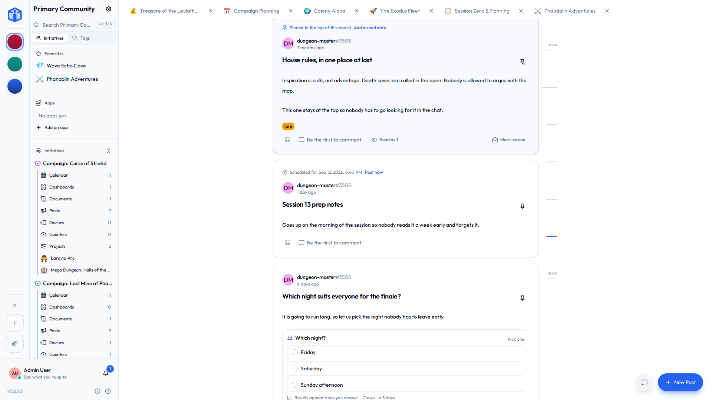

# Posts

A **board** is where an initiative says things out loud. The hall is booked. The rehearsal moved. Sam is doing front of house now, everyone be nice to Sam.

None of that is a task, and it isn't really a document either. It's a notice — read once, acted on, then it becomes the record of what was said and when. Pinning it to an actual noticeboard worked fine for centuries, right up until half the group stopped walking past the noticeboard.

## Writing one

**Posts → New post** in an initiative's sidebar. Give it a headline, write the notice in the full editor — pictures, links, the lot — and post it.

The editor is the same one documents use, which means a notice can carry a live **smart chip**: type `#` and point at a task, and the chip goes on showing that task's current column long after you wrote about it. See [Mentions & links](mentions-and-links.md).

You can post a notice with no body at all. A headline and a poll is a perfectly good notice.

## Who hears about it

A notice goes to everyone in the initiative by default. Change that under **Access** when you write it, or any time after, and only those people see it or get told about it.

Which is the useful bit: a notice shared with five people interrupts five people. Posting something the wardrobe team needs does not ring a bell for the other ninety.

They're told in the bell, and by email or push if they've asked for those — there's a **Posts** switch for both under [Notifications](notifications.md).

## Pinning

A manager can **pin** a notice to the top of the board, and give the pin an **end date**.

The end date is the part worth knowing about. A notice about Sunday should stop shouting on Monday, and if it's relying on somebody remembering to unpin it, it won't. Set the date when you pin it and the notice drops quietly back into the feed by its own age.

Pinning is a manager's job rather than an author's — otherwise the top of the board is simply whoever posted most recently and felt strongest about it.

## Posting later

Write it now, set a time, and it goes up then. Until it does it's a **draft**: nobody sees it, it's in no board, no count and no search result, and nobody has been told.

Only people who could edit it see it sitting there, marked as not up yet, with **Post now** if the time comes round sooner than expected. Once a notice is up it stays up — you can't put it back in the drawer, because everybody it was announced to has already been told.

Good for the Sunday reminder you'd rather write on Thursday while you still remember the details.

## Who's read it

A notice marks itself read once it's been on your screen for a moment — long enough to be reading it rather than scrolling past. Nothing to tick off.

Each notice says **how many people have read it**, and that opens the roster: who has, and who it's still waiting on. "Waiting on" means the people it was *shared with*, so a board of a hundred where a notice went to five isn't ninety-five people ignoring you.

- **Mark unread** puts one back, for the thing you'll deal with properly on Monday.
- **Unread only**, in the filter bar, shows what's left.

Your own notices never sit in your unread pile. You wrote them.

## Polls

A notice can ask a question: up to ten choices, one click to answer. Which night suits. Who's driving. Whether we're really doing the raffle again.

| Setting | What it does |
|---|---|
| **Pick several** | People can choose more than one answer. |
| **Closes** | Voting stops then. Leave it empty and it stays open. |
| **Hide results until voted** | The numbers stay hidden until somebody answers, so the early votes don't drag the later ones along behind them. |
| **Anonymous** | Shows the totals, never the names. |

Change your mind or clear your answer any time while it's open. Otherwise a tap opens **who voted** — who chose what, and who hasn't answered — with the author in that list too, since writing a question doesn't stop you answering it.

!!! tip "Once people have answered, the choices are fixed"
    You can still reword the question, move the closing time, or make it anonymous. You can't rewrite the choices, because a vote cast for "Tuesday" must not quietly become a vote for whatever replaced it. Anonymous can be switched on afterwards and never off, for the same reason.

## Finding the old one

Boards get long. The rail down the side of the board is every month that has notices — longer where the month was busy — and dragging it scrubs back through them with the month named under your finger.

Land on a month and the board starts there. Pins step aside while you're back there, because a pin says what matters *now*, and you're reading what mattered then. One line at the top says where you are, with a way back to the latest.

## Sharing and comments

Notices share exactly like everything else: **Viewer**, **Editor** or **Owner** per notice, or open to the whole initiative.

Every notice has its own comment thread and its own reactions. Switch the thread off under **Settings → Advanced** for the notice that's genuinely just an announcement — the room booking doesn't need a discussion.

## Related

- [Tools](tools.md) — the other tools an initiative can turn on.
- [Notifications](notifications.md) — the Posts switches for email and push.
- [Sharing projects & documents](../sharing/sharing-projects-and-documents.md) — the access levels in full.
- [Mentions & links](mentions-and-links.md) — smart chips inside a notice.
- [Your space](your-space.md#my-tools) — every board that's reached you, from every community.
