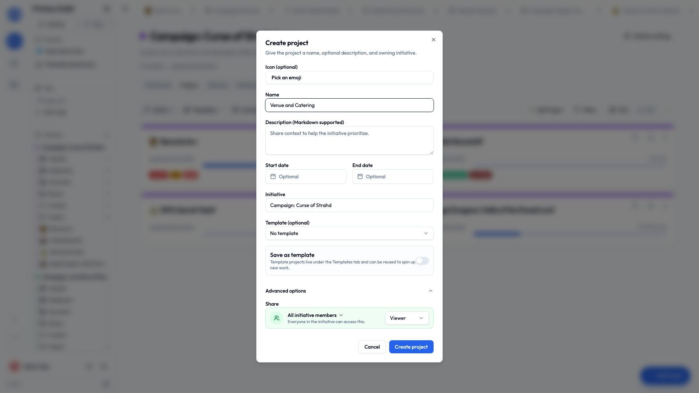
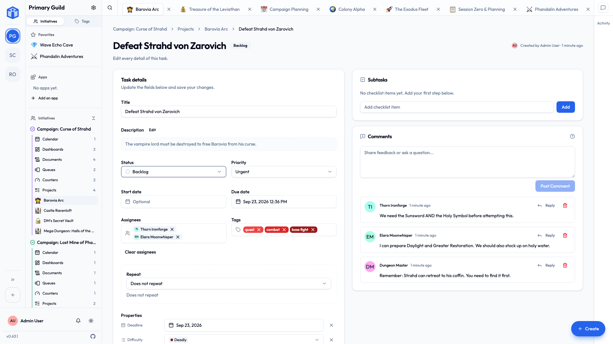

# Projects & tasks

A **project** is a board for tracking work. **Tasks** are the to-dos on it.

If you only ever learn one part of Initiative, make it this one. It's where basically everything happens.

## Making a project

1. Open the initiative it belongs in and click **Create Project**.
2. Fill in:
    - **Project name** — the only required bit.
    - **Icon** — an emoji, so you can find it at a glance.
    - **Description** — optional.
    - **Initiative** — which folder it lives in.
    - **Template** — optionally start from one you saved earlier (see [Templates](#templates)).
3. Create it. The board opens, empty and radiating potential.

### Favourites and pinning

- **Add to favourites** (the star) puts it in your **Favourites** list in the sidebar.
- **Pin project** keeps it near the top of its initiative.

Both are just for you. Starring something doesn't inflict it on anybody else.

## Adding tasks

Click **Create task**. The quick form wants a **title** and maybe a description. That's enough. You can fill the rest in later, or never, and nothing will nag you about it.

Need more detail now? Expand **Advanced details** for everything else, sorted into **Tracking**, **Schedule**, **People & labels**, and any custom **Properties** your initiative uses.

Editing a task later shows you the same sections in the same order, so there's one layout to learn instead of two.

A task can hold:

| Field | What it's for |
|---|---|
| **Title** | A short name. Required. |
| **Description** | The detail. Formatting works, with a **Preview**. |
| **Status** | Where it's got to. |
| **Priority** | Low, Medium, High, or Urgent. |
| **Start date** | When work should begin. |
| **Due date** | When it's due. Optional, and you don't have to be brave about it. |
| **Assignees** | One person or several. |
| **Subtasks** | A checklist of smaller steps, with a progress count. |
| **Tags** | Labels for finding things later — see [Tags](tags.md). |
| **Recurring** | Make it come back on a schedule. |

### Statuses

Every project starts with four:

**Backlog → To Do → In Progress → Done**

You can rename them, add your own, and give each one an icon and colour, from **Project settings → Task statuses**. Each one still belongs to one of the four underlying stages, which is how "archive done tasks" knows what counts as done.

### Subtasks

Break a big task into a checklist. As you tick them off, the task shows its progress — "3/5 subtasks" — which is more motivating on a bad Tuesday than it has any right to be.

Good for the tasks that are secretly three tasks wearing a coat.

### Recurring tasks

For the things that keep coming back: the weekly report, the monthly review, the bins.

Pick the rhythm — daily, every weekday, weekly on a chosen day, monthly on a date, annually, or a **custom** pattern.

Then pick *when* the next one appears: on a fixed **schedule**, or only **after you complete** the current one. Choose the second for anything you'd hate to return from holiday to fourteen copies of.

### The bit where you get confetti

Finish a task that's assigned to you and Initiative marks the occasion — confetti, a "+1 Heart", a "Natural 20", or a shower of gold coins.

Pick your preferred celebration in **User settings → Interface**, or set it to **None** if you'd rather your accomplishments passed in dignified silence.

There's optional sound and vibration too, for anyone who wants the full experience. No judgement. Some weeks you need the coins.

## When a board gets busy

- **Filter** by status, priority, assignee, due date and more.
- **Sort** by any column. In Table view, hold ++shift++ and click more columns to sort by several at once.
- **Group** by status, priority or assignee.
- **Select several tasks** and act on them together — status, dates, assignees, priority, tags, or archive, all in one go.

!!! tip "Archive things, don't delete them"
    Finished tasks don't need deleting. **Archive** sweeps them off the board while keeping the record — there's a one-click **Archive done tasks** for the end of a push.

    And you can filter them back into view any time you'd like documentary evidence of how much you actually got done, which is useful when somebody asks and also just nice.

## Project settings

- **Details** — icon, name, description, tags.
- **Access** — who can see or edit it. See [Sharing](../sharing/sharing-projects-and-documents.md).
- **Task statuses** — your workflow.
- **Advanced** — save as a template, duplicate, archive, delete.

### Moving a task to another project

You can move a task from its menu. One thing that catches people out: because every project can have its own statuses, a moved task restarts at **Backlog** in its new home.

Nothing's broken and you haven't lost anything. Set the new status and carry on.

## Templates

Set a project up exactly how you like it, then save it as a **template** — from **Project settings → Advanced**, or by ticking **Save as template** when you create one.

Next time, start *from* it and skip the fiddling. Ideal for anything you do more than once: every new client, every event, every production. Nobody forgets the step at the end, because the step at the end is already there.

## Exporting a project

**Export a project** to a portable file — an offline copy, a move somewhere else, or a backup of one specific project. It imports back in later.

!!! note "People are named by handle"
    An export identifies assignees, event attendees and person-type fields by **handle** (`foobar#1234`), because a handle is the same in every community and an email address isn't.

    Anything exported before that was true won't match its people on the way back in. Export it again and the new file will.

## Archiving and deleting

- **Archive** hides a finished project without losing anything. Unarchive whenever.
- **Delete** sends it to the community **Trash**, where an admin can restore it until the retention period runs out.

## Related

- [Task views](task-views.md) — Table, Kanban, Calendar.
- [Tags](tags.md) — labelling and filtering.
- [Your space](your-space.md) — all your tasks, from every project and community at once.
