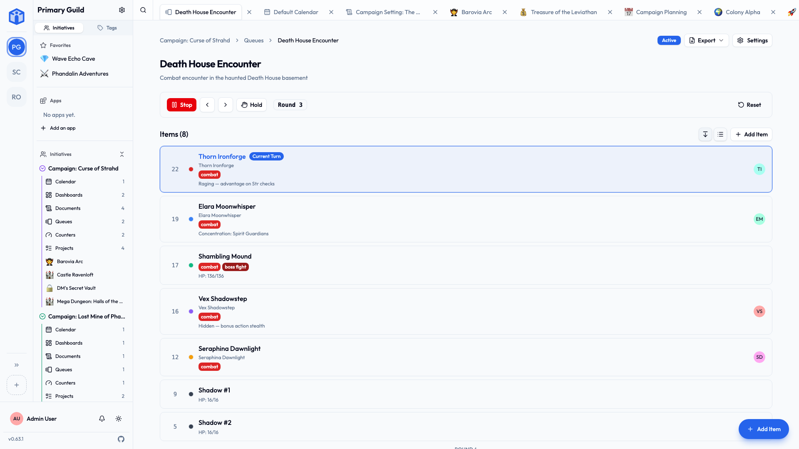

# Queues

A **queue** answers one question, and answers it for everybody at once: *whose turn is it?*

That sounds like a small thing until you count how often a group needs it. Who's on call this week. Who's opening up. Whose turn to bring biscuits. Who speaks next at the AGM. Whose go it is.

Every one of those is currently stored in one person's head, or in a chat message from three weeks ago that nobody can find, and both of those systems fail the moment that person goes on holiday.

## Making one

From an initiative's sidebar, choose **Queues → New queue**, give it a **name** and an optional **description**, and start adding items.

An **item** is usually a person, but it doesn't have to be — it's whatever takes turns. Tables at a fundraiser, agenda points, sections of a script.

Each item can carry:

| | What it's for |
|---|---|
| **Label** | What the item is called. Usually a name. |
| **Color** | So the queue is readable at a glance across a room. |
| **Position** | Where it sits in the order. Drag to rearrange. |
| **Member** | Link the item to an actual person in your community. |
| **Notes** | The detail that doesn't fit in a label — "has a key", "vegetarian", "back on the 14th". |
| **Documents and tasks** | Link the thing this turn is *about*, so nobody has to go hunting for it when their turn arrives. |
| **Visible / hidden** | Keep somebody in the queue without showing them right now. |

## Running one

**Start** the queue and it begins tracking. From there:

- **Next turn** and **Previous turn** step through the order.
- **Hold** parks the current turn without losing the place — the person stepped out, the item isn't ready, the answer is "not yet". **Release** picks it back up.
- **Round** counts how many times you've been all the way round, which is the number people usually actually want.
- **Reset** starts it over from the top.

!!! tip "Hidden items still hold their place"
    Marking somebody hidden takes them off the display without removing them from the order — right for the volunteer who's away this month and back next. Delete them only if they're actually gone.

## Things people use them for

- **On-call rotas** — who's carrying the phone this week.
- **Speaking order** — meetings, panels, table reads.
- **Chores** — the wheel everybody enthusiastically agrees to in January and nobody can recall by March.
- **Turn order** — tabletop games, tournaments, anything with a round in it.
- **Duty rosters** — front of house, driving, unlocking the hall.
- **Whose turn it is to email the council.** Nobody's turn. It's always nobody's turn. Put it in a queue.

## Sharing and comments

Queues share exactly like projects and documents: per-queue access at **Viewer**, **Editor** or **Owner**, or open to everyone in the initiative. Select several queues in the list view to change access on all of them at once.

Every queue has its own comment thread, which you can switch off under **Settings → Advanced** if the queue is the kind nobody needs to discuss.

## Related

- [Tools](tools.md) — the other optional tools.
- [Sharing projects & documents](../sharing/sharing-projects-and-documents.md) — the access levels in full.
- [Tags](tags.md) — labeling queues and their items.
- [Your space](your-space.md#my-tools) — every queue that's reached you, from every community, in one table.
