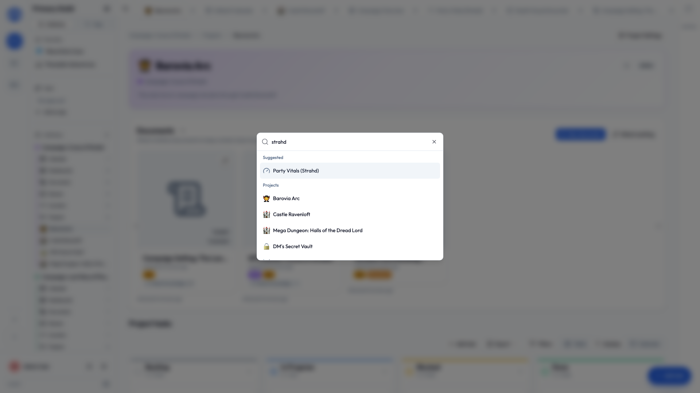

# Search & shortcuts

The fastest way anywhere in Initiative isn't clicking, it's searching. This page covers the search box and the handful of keystrokes worth knowing.

## Search

Press ++cmd+k++ (Mac) or ++ctrl+k++ (Windows and Linux) anywhere. On a phone, a **three-finger tap**. There's also a **Search** entry near the top of the sidebar if you'd rather click.

Start typing and Initiative answers as you go — you don't have to finish the word. Results are ranked, so the thing you probably meant is at the top.

Arrow keys move through results, ++enter++ jumps. For more than jumping straight to one thing, press ++enter++ on **See all results**.

### What it looks through

Everything in the community you're in:

- **Tools** — projects, queues, counter groups, calendars, dashboards.
- **What's inside them** — tasks, queue items, counters, calendar events.
- **Documents, and their contents** — not just names. The words inside a text document, the text on a whiteboard, the cells and sheet names of a spreadsheet.
- **Comments** on any of the above.
- **Tags** and **people**.

It only ever returns what you already have access to, so a search never tells you something exists that you couldn't otherwise open.

### The results page

It names the community it's searching, so there's never a question of which one you're in. Results group into tabs — **Tools**, **Members**, **Comments**, **Tags** — opening on Tools, where most things live. Every tab stays clickable so you can check one yourself, and an empty one says so rather than going grey.

Each result shows the line that matched with your words highlighted, so you can tell which of five similarly-named documents is the right one before opening any of them.

**Archived work** is left out unless you switch **Include archived** on.

### When you don't spell it right

Two things happen without you doing anything:

- **Half a word is enough.** Type `comm` and things called "Community" come back.
- **A misspelling still finds it.** If nothing matches, Initiative offers the closest names it can find and tells you that's what it's doing.

Same for people's names — you don't have to memorize a colleague's spelling.

### Searching from a picker

The same search sits behind every picker in the app: `#` mentions, `[[` document links, attaching a document to a project, choosing what a smart chip points at. They all rank and match as you type, in the same way. See [Mentions & links](mentions-and-links.md).

## The recent-items tab bar

Projects, tasks and documents stack as **tabs** across the top, like a browser. Click to return, close when you're done. Set how many it keeps (1 to 100) in **User settings → Interface**.

## Handy keystrokes

| Keys | What it does |
|---|---|
| ++cmd+k++ / ++ctrl+k++ | Open search |
| ++"Esc"++ | Close the search box or a dialog |
| ++shift++ + click a column | Add a column to the sort (Table view) |

Fuller list on the [keyboard shortcuts](../reference/keyboard-shortcuts.md) page.

!!! tip "When in doubt, search"
    Can't remember which initiative a document is in? Don't go looking. ++cmd+k++ / ++ctrl+k++, a few letters, done.
