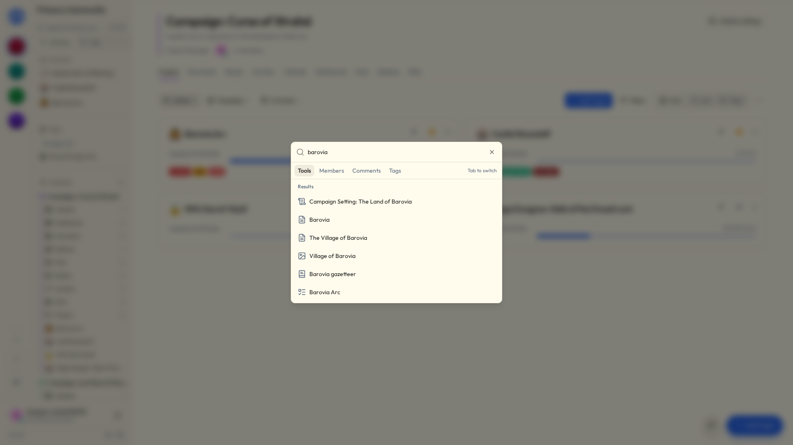

# Search & shortcuts

The fastest way to get anywhere in Initiative isn't clicking. It's typing.

## Search

Press ++cmd+k++ on a Mac, ++ctrl+k++ on Windows or Linux. On a phone, tap with three fingers. There's a **Search** entry near the top of the sidebar too, if you'd rather click, though you probably won't for long.

Start typing and answers appear as you go. You don't have to finish the word, and you don't have to finish the *first* word. Results are ranked, so the thing you almost certainly meant is sitting at the top.

Arrow keys move through results. ++enter++ jumps. For more than a quick jump, hit ++enter++ on **See all results**.

### What it looks through

Everything in the community you're in:

- **Tools** — projects, queues, counter groups, calendars, dashboards, posts, galleries, wikis.
- **What's inside them** — tasks, queue items, counters, calendar events, pictures, wiki pages.
- **Files, and their actual contents.** Not just titles: the words inside a text document, the text on a whiteboard, the cells and sheet names in a spreadsheet.
- **Comments** on any of the above.
- **Tags** and **people**. Search for somebody's display name or handle and you also find what mentions them — type it in whole words.

It only ever returns things you already have access to. Search will never quietly reveal that something exists by refusing to show it to you.

### The results page

It names the community it's searching, so there's never any confusion about which one you're in.

Results are grouped into tabs — **Tools**, **Members**, **Comments**, **Tags** — opening on Tools, where most things live. Every tab stays clickable so you can check for yourself, and an empty one says it's empty rather than going mysteriously grey.

Each result shows the line that matched, with your words highlighted, so you can tell which of five similarly-named files is the right one *before* opening any of them.

**Archived things** are left out unless you switch **Include archived** on.

### What comes first

The best match, mostly. But when two things match about as well, the one more of your community has been opening or working on this week goes a little higher. The meeting notes four people have been living in all week beat the ones somebody made in March and never opened again.

It takes three different people before anything counts, and one person opening a page forty times is one person. It only reorders what you'd have found anyway: nothing turns up because it's popular, and nobody can tell who opened what. Pickers lean the same way before you type anything. A community can [turn it off](../security/community-security.md#ranking-search-by-engagement), and you can stop your own activity counting under **My Settings → Privacy**.

### When you don't spell it right

Which is most of the time, and is fine:

- **Half a word is enough.** Type `comm` and things called "Community" come back.
- **A misspelling still finds it.** If nothing matches what you typed, Initiative offers the closest names it can find and tells you that's what it's doing.

Same goes for people's names. You do not have to memorise how your colleague spells theirs, and you certainly don't have to ask them again.

### The same search is behind every picker

Mentioning something with `#`, linking with `[[`, attaching a file to a project, choosing what a smart chip points at — all the same search underneath, ranking and forgiving typos in exactly the same way. See [Mentions & links](mentions-and-links.md).

## The recent-items tab bar

Projects, tasks and files stack up as **tabs** along the top, like browser tabs. Click to go back to one; close it when you're done.

You can cap how many it keeps (1 to 100) in **My Settings → Preferences**, if you'd like that limit enforced rather than merely intended.

## Keystrokes worth knowing

| Keys | What it does |
|---|---|
| ++cmd+k++ / ++ctrl+k++ | Open search |
| ++"Esc"++ | Close the search box or a dialog |
| ++shift++ + click a column | Add a column to the sort (Table view) |

There's a fuller list on the [keyboard shortcuts](../reference/keyboard-shortcuts.md) page.

!!! tip "When in doubt, search"
    Can't remember which initiative a file ended up in? Don't go looking for it — that way lies twenty minutes and a bad mood.

    ++cmd+k++, a few letters, done. Faster than the sidebar essentially every time, and about four days from becoming muscle memory.
