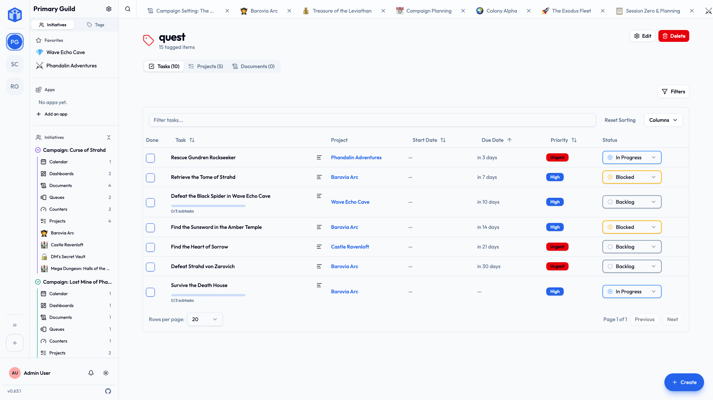

# Tags

**Tags** are labels you stick on things to group and find them. The same tag works on tasks, projects, documents and events, so something like `urgent`, `client-acme` or `idea` pulls together everything related, wherever it lives.

## Adding a tag

Wherever you see an **Add tags…** box:

1. Start typing a name.
2. Pick an existing tag, or choose **Create "your-tag"** to make one on the spot.

Done. It's attached, and now available everywhere else too.

!!! tip "Few and meaningful beats many and vague"
    A handful of clear tags you use consistently is worth more than dozens you used once. Think about how you'll want to *find* things later, and name for that.

## Finding things by tag

- In **Table** views, **filter** by tag to cut a busy list down to what's labeled.
- The **Tags** area in the sidebar lists every tag in the community.
- A tag's **detail page** shows everything carrying it, split into **Tasks**, **Projects** and **Documents**.

## Managing tags

From a tag's detail page you can **rename** it — the change applies everywhere it's used — or **delete** it. Deleted tags go to the **Trash**, so an accidental deletion is undoable for a while.

You can also **add or remove tags on many items at once**: select several tasks and edit their tags together.

## Related

- [Projects & tasks](projects-and-tasks.md) — tagging and filtering tasks.
- [Documents](documents.md) — tagging documents.
