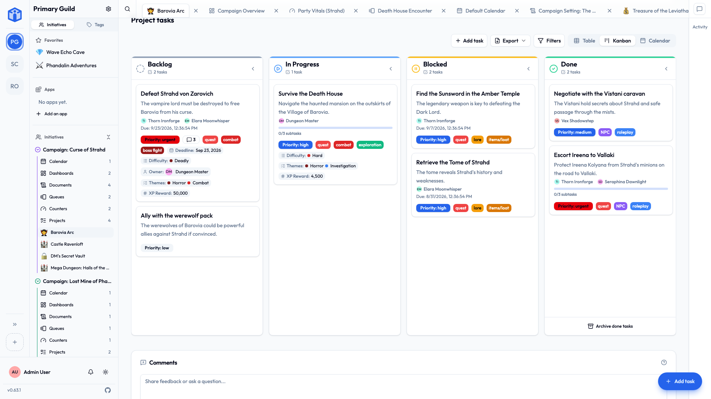
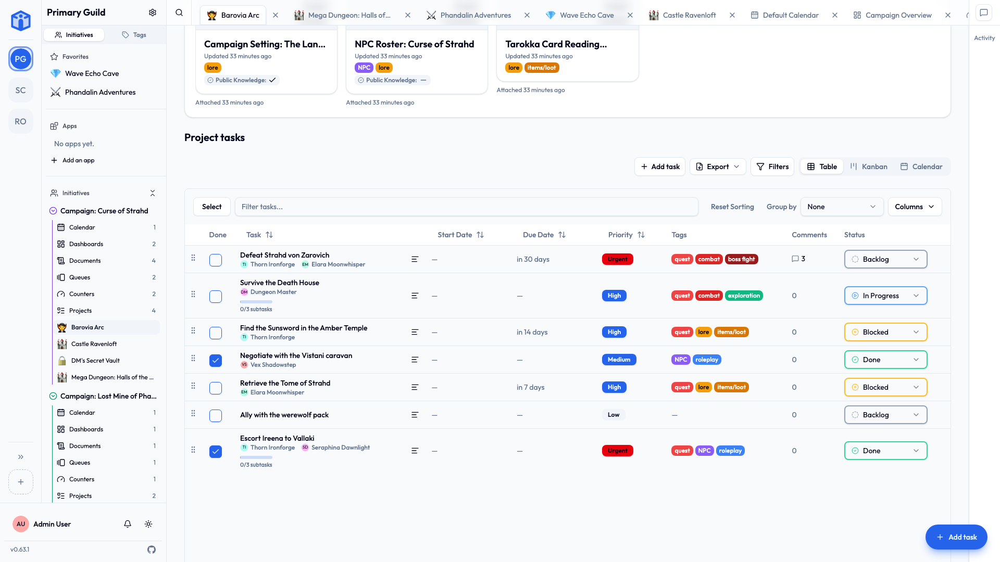
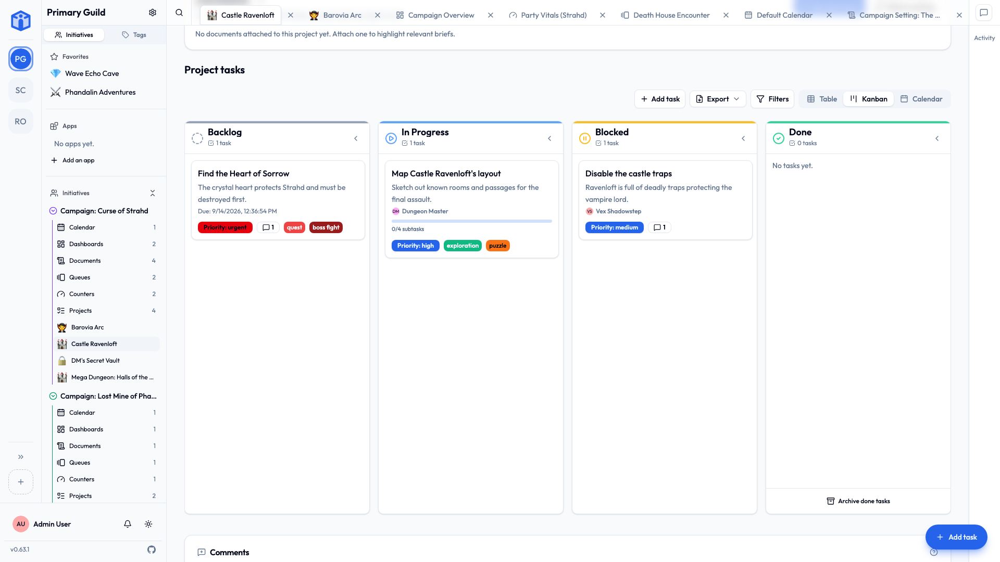

# Task views

The same tasks, three ways of looking at them.

Switching changes nothing about the tasks themselves — only what you're looking at — so there is no wrong choice here and nothing you can break by trying one. The switcher's at the top of any project board.

## Table

A spreadsheet-style list. One row per task, with columns for status, priority, dates, assignees and the rest.

**Best for:** scanning a lot of tasks, sorting, and editing several at once.

- Click a column heading to **sort** by it. Hold ++shift++ and click another to sort by both.
- **Group** rows by status, priority or assignee.
- **Filter** down to exactly what you want.
- **Select** several rows and edit them together.

## Kanban

Cards in columns, one column per status. Drag a card along as the work moves.

**Best for:** seeing the shape of what's happening, and updating things without opening anything.

- **Drag and drop** between columns to change status.
- **Collapse** a column you're deliberately not thinking about.

## Calendar

Your tasks laid out by their start and due dates.

**Best for:** seeing *when* everything lands, and noticing the Thursday you've cheerfully scheduled six deadlines on.

## So which one?

No wrong answer. A rhythm that works for most people:

- **Kanban** day to day, for nudging things along.
- **Table** when you're tidying up, sorting, or editing a lot at once.
- **Calendar** when you're planning ahead, or working out how bad next week is going to be.

Your choice is yours alone and it's remembered, so you can settle into one without imposing it on anybody else.
