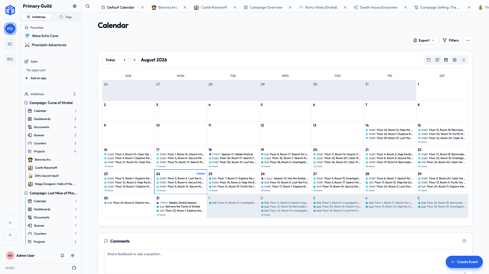
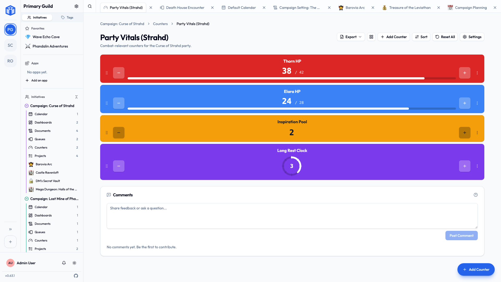
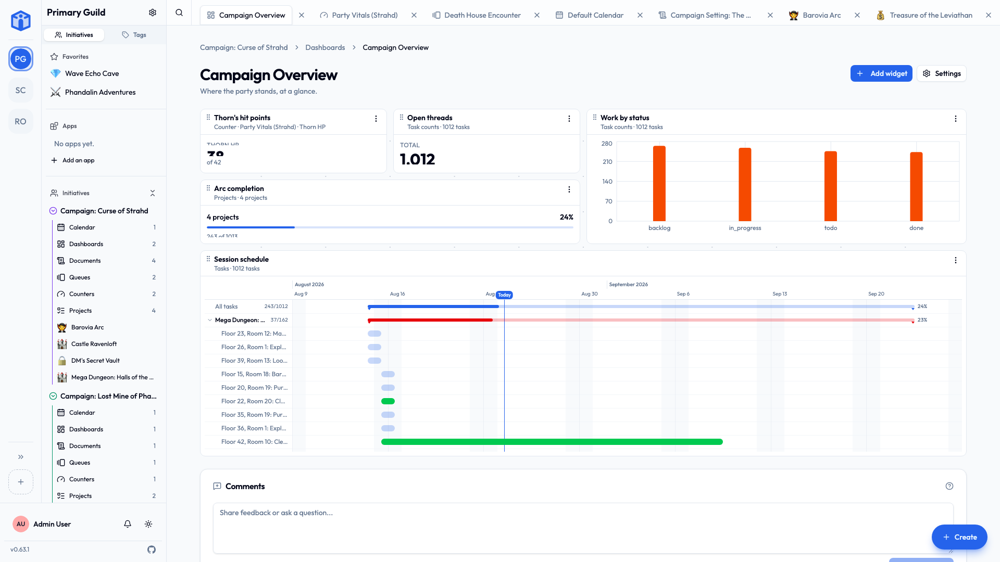

# Tools

Beyond projects and documents, each initiative can use a few extra **tools**: a **calendar**, **queues**, **counters**, and **dashboards**. They're optional — there if your group needs them, out of the way if it doesn't. You'll find them in the sidebar under the initiative, once your [role](../sharing/initiative-roles.md) allows it.

Most groups don't turn any of these on for a while. Add one when a real need shows up: a shared calendar when scheduling starts to sprawl, a dashboard when someone asks how the work is going.

!!! tip "Bulk-edit who can access them"
    You can select several **events, queues, or counters** in a list view and update **who can see or edit them** all at once — the same bulk access editing available for projects and documents. See [Sharing & access](../sharing/index.md).

## Calendar & events

The **calendar** is for things that happen at a time: meetings, sessions, deadlines, performances.

**Create an event** and you can set:

- **Title**, **description**, and **location** (or a link).
- **Start** and **end** times, or mark it **all day**.
- A **color** to tell event types apart.
- **Attendees** — the people invited.
- A **recurrence** if it repeats (same options as recurring tasks).

### RSVPs and reminders

Invited people can respond — **Accepted**, **Declined**, **Tentative**, or leave it **Pending** — so you can see who's coming. Each person can also set a **reminder** (at the start, or minutes/hours/days before) so the event doesn't sneak up on them.

The calendar shows your events by **day, week, month, year, or as a list**, and you can **import and export** events as standard `.ics` files to sync with other calendar apps.

!!! tip "See every event in one place"
    Your personal [My Calendar](your-space.md) gathers events *and* dated tasks from across all your guilds, so you get one combined view of everything on your plate.

## Queues

A **queue** keeps track of whose turn it is. It's ideal for anything that takes turns or rotates — an on-call roster, a speaking order, a chore wheel, who's opening the shop this week, turn order in a game.

A queue holds **items** (often people), and each item can have:

- A **label** and a **color**.
- A **position** in the order.
- **Notes**.
- Links to a **member**, **documents**, or **tasks**.
- A **visible** or **hidden** state.

You can **Start** the queue, step through **Next turn** / **Previous turn**, **Hold** and **Release** a turn, and track which **round** you're on. When it's done, **Reset** to begin again.

## Counters

A **counter** tracks a number that goes up and down — a ticket tally, seats left, a budget, a score. **Counter groups** bundle related counters together (for example, one counter per table at a fundraiser).

Each counter can have:

- A current **count**, with optional **minimum** and **maximum** bounds.
- A **step** (how much each tap adds or removes).
- An **initial value** to reset to.
- A **color** and a **display style**: a plain **number**, a **progress bar**, or a **segmented clock**.

**Increment**, **decrement**, or **reset** a counter with a tap, **reset all** in a group at once, and use **Focus** mode for a big, full-screen view — handy when everyone's looking at one screen.

## Dashboards

A **dashboard** puts the answer to "how are we doing?" on one screen. It's a canvas of tiles — charts, single numbers, timelines — each reading from your own data: task counts, project progress, upcoming calendar entries, a counter's value.

Dashboards **only display**. Nothing on one can be edited from it, so a dashboard is safe to leave open on a shared screen or hand to someone who only needs the overview.

Each tile shows *you* only what you're already allowed to see, so two people can open the same dashboard and correctly see different numbers.

You can build one from scratch, or add a ready-made one from the marketplace and adjust it — see [Apps & the marketplace](apps-and-marketplace.md).

## Related

- [Initiatives](initiatives.md) — tools live inside an initiative, and roles control who can use them.
- [Apps & the marketplace](apps-and-marketplace.md) — ready-made dashboards and apps from other groups.
- [Notifications](notifications.md) — event invites and reminders.
- [Your space](your-space.md) — your combined calendar.
