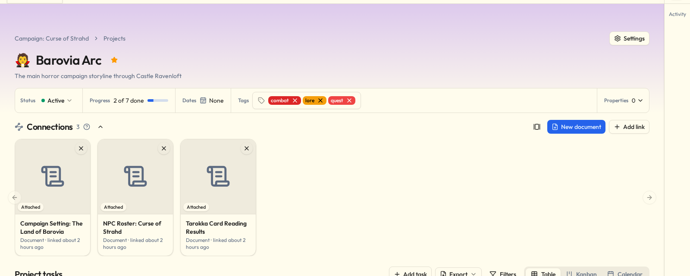
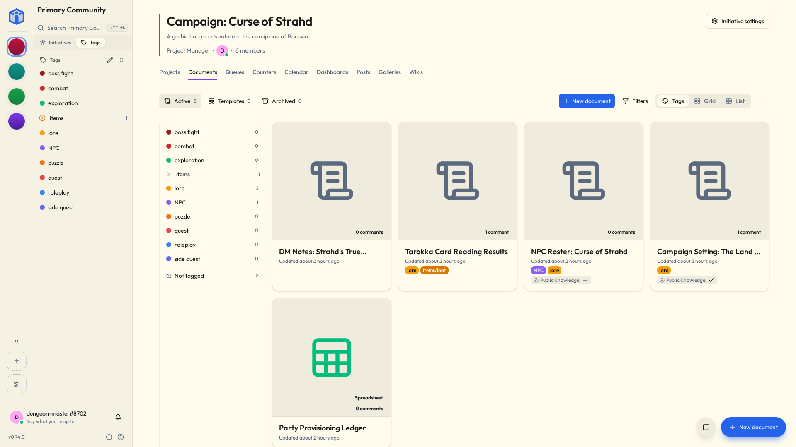
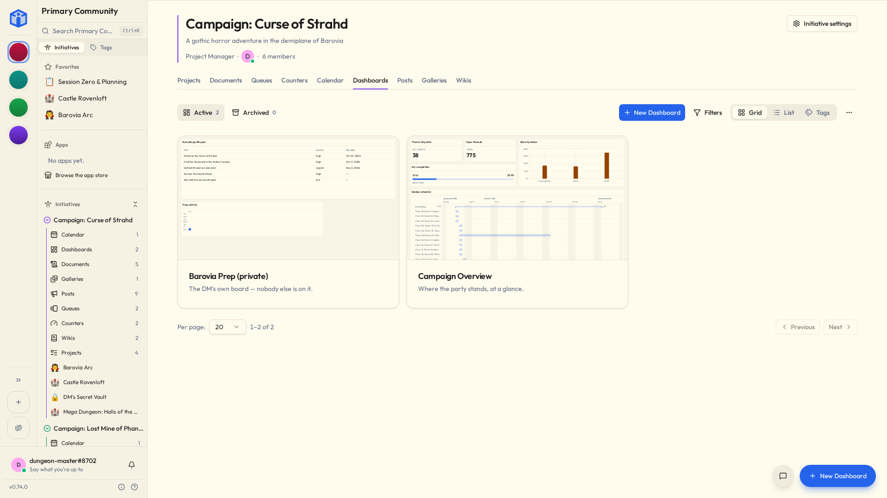

# Tools

Everything that lives inside an initiative is a **tool**. There are nine kinds. Projects and documents are switched on to begin with; the rest sit quietly, entirely unbothered by whether you ever open them.

-   :material-clipboard-check-outline: __Projects & tasks__

    Boards and the to-dos on them, as a table, a Kanban board or a calendar.

    [:octicons-arrow-right-24: Projects & tasks](projects-and-tasks.md)

-   :material-file-document-edit-outline: __Documents__

    Text, spreadsheets and whiteboards, written together in real time.

    [:octicons-arrow-right-24: Documents](documents.md)

-   :material-calendar-month-outline: __Calendar & events__

    Things that happen at a time, with RSVPs and reminders.

    [:octicons-arrow-right-24: Calendar](calendar.md)

-   :material-format-list-numbered: __Queues__

    Whose turn it is. Rotas, running orders, chore wheels.

    [:octicons-arrow-right-24: Queues](queues.md)

-   :material-counter: __Counters__

    Numbers that move. Tallies, totals, scores, seats left.

    [:octicons-arrow-right-24: Counters](counters.md)

-   :material-view-dashboard-outline: __Dashboards__

    One screen that answers "how are we doing?"

    [:octicons-arrow-right-24: Dashboards](dashboards.md)

-   :material-bullhorn-outline: __Posts__

    A noticeboard. Announcements, polls, and who's read them.

    [:octicons-arrow-right-24: Posts](posts.md)

-   :material-image-multiple-outline: __Galleries__

    A wall of pictures. Mockups, screenshots, the four logos that lost.

    [:octicons-arrow-right-24: Galleries](galleries.md)

-   :material-book-open-page-variant-outline: __Wikis__

    Linked pages, for the things your group knows rather than the things it is doing.

    [:octicons-arrow-right-24: Wikis](wikis.md)

## Add one when you actually need it

Most groups run on projects and documents for a good long while, and there is nothing wrong with that. The others each have a fairly specific moment where you'll suddenly want them:

- A **calendar**, when scheduling has visibly outgrown the group chat.
- A **queue**, the second time somebody asks whose turn it is.
- **Counters**, when a number needs to be the *same* number for everyone in the room.
- A **dashboard**, when somebody who isn't doing the work starts asking how the work is going.
- A **board**, the third time something important was announced in a chat and missed by four people.
- A **gallery**, when the mockups are in a folder called `final`, next to a folder called `final2`.
- A **wiki**, when every answer to "how does the float work?" is "ask Margaret".

Switching one on is not a commitment or a lifestyle change. Switching it off later doesn't delete anything.

That goes for projects and documents too. They're the two an initiative starts with, because most groups want them — but they're switches like the rest, in the **Tools** card under **Initiative settings → Details**. Making an initiative asks which ones it wants, too. A book club that keeps notes and a reading schedule can turn Projects off rather than look at an empty tab forever; a game night that is a calendar and a pile of counters can turn both off. Nothing is deleted, and turning one back on brings it all back.

## Who can use what

Tools appear in the sidebar under an initiative once your [role](../sharing/initiative-roles.md) allows them. A role decides which *kinds* of tool you can view and create; [sharing](../sharing/sharing-projects-and-documents.md) then decides which specific ones you can reach.

So "I can't see Queues at all" is a role question, for an initiative manager. And "I can see Queues but not *that* queue" is a sharing question, for whoever owns it. Two different people, two different conversations, and it's worth knowing which one you're having.

## What they all have in common

Every tool, without exception:

- **Shares the same way** — Viewer, Editor, Owner, or everyone in the initiative.
- **Takes tags**, so a tag pulls together everything on one subject regardless of what kind of thing it is. See [Tags](tags.md).
- **Has a comment thread**, switchable off per item under **Settings → Details**.
- **Can be pointed at** with `#` from any comment or document, and lists what points back in its [Connections](#connections).
- **Exports** from **Settings → Advanced**, for whoever could also delete it.
- **Can be [duplicated](#duplicating)**, with everything inside it.
- **Goes to the Trash** when deleted, not to oblivion.
- **Turns up in [My Tools](your-space.md#my-tools)**, gathered with everything else of its kind from every community you're in.

Learn it once and it's true of the next one. That's the entire point of doing it this way — including for the tools that don't exist yet, since the list has grown before and will again.

## The top of every tool page

Open a project, a queue, a dashboard or any other tool and the top of the page is laid out the same way:

- **A band in the initiative's colour**, so you always know which initiative you're standing in. It holds the breadcrumb back out, and **Settings** across from it if you're allowed to change things.
- **The name and description.** Click the name to rename it. A document is the one exception: its title is the field at the top of the document.
- **A strip underneath**, with **Status**, **Tags** and **Properties**, all changeable right there, beside whatever only that tool has — a project's progress and dates, a queue's turn controls.

**Status** is **Active** or **Archived**. Archiving marks a thing finished: it, and everything inside it, turns read-only until you take it back out. Projects and documents can also be a **Template**, and that's where you make one.

A wiki is laid out differently, because a wiki is for reading. See [Wikis](wikis.md).

## Lists

Each tool has a tab on the initiative's page listing everything of that kind you can reach. Projects, documents, queues, counters, dashboards, galleries and wikis can each be shown three ways, and each remembers the one you picked:

| View | What it's for |
|---|---|
| **Grid** | Cards, side by side. |
| **List** | One row each, with its tags. Quicker to scan when there are a lot. |
| **Tags** | The tag tree beside the cards — a row of tag chips on a phone. Click a tag to see what carries it, and more tags to add them. A tag includes the tags filed under it. |

Some cards show what's inside without opening anything: a dashboard's card is a small copy of the dashboard, a counter group's shows its first counters, a queue's shows whose turn it is and who's next, and a gallery's shows its cover.

Along the top of a list:

- **Show** switches between **Active** and **Archived** — and, for projects and documents, **Templates** — each with how many are in it.
- **Filters** narrows the list by name, by tag, and by the initiative's own [properties](initiatives.md).
- **More actions** holds the rest: **Select items**, for changing who can see or edit several at once (click the first, hold ++shift++, click the last — see [Sharing & access](../sharing/index.md)); **Import from file**, for bringing back something exported; and, where the [marketplace](apps-and-marketplace.md) has ready-made ones, **Browse the marketplace**.

There's one button for making a new one. On a phone it lives at the bottom of the screen.

## Connections

Every tool has a **Connections** section, and so do the things inside one — a task, an event, a picture, a wiki page. It lists what this links to and what links to it, and it's where you say how two things relate: this task *is blocked by* that one, this document *is attached to* that project. See [Mentions & links](mentions-and-links.md#connections).

## Duplicating

Every tool but a notice can be copied from **Settings → Advanced → Duplicate**, into this initiative or any other where you can make one. The copy brings everything inside it, with their tags and links — a calendar its events and repeats, a wiki its published pages — and keeps its sharing while it stays in the same initiative. Anyone who can read a template can copy it.

A notice is posted once. The next one is a new notice.

The things inside a tool copy on their own, too: a task, a counter, a queue item, an event, a wiki page. The copy lands in the same place as the original, with "(Copy)" on its name, and brings its tags, links and properties. Each tool's own page says where its **Duplicate** lives.

## Related

- [Initiatives](initiatives.md) — tools live inside an initiative.
- [Apps & the marketplace](apps-and-marketplace.md) — ready-made dashboards and apps.
- [Your space](your-space.md#my-tools) — every tool of every kind that's reached you, across every community.
