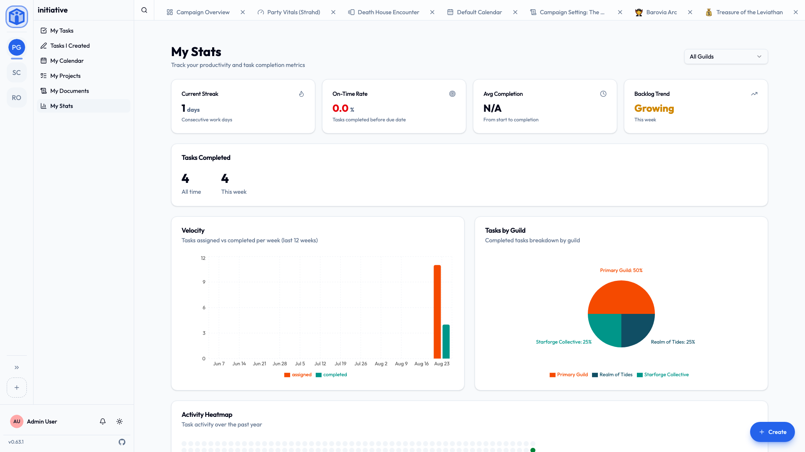

# Your space

Most of Initiative is organized by community and initiative. But you also get a set of **personal views** that gather *your* things from across **every** community you belong to — so you never have to go hunting community by community. Reach them by clicking the **Initiative logo** in the **top-left corner** of the screen (it sits above your communities on the rail).

## My Tasks

Everything assigned to you, from every community and project, in one list. Group it **by date** or **by community**, and filter by priority, status, or community. This is the page to live in if you just want to know "what should I be doing?"

## Tasks I Created

The tasks *you* made, wherever they ended up. Useful for following up on things you've handed off or set in motion.

## My Projects

Every project that has reached *you*, across all your communities — a fast way to jump to one without switching communities first.

"Reached you" is the same rule everywhere on these pages: work that's been shared with you directly, shared with a role you hold, or shared with everyone in an initiative you're in. It isn't "everything you could open if you went looking" — a community admin, who can reach anything in their community, still gets a list of their own work rather than the community's.

## My Documents

The documents that are yours, gathered together, on the same rule.

## My Contacts

Everyone you share a community with, on one page — so you can find a colleague without first remembering which community you know them from.

Your **favorites** sit at the top, then each of your communities in the order you dragged them into the rail, as sections you can collapse. It reads as one table: the same columns — person, name, and the communities you have in common — run down every section, so somebody who's in three of your communities lines up with themselves. Hover the small community icons on a row for the full list of what you share.

- **Star anyone** to keep them at the top, including people you share no community with. Starring is private and tells them nothing.
- **One search box** covers the whole page. Each community keeps its own member list, so a search visits them one at a time and says so while it works.
- Each section **pages on its own**, twenty at a time, without moving the ones around it.

Opening a row takes you to [that person's profile](../account/profile-and-preferences.md#your-profile-page).

!!! screenshot "My Contacts"
    **Show:** the contacts page with a Favorites section and two community sections, and the shared-community icons on a row.

    Save as `en/images/your-space/my-contacts.png`, then replace this box with:
    ``

## My Calendar

Your events **and** dated tasks from across every community, on one calendar — the calendars that have reached you, on the same rule as above. The single best place to see your whole schedule in one glance.

## My Stats

A friendly look at your own activity:

- **Current streak** — consecutive days you've gotten things done.
- **On-time rate** — how often you finish before the due date.
- **Tasks completed** — this week and all-time.
- **Velocity** — how much you take on versus complete each week.
- An **activity heatmap** of the past year.

It's just for you — a bit of encouragement and a sense of your own rhythm, not a leaderboard.

## Favorites

Star a project to add it to **Favorites** for one-click access. Your favorites are personal — starring something changes nothing for anyone else.

## Related

- [Notifications](notifications.md) — how Initiative tells you what needs attention.
- [Search & shortcuts](search-and-shortcuts.md) — jump anywhere in seconds.
- [Profile & preferences](../account/profile-and-preferences.md) — your own profile, and how you appear to everyone else.
