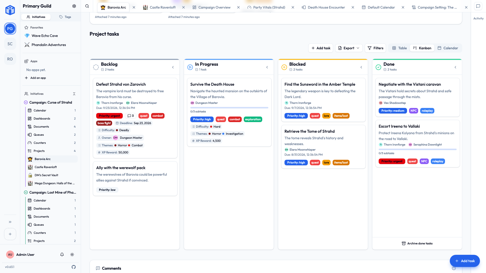

# Welcome to Initiative

Initiative is where your group's projects, tasks, documents, and plans live together. It's made for small businesses, clubs, committees, event teams, families, and anyone else coordinating work with other people — without needing to learn project management first.

## Start small; it grows with you

You can get real value on day one from a single board with tasks on it. Later, when your group needs a shared calendar, or a place to write things down, or a way to report on how the work is going, those are waiting — and until then they stay out of your way.

## New here? Start at the beginning

If this is your first time, **Getting started** covers creating your account, finding your way around, and joining or creating your first workspace.

[Start with Getting started →](getting-started/index.md){ .md-button .md-button--primary }

## Find what you need

-   :material-rocket-launch-outline: __Getting started__

    Create an account, sign in, take the tour, and join your group.

    [:octicons-arrow-right-24: Getting started](getting-started/index.md)

-   :material-sitemap-outline: __How Initiative is organized__

    Communities, initiatives, projects, documents — what they are and how they fit together.

    [:octicons-arrow-right-24: The big picture](concepts/index.md)

-   :material-book-open-variant: __Using Initiative__

    Day-to-day how-to guides for projects, tasks, documents, the calendar, and more.

    [:octicons-arrow-right-24: How-to guides](guides/index.md)

-   :material-storefront-outline: __Apps & the marketplace__

    Add ready-made dashboards and apps built by other groups like yours.

    [:octicons-arrow-right-24: Apps & the marketplace](guides/apps-and-marketplace.md)

-   :material-account-multiple-check-outline: __Sharing & access__

    Decide exactly who can see and edit each project and document.

    [:octicons-arrow-right-24: Sharing & access](sharing/index.md)

-   :material-shield-lock-outline: __Security & privacy__

    What "secure" means for you, and how your group's data stays separate from everyone else's.

    [:octicons-arrow-right-24: Security & privacy](security/index.md)

-   :material-cog-outline: __For administrators__

    Installing, configuring, and looking after your own Initiative server.

    [:octicons-arrow-right-24: Admin guide](admin/index.md)

-   :material-help-circle-outline: __Frequently asked questions__

    Short answers to the things people ask most — getting in, the age question, and why an account might be shut out.

    [:octicons-arrow-right-24: FAQ](faq.md)

## You choose who sees what

Nothing in Initiative is visible to "everyone" by default. Your group's space is separate from every other group's; inside it, each effort is visible only to the people you add to it; and individual projects and documents can be narrowed further still.

That means a business owner can keep payroll planning away from the seasonal staff, and an event team can work on next year's programme without the volunteers seeing it — in the same workspace, with no extra setup. [How that works →](sharing/index.md)

??? techspec "For the technically minded — what Initiative is, briefly"
    Initiative is a web application you can run yourself. The interface is a single-page web app; it talks to a Python service backed by a PostgreSQL database. Each group ("community") gets its **own database schema**, so a request in one community can't address another community's tables at all; the finer layers inside a community — which effort, which role, which item — are enforced by the database's own row-level security rather than by the app alone. There's a companion mobile app (iOS and Android) for notifications and on-the-go use. More in [Security & privacy](security/index.md) and the [administrator guide](admin/index.md).

## The tools come from people like you

The thing your group needs has usually already been built by another group with the same problem. Initiative's **marketplace** lets you add ready-made dashboards and apps to your workspace in a couple of clicks — no developer, no custom build.

It's curated, not a free-for-all: your marketplace holds what ships with Initiative plus what the person running your server has approved. See [Apps & the marketplace](guides/apps-and-marketplace.md).

## A note on the words we use

Initiative borrows a few everyday words and gives them a specific meaning. The two you'll meet first:

- A **community** is a workspace — one separate space for one group of people. Your book club and your work team would be two different communities.
- An **initiative** is a folder for a big effort inside a community. It gathers related projects and documents in one place.

There's a full [glossary](reference/glossary.md) if you ever hit a word you don't recognize.

## Built in the open

Initiative is developed publicly, and the feedback of the people using it shapes what gets built next. If something here is unclear, wrong, or missing, that's worth telling us about — the [project on GitHub](https://github.com/Morelitea/initiative) is where it happens.
