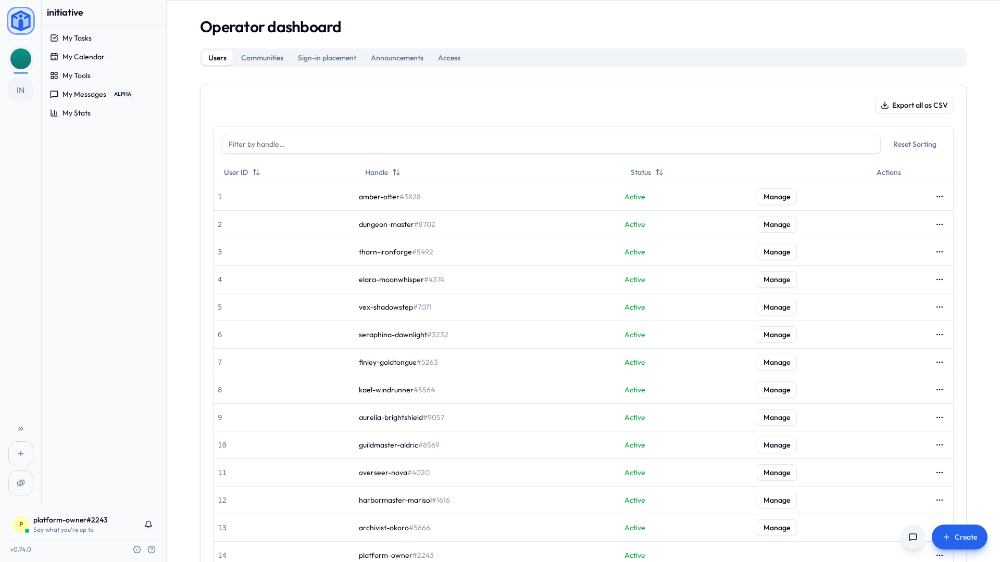
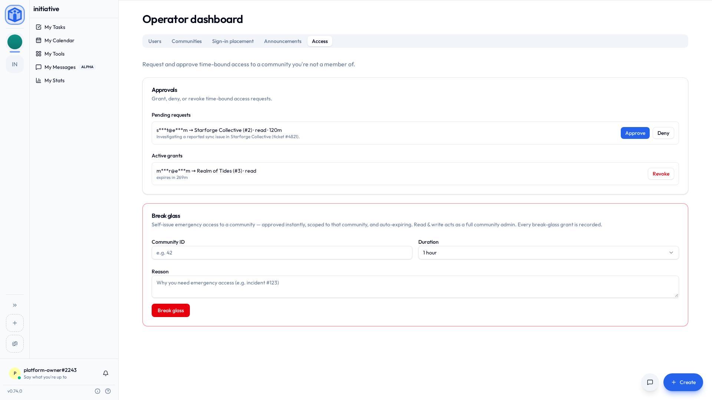

# Platform roles

Two role systems, kept deliberately separate:

- **Community roles** (superadmin / admin / member) govern a single workspace. See [Working with communities](../guides/communities.md).
- **Platform roles** govern the **whole server** — every community, every user. That's this page. The ladder runs member → support → moderator → operator → owner. **Admin** belongs to the community ladder above, and stays there.

Platform roles are managed by the [owner](#the-owner) — and for some actions, operators — from **Settings → Platform** and the **Operator dashboard**.

## The ladder

Five rungs, each adding to the one below:

| Role | What it can do |
|---|---|
| **Member** | Standard access to their own communities. No server-wide privileges. This is everyone by default. |
| **Support** | Read-only visibility of the platform's users and communities, can open a community's billing in the billing service's support console, can **request** time-bound access to a community to help with an issue, and can let somebody answer the age question again after a typo. |
| **Moderator** | Everything Support can do, **plus** user management (suspend/reactivate, sign out everywhere, revoke an account's API keys), content moderation, and suspending a community under a [Moderate grant](#suspending-a-community-as-a-moderator). |
| **Operator** | Manages users, communities, and roles platform-wide, has cross-community access (via break-glass), approves access requests, writes [announcements](announcements.md), writes [sign-in placement rules](single-sign-on.md#rules-on-a-provider), and opens [billing insights](#billing-insights). |
| **Owner** | Full control, **including server-wide configuration** (single sign-on, email, branding, AI). The only role that can change configuration. |

!!! info "Capabilities, not just titles"
    Each rung maps to a set of **capabilities**, and features are gated on the capability rather than the role name. The practical upshot is exactly what the table says — but it means the model is precise about *what* each role may do, not just who outranks whom.

## The owner

The **first person to register** on a new server becomes the **owner**. The owner is the only role that can change app-wide configuration, so:

!!! warning "Never leave the server without an owner"
    Don't demote or delete the last owner-level account.

    Initiative does guard against removing the final configuration-holder, but don't rely on that as a plan. Make sure there is always at least one person who can change settings and is reachable.

## Managing platform users

**Operator dashboard → Users** lists every account on the server by **User ID**, **Handle** and **Status**. The handle is all you need to go on, and IDs count up as accounts are made, so sorting by ID sorts by when somebody joined.

**Manage** opens everything you can change about one account:

- **Username** — the handle they're addressed by. The four digits after it stay as they are.
- **Profile picture** — take one down. Putting one up stays theirs.
- **Names in communities**, **status line** and **decorations** — clear any of them, for one that breaches your terms. Names clear in every community they're in. They can set each again.
- **Sign out everywhere** — ends every session the account has, on every device. For an account somebody else may have got into: its holder signs in again, and whoever else had it doesn't.
- **Cases** — how many open cases in your [operations community](#where-operations-work-lands) the account filed or is the subject of, with a link to each. A link opens only for someone with access to where the case is kept.
- **For case** — at the top of the panel, where you can read open cases: choose the case you're acting for, and each change you make in the panel is noted on it, by handle and name of the act. Optional.
- **API keys** — **Revoke** switches off every key the account holds, at once. The keys stay on the owner's list marked disabled, and they can make new ones.
- **Suspend** — puts the account in time out. They can sign in, and what they get is one screen: that they're suspended, the reason you gave, and [who to contact](#who-to-contact). Their communities, their own settings and every power their platform role carries stay out of reach until you lift it. Nothing is deleted; lifting it hands everything back exactly as it was.
- **Platform role** — move them up or down the ladder. You can't grant a rung above your own.

Each of those asks for its own capability, so a moderator opening the same panel sees everything but the platform role. What's offered on each account is worked out by the server: nothing on an account above your own rung, and nothing on your own — that's yours to change from your own settings.

The row's actions menu keeps the one-off jobs. It offers nothing but **Export** on an account above your own role.

- **Reset password** sends them a reset email.
- **Resend verification email**, shown on an account whose address isn't confirmed yet.
- **Reactivate** a deactivated account.
- **Restore account**, shown on a deleted account that hasn't been erased yet. It comes back exactly as it was — the same as if they'd signed in themselves during the window. See [How long deleted things are kept](configuration.md#how-long-deleted-things-are-kept).
- **Export** one account as CSV. **Export all as CSV**, above the list, takes the lot.
- **Reset age question** lets somebody answer the age question again, where they answered as under age. Nearly always a mistyped year. It clears the answer and nothing else — they answer again from scratch, and no birthday is recorded either way. See [Asking members their age](configuration.md#asking-members-their-age).
- **Turn password sign-in back on**, shown on an account marked **Password sign-in off**. Five wrong passwords or codes in fifteen minutes switch it off for fifteen minutes; a second time that day, an hour; after that, four hours each time. It comes back on by itself, or as soon as they reset their password from the emailed link, so this is for when they can't wait. Their passkeys work throughout, and so does anywhere they're already signed in. Moderator and above.
- **Clear two-factor authentication**, shown on an account with an authenticator app set up, while signing in with a password or an emailed code is turned on — those are the only sign-ins that ask for its code. For when their phone is gone and so are the recovery codes. It takes the authenticator off, signs them out everywhere and emails them; they sign in the way they usually do and set it up again. Moderator and above.
- **Delete user**, choosing how thorough it is:
    - **Deactivate** — can't sign in; data preserved; reversible.
    - **Anonymize** — personal details removed; their content remains as "Deleted user"; not reversible.
    - **Hard delete** — everything removed, including authored content; not reversible.

Before a destructive delete, Initiative makes you resolve one kind of **blocker**: an account holding a community's only [superadmin](../guides/communities.md#why-superadmin-is-separate) seat. Either the account holder hands the seat to another member first, or you [break glass](#cross-community-access-break-glass-and-time-bound-grants) into the community and, from its own settings, appoint somebody in **Settings → Users** — or, where there's nobody left to hand it to, delete the community in **Settings → Danger zone**. Deleting a community always happens there, under a grant. Content they owned is released on the way out for the community's admins to claim.

## Billing insights

On a server connected to a billing service, **Operator dashboard → Billing** opens a page of how things are going across every community: revenue, recurring revenue, refunds and chargebacks straight from the payment processor, beside counts of communities by plan, trials, overdue payments and cancellations.

It needs no grant, because it opens no community. Nothing on it names a community, a customer or a person — only totals and counts. Operators and owners hold it. A server with no billing service has no Billing tab.

## Cross-community access: break-glass and time-bound grants

**Nobody holds a standing back door into communities they don't belong to** — not even platform operators. When platform staff genuinely need to reach a community's data, they take **explicit, time-bound, recorded** access instead. Manage it from **Settings → Access**.

### What a grant can say

A request names **what it reaches**, and the two halves are asked for separately:

| | What it reaches |
|---|---|
| **Content** | What the community holds — read-only, read-and-write, or **moderate**. A read-write grant edits existing material; it doesn't author new material or manage members. A moderate grant reads everything, including what is [held](#held-content), and changes nothing. Only moderators and operators can ask for one, and it can't be self-issued. |
| **Settings** | The community's configuration and nothing inside it, held at **admin** or **superadmin** — the community's own two rungs. Somebody helping with a moderation setting has no business in anybody's files, and this is how they don't end up there. |

Ask for one, the other, or both. Each is approved and recorded on its own.

### The two paths

- **Request and approve** (Support and Moderator). Someone **requests** what they need, for a chosen number of hours, with a reason and the [case it's for](#grants-and-their-cases). An approver (Operator/Owner) grants or denies it, and it **auto-expires**.
- **Break glass** (Operator and Owner). For urgent situations, an operator can **self-issue** an emergency grant — approved instantly, scoped to that community, expiring automatically. Breaking glass issues both halves, the settings one at superadmin, because an emergency is no time to discover you asked for the wrong shape. Each is named and recorded separately, so afterwards the log says exactly how far it went.

### Grants and their cases

Where your [operations community](#where-operations-work-lands) takes security, moderation or support cases, a request names the **case** it's for, picked from the open cases you can read. The case must be about the community you're asking for, or about none yet, in which case the request settles it. Feedback cases can't be named; breaking glass may name a case, and doesn't have to.

The case hears what becomes of the grant: that it was asked for, how it was decided (an approval moves a case still waiting to be picked up into progress), each moderation act or suspension taken under it, and what it did — once an hour while it's live, and in full when it ends: what was read, counted by kind, and what was changed, listed, with who revoked it if somebody did. The case is only ever told ids, counts and the names of routes and acts, never what the community holds. A case lists its grants in its **Access** section, with **Request access** to ask for another.

!!! info "A grant is never a membership"
    Whatever it reaches and whoever holds it, a grant runs out. Anything that would outlive it stays out of reach — a grantee can't answer a request to join an initiative, for instance, because the membership on the other side of that answer has no end date.

!!! info "Breaking glass asks for your authenticator code"
    If you've set up [two-factor authentication](../account/two-factor-authentication.md), breaking glass asks for a code, at the moment you do it. A [passkey](../account/passkeys.md) answers too, and so does one of your recovery codes, which matters, because the phone is the thing most likely to be missing in the hour you need this.

    It's about your account, not anybody else's. A colleague setting one up asks nothing of you. The one exception: if you've [required two-factor authentication for platform roles](configuration.md#requiring-two-factor-authentication), everybody who can break glass is asked. Somebody whose single sign-on did the second factor on the way in is covered by that; anybody else without one is sent to **Security** in their own settings first. It takes about a minute.

!!! info "Why it's built this way"
    Privileged access has to be deliberately taken, is scoped to one community, expires on its own, and leaves a record naming who took it and why. That's a stronger position than a permanent bypass nobody has to justify. More in [How your data is kept separate](../security/how-your-data-is-kept-separate.md).

## Announcements

Operators and owners can write **announcements** — notices shown in a dialog to the people using the server. They're for a change somebody has to act on, or would otherwise be confused by. See [Announcements](announcements.md).

## What you decide per community

**Operator dashboard → Communities** lists every community on the server — deleted and suspended ones included — for support and above. Each row offers what your role allows: support and moderators see its members, storage and status, open its billing in the support console, and ask for access to it; operators and owners also set its status, open the operator console, and break glass. **Manage**, for operators and owners, opens what you set for one of them: its storage and member limits, whether it may configure [its own sign-in](single-sign-on.md#letting-a-community-use-a-provider), and a few features you can switch on or off. See [File & object storage](object-storage.md#per-community-storage-limits) for the limits.

**Help requests** is one of those features, and it starts off. Switched on, the community's members can ask about the community itself behind **Ask for help**, and whoever holds its seat can ask for a copy of its data or for it to be deleted; what they send lands in your support project (see [Where operations work lands](#where-operations-work-lands)) — so it can only be switched on once that project is set up.

Questions about somebody's own account — signing in, billing, anything else — don't depend on it. Once support is bound, anybody signed in can ask those from anywhere, inside a community or not: a person locked out of something has no community to ask from. With support not bound, the button gives the support address from [Who to contact](#who-to-contact), or isn't shown at all if there isn't one.

Each support case carries the topic its asker chose, shown on the case beside its stream. A suspension appeal is a moderation case with the topic **Suspension appeal**, which — unlike a report — is a conversation: reply to the requester from the case as you would on support. One account has one appeal open at a time. **Feedback** cases carry the app's context in their description, where the sender kept it.

### A community's status

Each row on **Operator dashboard → Communities** has a status, and there are four:

| Status | Its members | Its admins | In their community lists |
|---|---|---|---|
| **Active** | Everything, as normal. | Everything, as normal. | Listed. |
| **Read-only** | Read, but can't change anything. | Keep running it: settings, invites, the lot. | Listed. |
| **On hold** | Nothing. | Nothing. | Gone, for everyone. |
| **Suspended** | Nothing. | Nothing, settings included. | Gone for members. Admins see it with a lock. |

On hold and suspended both ask you to confirm first, because each takes everybody out in one click. Neither changes anything inside, and setting a community back to **Active** puts it all back.

- **On hold** tells the community's superadmins once, by email and in the app, that it's on hold and [who to contact](#who-to-contact). The email also gives the date it's deleted if the hold is never lifted: 30 days on, unless you've [changed the window](configuration.md#how-long-deleted-things-are-kept).
- **Suspended** tells nobody directly. Its admins find the lock on their rail, and opening it says the community is suspended and gives them the address.

Neither status keeps *you* out. A [grant or break-glass](#cross-community-access-break-glass-and-time-bound-grants) reaches a community whatever its status, which is how you look inside before deciding what happens to it.

### Suspending a community as a moderator

A moderator suspends a community, and lifts its suspension, from its row — but only while holding a live [**Moderate** grant](#what-a-grant-can-say) on it, so they're acting on a community they're looking at. Ask for the grant first, and an operator approves it.

A suspension starts from active, read-only, on hold, or **deleted**. Suspending a deleted community takes it out of its deletion countdown and keeps everything in it: the answer to a community deleting itself to destroy evidence. Lifting a suspension puts the community back where it was. One suspended out of deletion goes back to being deleted, with its countdown started again from the beginning, so its owners get the whole window to notice.

Operators and owners set a community's status from its row as before, and a suspension they make is lifted back to where it began too.

### Deleted communities

Deleted communities are in that list too, marked with the date everything in them is destroyed. **Restore** brings one back as it was — and where nobody is left who could run it, asks you who takes it over. See [How long deleted things are kept](configuration.md#how-long-deleted-things-are-kept).

## Where operations work lands

Security notes, moderation reports, support requests and feedback each open a case in one community of your choosing: the **operations community**. It's an ordinary community in every respect, and its members work the cases like any other tasks.

It's all one page, **Settings → Platform → Intake**. Pick the community, then say which of its projects each kind lands in — or choose **Set this up for me** and get a ready-made project with its own statuses and fields. Pause a kind and it stops receiving; choose no community at all and nothing is routed anywhere.

Give security and moderation an initiative each, so only the people working those cases can read them. The page says so if two kinds share one.

**Security cases open themselves.** The server watches what its audit log records, and a run of something that looks wrong opens a security case: many failed sign-ins from one address, a spent session token used again, many wrong second-factor codes, a one-time token presented twice, an account made an operator or owner, an operator breaking glass, staff clearing someone's second factor, the user list exported, an API key reaching past what it may do, and floods of refused cross-site requests, rate-limit hits or captchas from one address. A run that goes on is one case, with a note each time it carries on. The thresholds are set in code, not in settings. Each case points at a `security.threshold_crossed` line in the audit log, which names what was counted.

People report security problems from the app too, into the same project. Where the security kind is bound, `/.well-known/security.txt` names your security address (or the general one) and the in-app form; with no address at all it's a 404. A problem with the Initiative software rather than your server belongs with the project: forward it, and put its key in the case's `tracker_key`.

The people who asked follow their cases from **My Tickets**. Pick the status that means **Waiting on the requester**, and the one their answer moves a case to; **Set this up for me** picks both. With none picked, requesters see Received, In progress and Closed, and never "Waiting on you". Answer them from the panel on the case, which is kept apart from its comments, so the team's own discussion stays the team's.

## Held content

A community's moderators can **hold** something for the platform when a legal request asks for it to be kept, or it may be illegal. Held content disappears for everyone in that community, its admins included, and nobody there can change or delete it. The community can't be deleted for good while anything in it is held.

Each hold opens a moderation case in the operations community, or lands on the case a platform moderator placed it from. The case shows its **Holds** to anyone with a moderate grant on that community: why it was held, the note left with it, and three ways to release it:

| Release | What happens |
|---|---|
| **Restore** | It's back exactly as it was. |
| **Remove** | It's taken down through the community's moderation log: a comment becomes a line saying it was removed for legal reasons, and anything else goes to the community's bin. |
| **Purge** | It's deleted for good, with everything held with it. |

A hold never expires. Every 30 days it stays in place, its case is reminded.

## Who to contact

Whenever Initiative tells somebody to get in touch, it names an address. You pick those under **Settings → Platform → Intake**, in **Who to contact**: one general address, then one for each kind of work.

| When somebody sees | It names |
|---|---|
| Their account's time-out screen, where appeals aren't taken | Moderation |
| A suspended community | Moderation |
| A community on hold | Support |
| **Ask for help**, where support isn't bound | Support |

Leave a kind blank and it uses the general address. It never borrows another kind's, so a moderation question doesn't turn up in the support inbox wondering why it's there. With neither set, the notice says to contact whoever runs this server, which is true but not very helpful to somebody who doesn't know who that is.

**Security** and **Feedback** have fields too: they're what **Report a security problem** and **Send feedback** give where those aren't bound.

## Related

- [Announcements](announcements.md) — telling everyone something.
- [Configuration](configuration.md) — foundational settings.
- [Working with communities](../guides/communities.md) — the per-community roles, and the superadmin seat.
- [How your data is kept separate](../security/how-your-data-is-kept-separate.md) — the access model behind all of this.
