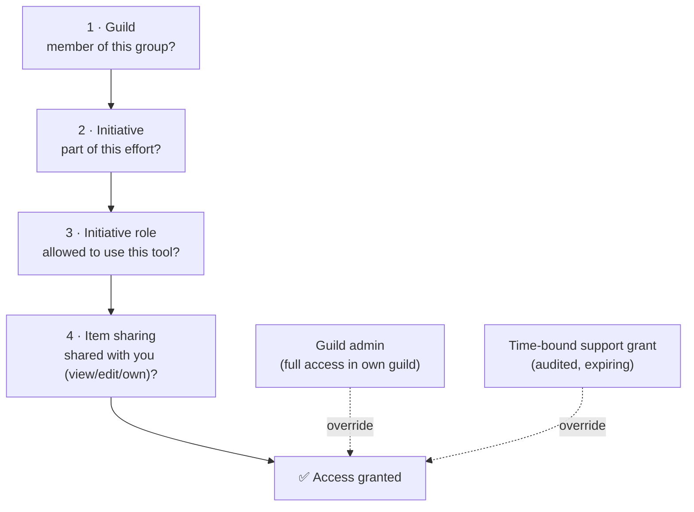

# How your data is kept separate

This page is the **technical explanation** of Initiative's multi-tenancy and access control — written for project managers, administrators, IT teams, and anyone evaluating Initiative for a group that cares about data isolation. It avoids code, but it doesn't shy away from detail.

If you just want the everyday version, read [Security & privacy](index.md) instead.

## The short version

Initiative is **multi-tenant**: many separate groups (guilds) can share one server without ever seeing each other's data. The separation is enforced **in the database itself**, not only in the application. So even if a flaw slipped into the app, the database would still refuse to return data a user isn't entitled to. Security is **fail-closed**: the default is no access, and access has to be positively established on every request.

## Each guild gets its own space in the database

A guild is not just a label attached to shared rows. Each guild's content — its initiatives, projects, tasks, documents, calendar, queues, counters, tags, and comments — lives in its **own dedicated area of the database** (a separate schema), provisioned when the guild is created and removed when the guild is deleted.

Shared identity and configuration (the list of users, guild memberships, invitations, server settings) lives in a common area. Everything that *belongs to a guild* lives in that guild's own space.

??? techspec "Why a separate schema per guild, rather than a shared table with a guild column?"
    A single shared table relying only on a "guild ID" column for separation is one forgotten `WHERE` clause away from a cross-tenant leak. A schema-per-guild design makes the boundary structural: a request is routed into a specific guild's space and literally cannot address another guild's tables. It's a stronger isolation line, which matters for groups with real confidentiality requirements. This is a firm architectural commitment, not an implementation detail that might change.

## The database connects under least-privilege roles

The application **never connects to the database as a superuser** — not for requests, not for jobs, not even for migrations. It uses purpose-built database roles, each with the least privilege it needs:

| Role | Used for | Can it bypass security rules? |
|---|---|---|
| Application role | Every normal user request | **No** — security rules always apply |
| System role | Background jobs, startup tasks | Yes, but never on a user request — and only on the specific tables it has been explicitly granted |
| Provisioning role | Migrations, creating/removing guild spaces | Structure only — it owns the tables but its own data access still obeys the security rules |

The key point: the role that handles your requests **cannot bypass the security rules**. Each request temporarily assumes the specific guild role it's allowed to, does its work, and resets. There is no standing, all-guilds back door in the request path.

## The six gates

Every read or write of guild data passes through the same access model. Picture it as nested gates — you must clear them from the outside in:

1. **Guild** — no guild data exists for you unless you belong to the guild. This is the outer wall.
2. **Initiative** — within a guild, you can't reach the content of an initiative you're not a member of. This is the hard isolation boundary that keeps sensitive efforts away from non-involved members of the *same* guild.
3. **Initiative role** — your role decides which *kinds* of tools you may use, and how.
4. **Item sharing** — for a specific project or document, per-item grants decide whether you can view, edit, or own it.

Two deliberate overrides sit above the four gates:

- **Guild administrators** always have full read/write access within their own guild. Running a group requires it.
- **Support access** for hosted operators is **time-bound, scoped to one guild, and recorded** — granted explicitly and expiring automatically. It is never a permanent or ambient bypass.

??? techspec "How the gates are actually enforced"
    Gates 2–4 are implemented with PostgreSQL **row-level security** policies attached to the guild content tables. Each policy defers to a single access function that asks: is the current user a member of this initiative, **or** a guild admin, **or** acting under a valid support grant? Because the check lives in the database and runs on every statement, the application and the database agree on the answer — and the database has the final say. Gate 1 (guild) is the schema boundary plus the per-request role described above. A consequence worth knowing: a guild member who isn't in a given initiative gets a "not found" result for that initiative's content, because row-level security hides the rows entirely.

## Sessions and sign-in

- **Web sessions** use secure, HttpOnly cookies — meaning a malicious script running in the browser cannot read your session and impersonate you. This closes a common account-takeover route.
- **Mobile apps** store their credentials in the device's secure storage.
- **Single sign-on (OIDC)** is supported, with modern protections (PKCE) and optional automatic mapping of identity-provider groups to guild and initiative memberships.
- **Sign-in tokens carry the minimum** needed; your guild and role context is worked out fresh, server-side, on each request — so a stale token can't grant access you no longer have.

## Encryption

- **In transit:** you should always run Initiative behind HTTPS, so traffic between browser and server is encrypted. (Administrators: see [Configuration](../admin/configuration.md).)
- **At rest:** the most sensitive stored fields — saved AI provider keys, single-sign-on secrets, email server passwords, and email addresses — are **encrypted** in the database using a key derived from the server's secret, so they aren't readable from the raw data alone.

## What this means in practice

- One server can safely host many unrelated groups.
- A bug in one feature can't quietly become a cross-group data leak, because the database boundary holds independently of the app.
- "Who can see this?" has a single, consistent answer enforced everywhere — the web app, the mobile app, file downloads, and live collaboration all defer to the same gates.

## Related

- [Security & privacy](index.md) — the plain-language version.
- [Data & compliance](data-and-compliance.md) — data ownership, your rights, and compliance posture.
- [Sharing & access](../sharing/index.md) — how you set the initiative and item layers yourself.
