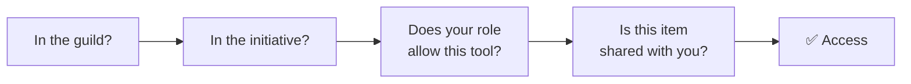

# Sharing & access

"Who can see this?" is one of the most important questions in any shared tool — and one of the easiest to get wrong elsewhere. Initiative keeps it simple by building access up in **layers**, from the outside in. This section walks through those layers, then shows you how to share specific projects and documents.

## The simple version

To see or edit something, you have to clear each gate in turn:

1. **Are you in the guild?** If not, you don't see anything in it. Full stop.
2. **Are you in the initiative?** Even inside a guild, an initiative is only visible to the people added to it. This is the big privacy boundary — it's how the "spring play" team can keep their work away from the "summer show" team.
3. **Does your role allow this kind of thing?** Your [initiative role](initiative-roles.md) decides which *tools* you can use — for example, whether you can create projects or only view them.
4. **Is this particular item shared with you?** Finally, each project and document can be shared with specific people or roles, at a **view**, **edit**, or **own** level. See [Sharing projects & documents](sharing-projects-and-documents.md).

You only reach something when **all four** are satisfied. It sounds like a lot, but in practice it's intuitive: join a group, join an effort, get the right role, and have things shared with you.

## Two important exceptions

Two people can see more than the layers above would suggest, by design:

- **Guild administrators** can always see and manage everything in *their own* guild. Someone has to be able to keep the lights on.
- **Support staff** (on a hosted service) can be granted **temporary, time-limited, recorded** access to help with a problem — never a permanent back door, and always logged. See [Security & privacy](../security/index.md).

## Why a missing item shows as "not found," not "denied"

If you're not in an initiative, its projects and documents don't appear as locked doors — they simply aren't there for you. Trying to open a direct link to one gives a "not found" result rather than "access denied." That's deliberate: it avoids even revealing that the item *exists*, which is itself a small leak of information.

## In this section

-   :material-shield-account-outline: __Initiative roles__

    What roles are, the permissions they unlock, and the "full access" shortcut.

    [:octicons-arrow-right-24: Initiative roles](initiative-roles.md)

-   :material-share-variant-outline: __Sharing projects & documents__

    Share with people or whole roles, at view / edit / own levels.

    [:octicons-arrow-right-24: Sharing projects & documents](sharing-projects-and-documents.md)

??? techspec "For the technically minded — where these layers are enforced"
    The four gates above are not just interface logic. The guild boundary is a separate database area per guild; the initiative boundary, role checks, and item-level sharing are enforced by the database's own row-level security, evaluated on every request. The result is that even a flaw in the application can't hand someone data the database wouldn't have given them. The full architecture, including the audited support-access path, is in [How your data is kept separate](../security/how-your-data-is-kept-separate.md).
