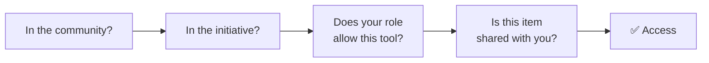

# Sharing & access

"Who can see this?" is the most important question in any shared tool, and the easiest one to get wrong. Initiative answers it in **layers**, from the outside in. Each layer narrows the one before it, so the people who end up seeing something are exactly the people you put in front of it.

## The simple version

To reach something, you clear each gate in turn:

```mermaid
graph LR
  A["In the community?"] --> B["In the initiative?"]
  B --> C["Does your role<br/>allow this tool?"]
  C --> D["Is this item<br/>shared with you?"]
  D --> E["✅ Access"]
```

1. **Are you in the community?** If not, you see nothing in it. Full stop.
2. **Are you in the initiative?** Even inside a community, an initiative is visible only to the people added to it. This is the big privacy boundary — how a business keeps payroll planning away from seasonal staff, and how the spring-play team keeps its work away from the summer-show team, in the same workspace.
3. **Does your role allow this kind of thing?** Your [initiative role](initiative-roles.md) decides which *tools* you can use — whether you can create projects, or only view them.
4. **Is this particular item shared with you?** Each project and document can be shared with specific people or roles, at **view**, **edit**, or **own**. See [Sharing projects & documents](sharing-projects-and-documents.md).

All four have to be satisfied. It sounds like a lot; in practice it's intuitive. Join a group, join an effort, get the right role, have things shared with you.

## Two deliberate exceptions

Two people see more than the layers suggest, by design:

- **Community administrators** always see and manage everything in *their own* community. Somebody has to keep the lights on.
- **Support staff** (on a hosted service) can be granted **temporary, time-limited, recorded** access to help with a problem — granted explicitly, expiring on its own, and logged. See [Security & privacy](../security/index.md).

## Why a missing item says "not found", not "denied"

If you're not in an initiative, its projects and documents aren't locked doors — they simply aren't there for you. A direct link comes back "not found" rather than "access denied", because as far as your account is concerned there's nothing at that address.

## In this section

-   :material-shield-account-outline: __Initiative roles__

    What roles are, what they unlock, and the Manager role's full access.

    [:octicons-arrow-right-24: Initiative roles](initiative-roles.md)

-   :material-share-variant-outline: __Sharing projects & documents__

    Share with people or whole roles, at view / edit / own.

    [:octicons-arrow-right-24: Sharing projects & documents](sharing-projects-and-documents.md)

??? techspec "For the technically minded — where these layers are enforced"
    Not in interface logic. The community boundary is structural — a separate database schema per community, which a request is routed into and cannot reach outside of. The initiative boundary, role checks and item-level sharing are enforced inside that schema by the database's own row-level security, evaluated on every statement, so the database has the final say rather than the application. Full architecture, including the audited support-access path, in [How your data is kept separate](../security/how-your-data-is-kept-separate.md).
