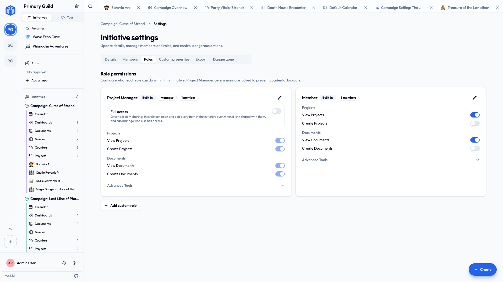

# Initiative roles

Every member of an initiative holds a **role** — a reusable bundle of permissions deciding which *kinds of tools* they can use here. Roles save you setting permissions person by person: describe the kind of member once, then assign it.

## Roles vs. sharing

Two different questions, and both apply:

- **Roles** answer *"what kinds of things can this person do in this initiative?"* — can they create projects, or only view them?
- **Sharing** answers *"can this person see this **specific** project or document?"* — covered in [Sharing projects & documents](sharing-projects-and-documents.md).

So a role might let someone create documents in general, while an individual document is still only visible to the people it's shared with.

## What a role can grant

Permissions group by tool, and each offers **View**, **Create**, or neither:

| Tool | Permissions |
|---|---|
| **Projects** | View, Create |
| **Documents** | View, Create |
| **Queues** | View, Create |
| **Counters** | View, Create |
| **Events** (calendar) | View, Create |
| **Dashboards** | View, Create |

A "Contributor" might view and create projects and documents; a "Guest" only views them and has no access to queues or counters at all.

## The built-in Manager role

Every initiative includes a **Manager** role (also called project manager, or PM). It's the lead role: fixed permissions, broad ones, and whoever creates an initiative starts as its Manager.

Manager is also the **only** role with **full access** — Managers reach everything in the initiative, including projects and documents never shared with them individually. No other role, built-in or custom, can be given it.

!!! warning "Managers see everything — pick them carefully"
    Because Manager overrides per-item sharing, anything kept private to a few people is still visible to one. Hand out the Manager role only to the few who genuinely need the whole picture.

## Creating your own roles

1. Open the initiative's **settings → Roles**.
2. **Add a role** and name it something your group will recognize: "Director", "Cast", "Editor", "Observer".
3. Tick the permissions it should have.
4. Save. It's available next time you add or edit a member.

Name roles for *people*, not permissions. "Volunteer" is friendlier and clearer than "View-only contributor."

## Assigning them

When you [add a member](../guides/initiatives.md#adding-members), you pick their role. Change it later from the same **Members** settings — changes take effect right away.

## Related

- [Sharing projects & documents](sharing-projects-and-documents.md) — the final, per-item layer.
- [Working with initiatives](../guides/initiatives.md) — creating initiatives and adding members.
