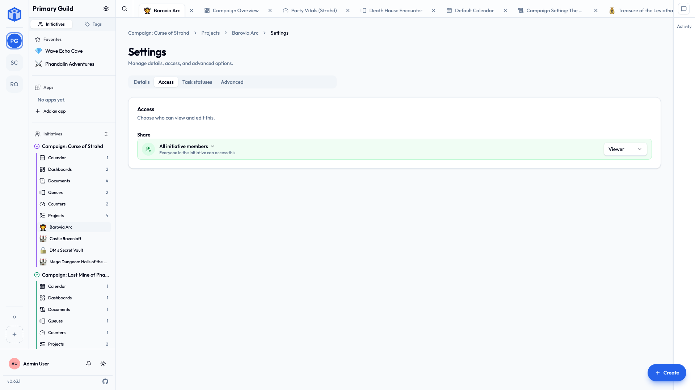

# Sharing projects & documents

The last and most precise layer: who can reach one **specific** project or document.

It works identically for both, so learn it once and you're done.

## The three levels

| Level | Can do |
|---|---|
| **Viewer** | Open it and read it. |
| **Editor** | Read it **and** change it. |
| **Owner** | Everything an editor can, **plus** decide who else gets access. |

Pick the lowest level that lets somebody do their job. Most people only ever need Viewer or Editor, and you can always move them up later.

## Who you can share with

- **A person** — one specific member of the initiative.
- **A role** — *everyone* holding that [initiative role](initiative-roles.md), in one go. Share with "Cast" and every cast member gets it, including the people you add to that role next month.

Sharing with a **role** is the tidy option when a whole group should have the same access. Set it once instead of adding eleven people individually and forgetting the twelfth.

## Open, or restricted

- **All initiative members** — everyone in the initiative can reach it. Good for things the whole team should see.
- **Restricted** — only the people and roles you name. Good for anything you'd rather not explain later.

When in doubt, start restricted. Widening access takes two clicks; un-sharing something people have already read takes a conversation.

## Changing access later

Open the **Access** tab in a project's or document's settings whenever you like — add people, change a level, remove somebody. Changes apply immediately.

Every settings tab has its own web address too, so you can send somebody a link straight to a tool's sharing options instead of describing which three things to click.

You can also **change access on several things at once**: from a list view, select multiple documents, projects, queues, counters or calendar events and update them in one step. Handy when a new teammate joins a batch of work, and handier when somebody leaves.

You don't have to click each card individually, either. Click the first, hold ++shift++, click the last, and everything between comes with it. Shift-clicking away from a card you just unticked clears that run the same way. (++shift+enter++ or ++shift+space++ does it from the keyboard.)

## Three things worth remembering

- **Initiative membership comes first.** You can only share with somebody already in the initiative. If they're not, [add them there](../guides/initiatives.md#adding-members) first — the box won't offer them otherwise.
- **Managers see everything.** A member with the [Manager role](initiative-roles.md#the-built-in-manager-role) opens the item regardless of anything on this page. That's intended, and worth remembering for genuinely private material.
- **Community admins see everything in their community.** Also by design. Somebody has to be able to administer the place.

??? techspec "For the technically minded — how item sharing is stored and checked"
    Per-item sharing is recorded as grants naming a project or document, a person *or* a role, and a level (view / edit / own). On every request the database evaluates whether the current user satisfies the grant — directly, through a role they hold, through the initiative's Manager role, or as a community admin — before any data comes back. Because that check lives in the database alongside the community and initiative boundaries, the link to a project is never the thing that grants access to it. See [How your data is kept separate](../security/how-your-data-is-kept-separate.md).

## Related

- [Initiative roles](initiative-roles.md) — sharing with whole roles at once.
- [Sharing & access overview](index.md) — how this fits with the other layers.
